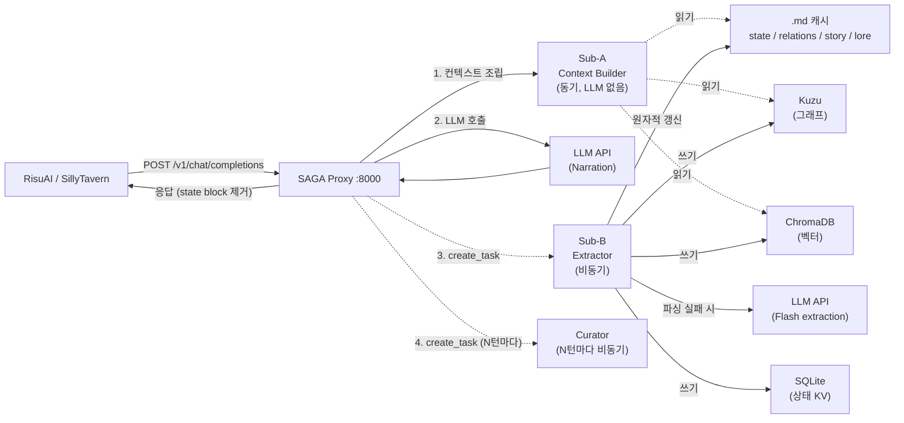

# Research Note — 2026

## Stateful Graph RAG 기반 Context Engineering 프록시

### SAGA RP Agent Proxy v3.0

---

> **한 줄 요약:** 매 턴 1회 LLM 호출만으로 장기 RP 세션의 상태 일관성을 유지하는 OpenAI-compatible 프록시.
> 그래프 DB + 벡터 DB + .md 캐시를 조합하여, 프론트엔드 수정 없이 동적 컨텍스트를 자동 주입한다.

---

## 목차

1. [용어 설명](#1-용어-설명)
2. [연구 개요](#2-연구-개요)
3. [기존 방식의 한계](#3-기존-방식의-한계)
4. [SAGA의 접근: Stateful Graph RAG](#4-saga의-접근-stateful-graph-rag)
5. [시스템 아키텍처](#5-시스템-아키텍처)
6. [3-Agent 파이프라인](#6-3-agent-파이프라인)
7. [스토리지 설계](#7-스토리지-설계)
8. [다이나믹 로어북](#8-다이나믹-로어북)
9. [비용 및 품질 고찰](#9-비용-및-품질-고찰)
10. [평가 (LLM-as-a-Judge)](#10-평가-llm-as-a-judge)
11. [빠른 시작](#11-빠른-시작)
12. [설정 레퍼런스](#12-설정-레퍼런스)
13. [API 레퍼런스](#13-api-레퍼런스)
14. [월드 데이터 작성법](#14-월드-데이터-작성법)
15. [프로젝트 구조](#15-프로젝트-구조)
16. [로드맵](#16-로드맵)
17. [선행 연구 및 참고 자료](#17-선행-연구-및-참고-자료)

---

## 1. 용어 설명

이 문서에서 반복적으로 등장하는 개념을 먼저 정리한다.

| 용어 | 설명 |
|------|------|
| **RAG** (Retrieval-Augmented Generation) | 외부 저장소에서 관련 정보를 검색하여 LLM 프롬프트에 주입하는 패턴. |
| **Graph RAG** | 벡터 검색에 그래프 구조(노드 + 엣지)를 결합하여, 관계 기반 N-hop 확장으로 검색 품질을 높이는 RAG 확장. |
| **Stateful RAG** | 매 턴 LLM 응답에서 상태를 추출하여 저장소를 갱신하고, 다음 턴 검색에 반영하는 Read-Write 순환 RAG. 일반 RAG가 읽기 전용이라면, Stateful RAG는 매 턴 쓰기도 수행한다. |
| **Context Engineering** | 제한된 토큰 예산 안에서 어떤 정보를 얼마나 넣을지 우선순위를 매겨 프롬프트를 조립하는 기법. |
| **Prompt Caching** | Anthropic `cache_control: ephemeral` 등을 이용하여 프롬프트의 불변 부분을 캐싱, 비용과 지연을 줄이는 기법. |
| **State Block** | LLM 응답 끝에 붙는 구조화된 상태 출력 블록 (` ```state ... ``` `). SAGA가 파싱하여 DB를 갱신한다. |
| **Lorebook** | 세계관 설정 항목의 모음. 전통적으로 정적이지만, SAGA에서는 동적으로 필터링/감쇠된다. |
| **Curator** | N턴마다 서사 품질을 자동 관리하는 에이전트. 모순 탐지, 서사 압축, 이벤트 스케줄링을 수행한다. |
| **RisuAI / SillyTavern** | RP 프론트엔드 클라이언트. OpenAI-compatible API를 지원하므로 SAGA 프록시를 투명하게 사용할 수 있다. |

---

## 2. 연구 개요

### 배경: RP 장기 세션의 근본 문제

RP(롤플레이) 챗봇은 수십~수백 턴에 걸친 장기 세션에서 구조적인 한계에 부딪힌다.

- **상태 유실**: 50턴 전에 죽은 NPC가 재등장하고, 버린 아이템이 인벤토리에 남아 있다.
- **모순 누적**: HP가 0인데 전투를 계속하고, 동쪽으로 이동했는데 서쪽 마을에 있다.
- **로어북 정적 한계**: 세계 상태가 변해도(마을 파괴, 세력 붕괴) 로어북은 초기 설정 그대로다.
- **컨텍스트 낭비**: 전체 대화 히스토리를 보내면 128K 토큰 중 상당수가 관련 없는 과거 대화로 소모된다.

이 문제들은 단순히 컨텍스트 창을 늘려서 해결되지 않는다. 200K 토큰을 보내도 LLM이 50턴 전 세부사항을 정확히 기억하리라는 보장은 없으며, 비용은 선형으로 증가한다.

### 목표

- **프론트엔드 변경 없이** 장기 기억 + 상태 일관성을 확보한다.
- 기존 클라이언트(RisuAI, SillyTavern 등)에서 **API Base URL만 변경**하면 동작한다.
- 유저 체감 지연을 최소화한다 — **1회 LLM 호출 + 비동기 후처리**.

### 선행 연구

SAGA는 다음 연구와 프로젝트들의 아이디어를 결합하고 확장한다:

- **MemGPT / Letta** [[1]](#ref-1) — LLM에 가상 메모리 계층을 부여하여 무한 컨텍스트를 시뮬레이션하는 OS 패러다임을 제안. Letta의 "Step Loop" — 에이전트가 자기 Memory Block을 읽고 편집하는 다회 호출 패턴 — 은 RP 도메인에서 코히바블랙 [[2]](#ref-2) 에 의해 실증적으로 검증되었다. SAGA의 Curator는 이 패턴을 비동기 후처리에서 차용하되, 유저 대기 경로에서는 사용하지 않는 트레이드오프를 택했다.
- **Graph RAG** [[3]](#ref-3) — Microsoft Research가 제안한 그래프 기반 RAG. 벡터 검색만으로 포착하기 어려운 관계 기반 질의를 그래프 확장으로 보완한다. SAGA는 이 아이디어를 Kuzu + ChromaDB 하이브리드 리랭킹으로 구현했다.
- **RAG** [[4]](#ref-4) — 검색 증강 생성의 원형. 외부 저장소에서 관련 문서를 검색하여 LLM 프롬프트에 주입하는 기본 패턴.
- **LLM-as-a-Judge** [[5]](#ref-5) — LLM을 평가자로 사용하는 방법론. SAGA는 크로스 프로바이더 저지 + 네거티브 캘리브레이션으로 편향을 완화했다.
- **코히바블랙의 Research Note** [[2]](#ref-2) — Letta 기반 RP 에이전트의 실전 적용기. 같은 문제(RP 장기 세션의 상태 유실)를 "에이전트 자기편집 다회 호출"로 풀었다. SAGA는 이를 벤치마크 삼아 "프록시 기반 1회 호출 + 비동기 추출"이라는 다른 아키텍처를 선택했다.
- **에이전트 컨텍스트 관리의 .md 수렴** — Claude Code, OpenClaw, oh-my-claudecode(OMC), Codex, Letta Code MemFS[[6]](#ref-6) 등 아키텍처가 다른 에이전트 시스템들이 공통적으로 마크다운을 컨텍스트 관리 형식으로 채택하고 있다. "에이전트가 무엇이 중요한지 스스로 판단하여 .md 메모를 갱신한다"는 패러다임에서 영감을 받아, SAGA의 .md 캐시 설계와 Letta Curator의 Memory Block 자기편집 구조로 이어졌다.

### 접근 방식

OpenAI-compatible 프록시로 클라이언트와 LLM 사이에 위치하여:

1. **매 턴 요청 시** — 3종 DB에서 현재 상태와 관련 컨텍스트를 검색, 프롬프트에 주입 (동기, ~35ms)
2. **매 턴 응답 후** — LLM 응답에서 상태 변화를 추출, 3종 DB를 갱신 (비동기, 유저 대기 없음)
3. **N턴마다** — 서사 모순 탐지, 장기 서사 압축, 이벤트 스케줄링 (비동기)

---

## 3. 기존 방식의 한계

### 비교 테이블

| 접근 방식 | 상태 추적 | 구조화된 상태 | 유저 지연 | 비용 | 한계 |
|-----------|----------|-------------|----------|------|------|
| **정적 로어북** | X | X | 없음 | 낮음 | 세계가 변해도 로어북은 고정 |
| **전체 히스토리 전송** | 암묵적 | X | 없음 | 높음 | 토큰 낭비, 관련 없는 정보 포함, 장기 세션에서 누적 모순 |
| **Hyper Memory 계열** | 대화 기억 | X | 낮음 | 중간 | 비구조적 기억 — "위치", "HP", "관계 그래프" 같은 구조화된 상태 추적 불가 |
| **Letta Step Loop** | O | O | **높음 (다회 호출)** | **높음** | 에이전트가 자기편집을 위해 3~5회 LLM 호출 → 턴당 지연 수 초~수십 초 |
| **SAGA (본 프로젝트)** | O | O | **낮음 (1회 호출)** | 중간 | 추출 정확도가 State Block 품질에 의존 |

### 정적 로어북의 문제

전통적인 로어북은 세션 시작 시 고정된다. "에르겐은 마을 광장의 약초상이다"라고 작성해 두면, 에르겐이 숲으로 이동하거나 사망하더라도 로어북은 변하지 않는다. 결과적으로 LLM은 오래된 설정을 참조하여 모순된 서사를 생성한다.

### Letta Step Loop 방식과의 차이

Letta [[1]](#ref-1)는 에이전트가 자신의 Memory Block을 직접 편집하는 "Step Loop" 패턴을 사용한다. 코히바블랙 [[2]](#ref-2)은 이를 RP 도메인에 적용하여 장기 세션에서의 효과를 실증했다. 강력하지만, 한 번의 유저 턴에 대해 에이전트가 **3~5회 LLM을 호출**하여 기억을 읽고, 수정하고, 응답을 생성한다.

```
[Letta Step Loop]
유저 입력 → (1) 기억 읽기 → (2) 기억 편집 → (3) 응답 생성 → (4) 기억 재편집 → ...
           └─── 3~5회 LLM 호출, 유저가 전부 대기 ───┘

[SAGA]
유저 입력 → (1) DB 검색 + 프롬프트 조립 → LLM 1회 호출 → 응답 반환
                                                          └─ (비동기) 상태 추출 + DB 갱신
```

SAGA는 이 트레이드오프를 다르게 풀었다:
- **동기 경로**: DB 검색 + 프롬프트 조립만 수행 (LLM 호출 없음, ~35ms)
- **비동기 경로**: 응답 반환 후 경량 LLM으로 상태 추출 (유저 대기 없음)
- **Curator**: N턴마다 Letta Memory Block 기반 자기편집 수행 (비동기, 유저 대기 없음)

결과적으로 유저가 체감하는 지연은 LLM 1회 호출뿐이다.

---

## 4. SAGA의 접근: Stateful Graph RAG

### 핵심 아이디어: Read-Write 순환

```
                    ┌──────────────────────────────┐
                    │         3종 DB 저장소          │
                    │  Kuzu(그래프) + ChromaDB(벡터)  │
                    │      + SQLite(상태 KV)         │
                    └──────┬───────────────┬────────┘
                   READ    │               │  WRITE
                (동기 ~35ms)│               │(비동기)
                           ▼               │
    ┌────────┐    ┌────────────────┐    ┌──┴──────────────┐
    │ Client │───▶│  Sub-A:        │───▶│  LLM (1회 호출)   │
    │        │◀───│  Context Build │◀───│                  │
    └────────┘    └────────────────┘    └──┬──────────────┘
                                           │ 응답 반환 후
                                           ▼
                                    ┌──────────────┐
                                    │  Sub-B:      │
                                    │  추출 + 갱신  │──▶ DB WRITE
                                    └──────────────┘
```

매 턴은 두 단계로 구성된다:

1. **READ** (동기): Sub-A가 3종 DB에서 현재 상태, 관련 로어북, 그래프 연결을 검색하여 프롬프트에 주입
2. **WRITE** (비동기): Sub-B가 LLM 응답의 State Block을 파싱하여 3종 DB를 갱신

이 순환이 매 턴 반복되므로, DB는 항상 최신 세계 상태를 반영하고, 다음 턴의 검색은 갱신된 상태를 기반으로 동작한다.

### 설계 철학: "에이전트는 큐레이션만, 메인 루프는 코드로"

RP는 본질적으로 **동적 메모리 시스템**을 요구한다. 세계 상태가 매 턴 변하고, 그 변화가 다음 턴의 맥락에 즉시 반영되어야 한다. Letta(MemGPT) [[1]](#ref-1)는 이를 에이전트의 자기편집 Step Loop로 해결하지만, 메인 응답 경로에 에이전트를 두면 다회 호출 지연이 불가피하다.

SAGA의 착안점은 **에이전트 생태계 전반에서 관찰되는 컨텍스트 관리 패턴의 수렴**이었다.

| 시스템 | 아키텍처 | 컨텍스트 관리 |
|--------|---------|-------------|
| **Claude Code** | CLI 에이전트 | `CLAUDE.md`, `~/.claude/memory/*.md` |
| **oh-my-claudecode (OMC)** | 오케스트레이터 | `notepad.md`, `AGENTS.md`, `.omc/plans/*.md` |
| **OpenClaw** | Gateway/프록시 | `.md` 기반 컨텍스트 주입 |
| **Codex** | CLI 에이전트 | `AGENTS.md`, 마크다운 기반 지시 |
| **Letta Code** | 에이전트 프레임워크 | `memory/*.md` + YAML frontmatter (MemFS) [[6]](#ref-6) |

Swarm, Orchestrator, Skill 시스템 등 상위 아키텍처는 다양하지만, **에이전트에게 컨텍스트를 전달하는 최종 형식은 마크다운으로 수렴**하고 있다:

- LLM의 학습 데이터에 마크다운이 압도적으로 많아 **가장 잘 읽는 형식**
- 헤딩/리스트/테이블로 **반구조화** 가능 (JSON은 기계적, 자연어는 비구조적)
- YAML frontmatter로 **메타데이터 분리** (본문은 LLM이, 프론트매터는 코드가 읽음)
- 텍스트 기반이라 **diff/캐싱 친화적** (git diff, Prompt Caching 모두 효율적)

특히 Letta Code의 MemFS[[6]](#ref-6)는 주목할 만하다. Memory Block(단일 문자열)에서 진화하여, git 기반 마크다운 파일 시스템으로 에이전트 메모리를 관리한다 — SAGA의 .md 캐시(`state.md`, `relations.md`, `story.md`, `lore.md` + YAML frontmatter)와 매우 유사한 구조다. 차이는 **편집 주체**: MemFS는 에이전트가 LLM 호출로 편집하고, SAGA는 코드 로직(Sub-B)이 밀리초 단위로 편집한다.

SAGA의 .md 캐시는 임의적 선택이 아니라, **에이전트 생태계 전체가 수렴하고 있는 패턴의 RP 도메인 적용**이다.

이 배경 위에서, RP에 적용할 때 핵심 질문은: **에이전트의 판단력이 정말 필요한 곳은 어디인가?**

- **매 턴 상태 추출**: "위치가 바뀌었는가? HP가 변했는가?" → 정규식 + 경량 LLM으로 충분. 에이전트 판단 불필요.
- **매 턴 컨텍스트 조립**: "어떤 로어북이 관련 있는가?" → 점수 기반 필터링으로 충분. 에이전트 판단 불필요.
- **N턴마다 서사 큐레이션**: "이 모순은 의도된 것인가? 이 복선은 회수해야 하는가?" → **에이전트의 판단력이 필수.** 이전 큐레이션 결정을 기억하고 일관되게 이어가야 한다.

따라서 SAGA는 Letta를 **메인 루프에서 빼고, Curator에만 배치**했다. 코딩 에이전트가 Notepad를 통해 작업 맥락을 자기관리하듯, Letta Curator는 Memory Block을 통해 큐레이션 판단 이력을 자기관리한다. 매 턴의 기계적 작업(추출, 검색, 필터링)은 코드 로직이 처리하고, 서사적 판단이 필요한 큐레이션에서만 에이전트가 개입한다.

```
코딩 에이전트 패턴:                    SAGA 적용:
┌──────────────┐                   ┌──────────────────┐
│ Agent        │                   │ Letta Curator     │
│  └ Notepad   │ ← 자기관리        │  └ Memory Block   │ ← 자기편집
│  └ 작업 실행  │                   │  └ 서사 판단       │
└──────────────┘                   └──────────────────┘
  "뭐가 중요하지?"                    "이 모순은 의도적인가?"
  "이전에 뭘 했지?"                   "지난 큐레이션에서 뭘 결정했지?"
```

이 분리 덕분에:
- **메인 루프**: LLM 0회 호출 (Sub-A) + LLM 1회 호출 (내레이션) = 최소 지연
- **큐레이션**: Letta Step Loop의 다회 호출을 허용하되, N턴마다 비동기로 실행하므로 유저에게 영향 없음

### 일반 RAG vs Stateful RAG

| | 일반 RAG | Stateful RAG (SAGA) |
|---|---------|-------------------|
| 검색 대상 | 정적 문서 | 매 턴 갱신되는 3종 DB |
| 쓰기 | 없음 (읽기 전용) | 매 턴 비동기 DB 갱신 |
| 검색 방식 | 벡터 유사도 | 벡터 + 그래프 N-hop 확장 + 규칙 게이트 |
| 상태 구조 | 비구조적 텍스트 | 그래프 노드/엣지 (Character, Location, Item, Event, Lore) |
| 로어북 | 정적 | 동적 감쇠 + 레이어 우선순위 |

### Graph RAG: 벡터 검색의 한계 보완

벡터 유사도 검색만으로는 "에르겐이 알고 있는 것" 같은 관계 기반 질의에 취약하다 [[3]](#ref-3). SAGA는 이 문제를 ChromaDB 벡터 검색 결과에서 Kuzu 노드를 찾아 N-hop 확장한 뒤 추가 검색을 수행하는 방식으로 해결한다.

```
ChromaDB 검색: "어둠의 숲" → [어둠의 숲, 고블린왕 크룩, ...]
                                      │
Kuzu N-hop 확장 (max_hop=2):          ▼
    어둠의 숲 ──ADJACENT──▶ 마을 광장
    어둠의 숲 ──HAS_LORE──▶ 대붕괴
    크룩 ──RELATES_TO──▶ 아리아
    크룩 ──LOCATED_AT──▶ 어둠의 숲
                    │
ChromaDB 재검색:    ▼
    [대붕괴, 마을 광장, ...] → 병합 + 중복 제거
```

### Context Engineering: 토큰 예산 내 우선순위 패킹

128K 컨텍스트 중 동적 컨텍스트에 할당하는 예산은 기본 1,500 토큰이다. 이 안에서 다음 우선순위로 패킹한다:

| 항목 | 기본 예산 | 설명 |
|------|----------|------|
| .md 캐시 | 600 tok | state/relations/story/lore 4파일 (프롬프트 캐싱 프리픽스) |
| 로어북 | 800 tok | 동적 필터링된 로어북 엔트리 |
| 그래프 컨텍스트 | 300 tok | N-hop 확장 결과 |
| 상태 브리핑 | 200 tok | 최신 상태 델타 (위치, HP, 인벤토리) |
| State Block 지시 | 100 tok | LLM에게 상태 블록 출력을 요청하는 지시문 |

---

## 5. 시스템 아키텍처

### 전체 요청 흐름



> **핵심**: Sub-A = **읽기 전용** (DB→컨텍스트), Sub-B = **쓰기 전용** (파싱→DB→캐시), LLM 호출은 **Proxy가 직접** 수행한다. Sub-B와 Curator는 Proxy가 독립적으로 `asyncio.create_task()`하며, Sub-B → Curator 종속 관계는 없다.

### 요청 처리 단계

```
1. 세션 ID 추출 (시스템 메시지 MD5 해시 앞 8자)
2. 세션 존재 확인 → 없으면 WorldLoader로 초기화 (Kuzu + ChromaDB + .md 캐시 부트스트랩)
3. [동기] Sub-A: Context Builder (~35ms)
   → .md 캐시 읽기 → 병렬 Kuzu/ChromaDB 조회 → 하이브리드 리랭킹 → 로어북 필터 → 예산 내 조립
4. 프롬프트 캐싱 적용 (Anthropic cache_control: ephemeral)
5. LLM 1회 호출 (내레이션 모델)
6. State Block 제거 후 클라이언트에 응답 반환
7. 턴 카운터 증가
8. [비동기] Sub-B: Post-Turn Extractor
   → State Block 파싱 → Kuzu/SQLite/ChromaDB 갱신 → .md 캐시 원자적 교체
9. [비동기, N턴마다] Curator
   → 모순 탐지 → 서사 압축 → 이벤트 스케줄링
```

---

## 6. 3-Agent 파이프라인

### Sub-A: Context Builder

> **역할**: 매 턴 동기 실행, ~35ms 목표, LLM 호출 없음

Sub-A는 유저 요청이 올 때마다 실행되어 동적 컨텍스트를 조립한다. 핵심은 **2-tier 조회**: .md 캐시를 먼저 읽고, DB에서 동적으로 보충하는 구조이다.

**파이프라인:**

```
Phase 0: .md 캐시 읽기 + 신선도 검사
  │  (캐시 턴 vs 현재 턴, |diff| ≤ 1이면 fresh)
  ▼
Phase 1: 병렬 DB 조회
  │  asyncio.gather(Kuzu 플레이어 컨텍스트, ChromaDB 벡터 검색)
  ▼
Phase 2: Graph x Vector 하이브리드 리랭킹
  │  ChromaDB 결과 → Kuzu 노드 매칭 → N-hop 확장 → 재검색 → 병합
  ▼
Phase 3: 다이나믹 로어북 필터링
  │  레이어 우선순위 + 위치/NPC 게이트 + 감쇠 + 예산 컷오프
  ▼
Phase 4: 토큰 예산 내 조립
  │  상태 델타 + 그래프 연결 + 로어북 + 이벤트 + State Block 지시
  ▼
출력: { cached_prefix, dynamic_suffix }
```

**출력 형식:**

Sub-A의 결과는 시스템 메시지에 주입된다:

```
[--- SAGA Dynamic Context ---]
{cached_prefix}       ← .md 캐시 4파일 (프롬프트 캐싱 대상)

[최신 변경]
위치: 어둠의 숲 | HP: 85/100 | 인벤토리: 불꽃 검, 치유 물약

[관련 연결]
어둠의 숲(location) → 고블린왕 크룩(character) → 고대 유적(location)

[관련 로어북]
- 어둠의 숲: 에르시아 변방의 위험한 숲...
- 대붕괴: 300년 전 마법 재앙...

[이벤트]
- [quest_update] 고대 열쇠 단서 발견

[--- SAGA State Tracking ---]
응답 마지막에 아래 형식의 상태 블록을 추가해주세요:
```

### Sub-B: Post-Turn Extractor

> **역할**: 매 턴 비동기 실행, 유저 대기 없음

응답이 클라이언트에 반환된 후 `asyncio.create_task`로 백그라운드에서 실행된다.

**파이프라인:**

```
1. State Block 파싱
   │  정규식: ```state ... ``` 블록 추출
   │  실패 시 → 경량 LLM (gemini-2.0-flash 등) 폴백 추출
   ▼
2. Kuzu 그래프 갱신
   │  위치 이동 → create_location() + update_character_location()
   │  NPC 등장 → create_character() + create_relationship()
   │  관계 변화 → update_relationship()
   │  아이템 획득/소실/이전 → create_item() + add/remove/transfer_ownership()
   │  HP 변화 → update_character_hp() (0~max_hp 클램핑)
   ▼
3. SQLite 갱신
   │  world_state KV 업서트 (player_location, player_mood)
   │  turn_log 기록 (state_block, user_input, response, token_count)
   ▼
4. ChromaDB 에피소드 기록
   │  "Turn 5 | 장소: 어둠의 숲 | 만남: 고블린 족장 | 획득: 불꽃 검"
   ▼
5. .md 캐시 원자적 갱신
   │  4파일 각각 .tmp 작성 → os.replace() 원자적 교체
```

**State Block 형식 (LLM 출력):**

````
```state
location: 어둠의 숲
location_moved: true
hp_change: -15
items_gained: [불꽃 검]
items_lost: []
items_transferred: []
npc_met: [고블린왕 크룩]
npc_separated: []
relationship_changes: [{from: 아리아, to: 크룩, type: hostile, delta: -2}]
mood: tense
event_trigger: null
notes: 고블린 영역 진입, 경계 상태
```
````

**동시성 제어:** `asyncio.Event` 락으로 이전 Sub-B 완료를 대기한 뒤 실행. 빠른 연속 턴에서 DB 경합을 방지한다.

### Curator

> **역할**: N턴마다(기본 10턴) 비동기 실행, 서사 품질 자동 관리

**수행 작업:**

| 작업 | 설명 |
|------|------|
| 서사 모순 탐지 | 죽은 NPC 재등장, HP 0인데 생존, 위치 불일치 등 |
| 장기 서사 압축 | story.md가 50턴 이상이면 요약 압축 |
| 이벤트 스케줄링 | 복선 회수, 새 이벤트 제안, 이벤트 큐 갱신 |

**어댑터 구조:**

- **Primary — Letta Memory Block**: Memory Block(`narrative_summary`, `curation_decisions`, `contradiction_log`)을 가진 에이전트가 매 큐레이션마다 자기편집
- **Fallback — Direct LLM**: Letta 실패 시 직접 LLM 호출로 JSON 응답 수신

Curator는 Letta의 자기편집 패턴을 **비동기 후처리에서만** 사용한다. 유저 대기 경로(동기)에서는 Letta를 호출하지 않으므로, Step Loop의 지연 문제를 회피한다.

---

## 7. 스토리지 설계

### 4종 스토리지 역할

| 스토리지 | 역할 | 특성 | 경로 |
|---------|------|------|------|
| **SQLite** | 세션 메타, 턴 로그, world_state KV, 이벤트 큐 | 트랜잭션, 빠른 KV 조회 | `db/state.db` |
| **Kuzu** (그래프 DB) | 캐릭터/장소/아이템/이벤트/로어 노드 + 관계 엣지 | 관계 쿼리, N-hop 확장 | `db/graph.kuzu` |
| **ChromaDB** (벡터 DB) | 로어북 시맨틱 검색, 에피소드 기억 | 벡터 유사도 검색 | `db/chroma/` |
| **.md 캐시** | state/relations/story/lore 4파일 | 프롬프트 캐싱 프리픽스, 원자적 쓰기 | `cache/sessions/{session_id}/` |

### Kuzu 그래프 스키마

**노드 5종:**

| 노드 | 주요 속성 | 용도 |
|------|----------|------|
| **Character** | name, is_player, hp, max_hp, location, mood, status, traits | PC + NPC |
| **Location** | name, loc_type, description, properties | 장소, 던전 |
| **Item** | name, item_type, description, properties | 장비, 소비품 |
| **Event** | name, event_type, description, turn | 세계 이벤트, 퀘스트 |
| **Lore** | name, lore_type, layer (A1~A4) | 로어북 엔트리 |

**엣지 10종:**

| 엣지 | From → To | 속성 | 의미 |
|------|-----------|------|------|
| RELATES_TO | Character → Character | rel_type, strength | NPC 관계 (met, knows, hostile...) |
| LOCATED_AT | Character → Location | since_turn | 현재 위치 |
| OWNS | Character → Item | quantity, equipped | 소유/장착 |
| ADJACENT | Location → Location | direction, cost, conditions | 지도 연결 |
| INVOLVED_IN | Character → Event | role | 이벤트 참여 |
| CAUSED | Event → Event | description | 인과 관계 |
| KNOWS | Character → Lore | confidence | 로어 지식 |
| RELATED | Lore → Lore | relation | 로어 간 연결 |
| HAS_LORE | Location → Lore | — | 장소별 로어 |
| ITEM_LORE | Item → Lore | note | 아이템별 로어 |

**노드 ID 형식:** `{session_id}_{entity_name}` (예: `abc123de_아리아`)

### .md 캐시와 프롬프트 캐싱

.md 캐시 4파일은 프롬프트의 불변 프리픽스로 사용된다. Anthropic의 `cache_control: ephemeral`과 결합하면, 시스템 메시지 중 .md 캐시 부분은 동일 세션에서 캐싱되어 재전송 비용을 줄인다.

**YAML Frontmatter 구조:**

```yaml
---
turn: 5
session_id: abc123de
updated_at: "2026-02-22T10:30:45.123456"
changed: [location, hp, inventory, npcs, relationships]
---

## 현재 상태
- **플레이어:** 아리아 | HP: 85/100 | 위치: 어둠의 숲
- **인벤토리:** 불꽃 검, 치유 물약
- **분위기:** determined
```

**원자적 쓰기:** `.tmp` 파일에 작성 후 `os.replace()`로 교체. Sub-B의 동시 갱신에서 파일 손상을 방지한다.

---

## 8. 다이나믹 로어북

### 레이어 시스템

| 레이어 | 우선순위 | 감쇠 | 용도 | 예시 |
|-------|---------|-----|------|------|
| **A1** | 최고 (0) | 없음 | 핵심 세계관, 주요 장소, 역사 | 어둠의 숲, 고대 열쇠, 대붕괴 |
| **A2** | 높음 (1) | 없음 | 주요 아이템, 활성 장소 | 마을 광장, 불꽃 검 |
| **A3** | 보통 (3) | 7턴 | 세력, 배경 설정 | 은빛 성채, 숲의 결사, 치유 물약 |
| **A4** | 낮음 (4) | 3턴 | 숨겨진 비밀, 스포일러 | 에르겐의 비밀, 고블린왕의 목적 |

감쇠는 "마지막 언급 이후 경과 턴"으로 계산된다. A4 엔트리가 3턴 동안 언급되지 않으면 필터링에서 제외된다.

### 필터링 파이프라인

```
ChromaDB 벡터 후보 (n_results=10)
        │
        ▼
  ┌─────────────────────┐
  │  1. 위치 게이트      │  player_location in tags → +3.0
  │  2. NPC 게이트       │  nearby NPC matches entry → +2.0
  │  3. 관계 전파        │  in known relationships → +1.0
  └─────────┬───────────┘
            ▼
  ┌─────────────────────┐
  │  4. 감쇠 검사        │  A4: skip if > 3턴, A3: skip if > 7턴
  └─────────┬───────────┘
            ▼
  ┌─────────────────────┐
  │  5. 레이어 부스트     │  (4 - priority) × 0.5
  │     A1: +2.0         │  (A1이 가장 높은 부스트)
  │     A2: +1.5         │
  │     A3: +0.5         │
  │     A4: +0.0         │
  └─────────┬───────────┘
            ▼
  ┌─────────────────────┐
  │  6. 중복 제거 + 정렬  │  score desc, then layer priority asc
  └─────────┬───────────┘
            ▼
  ┌─────────────────────┐
  │  7. 토큰 예산 컷오프  │  누적 토큰이 lorebook_max(800) 초과 시 중단
  └─────────────────────┘
```

**점수 계산 예시:** "어둠의 숲" 엔트리 (A1, 플레이어가 어둠의 숲에 위치)
- 기본 점수: 0.0
- 위치 게이트: +3.0 (tags에 "숲" 포함)
- 레이어 부스트: +2.0 (A1: `(4-0) × 0.5`)
- 감쇠: 없음 (A1은 감쇠 없음)
- **최종 점수: 5.0**

---

## 9. 비용 및 품질 고찰

### 멀티모델 전략

SAGA는 작업별로 다른 모델을 사용하여 비용을 최적화한다:

| 작업 | 기본 모델 | 이유 |
|------|----------|------|
| 내레이션 | Claude Sonnet 4.5 | 서사 품질이 핵심이므로 고성능 모델 |
| 상태 추출 | 경량 LLM (Gemini Flash 등) | 구조화된 추출은 저비용 모델로 충분 |
| 큐레이션 | Claude Sonnet 4.5 | 서사 판단이 필요하나, N턴마다만 실행 |
| 임베딩 | text-embedding-3-small | 범용 임베딩, 저비용 |

### 비용 비교 (100턴 기준, 개념적 추정)

| 접근 방식 | LLM 호출 횟수 | 예상 비용 비율 | 비고 |
|-----------|-------------|-------------|------|
| 전체 히스토리 전송 | 100 | 높음 | 턴마다 전체 히스토리 포함, 토큰 선형 증가 |
| Letta Step Loop | 300~500 | 매우 높음 | 턴당 3~5회 호출, 모두 고성능 모델 |
| SAGA | 100 + 100 경량 + 10 Curator | 중간 | 내레이션 100회 + 경량 LLM 추출 100회 + 큐레이션 10회 |

### 프롬프트 캐싱 효과

Anthropic의 [Prompt Caching](https://docs.anthropic.com/en/docs/build-with-claude/prompt-caching) (`cache_control: ephemeral`)을 .md 캐시 프리픽스에 적용하면:
- 동일 세션에서 .md 캐시 부분(~600 토큰)은 캐싱되어 재전송 비용 감소
- 캐시 히트 시 입력 토큰 비용 90% 할인 (Anthropic 기준)
- .md 캐시는 Sub-B가 갱신할 때만 변경되므로, 대부분의 턴에서 캐시 히트

### 한계와 트레이드오프

**SAGA가 잘 하는 것:**
- 구조화된 상태(위치, HP, 인벤토리, NPC 관계) 추적
- 프론트엔드 수정 없이 적용 가능
- 유저 체감 지연 최소화 (1회 호출)

**SAGA의 한계:**
- **추출 정확도**: State Block 파싱 품질에 의존. LLM이 State Block을 잘못 출력하면 상태 오염 발생. 경량 LLM 폴백으로 완화하지만 완벽하지 않음
- **1턴 지연**: 상태 갱신이 비동기이므로, 변경 사항이 DB에 반영되기 전에 다음 턴이 시작될 수 있음 (asyncio.Event 락으로 순서 보장하지만, 극단적으로 빠른 입력 시 경합 가능)
- **그래프 스키마 경직성**: 현재 5종 노드 + 10종 엣지로 고정. 새로운 개체 유형을 추가하려면 스키마 변경 필요
- **단일 세션 한정**: 세션 간 상태 공유 미지원. 같은 월드의 다른 세션은 독립적

---

## 10. 평가 (LLM-as-a-Judge)

### 방법론

- **크로스 프로바이더 저지** [[5]](#ref-5): 내레이션 모델과 다른 프로바이더의 LLM을 저지로 사용하여 자기평가 편향(same-provider bias)을 회피
- **기본 저지**: `gpt-4.1` (OpenAI) — 프로바이더/모델 변경 가능
- **네거티브 캘리브레이션**: 의도적 저품질 응답을 저지에게 평가시켜, 저지의 변별력을 검증

### 6개 평가 기준 (각 5점 만점)

| 기준 | 설명 | 핵심 체크 |
|------|------|----------|
| **서사 품질** | 문장력, 묘사의 생생함, 문체 일관성 | 몰입감 있는 서술인가? |
| **캐릭터 일관성** | NPC 성격/말투 유지, 설정 준수 | NPC가 이전 턴과 같은 인물인가? |
| **세계관 정합성** | 판타지 세계관 논리적 일관성 | 현대 요소 혼입, 설정 모순 없는가? |
| **유저 자율성** | 강제 전개 없이 유저 행동 반영 | 유저 입력을 무시하거나 강제하지 않는가? |
| **응답 관련성** | 유저 입력에 대한 직접적 반응 | 질문에 답하고, 행동에 반응하는가? |
| **플레이어 주권** | 유저 캐릭터 이름/외모/무기/스킬 임의 결정 금지 | 내레이터가 PC 설정을 침범하지 않는가? |

### 8개 시나리오

| ID | 시나리오 | 카테고리 | 검증 포인트 |
|----|---------|---------|-----------|
| S1 | 첫 만남 — 마을 광장 | introduction | 마을 묘사, NPC 존재, 분위기 설정 |
| S2 | 전투 시작 — 고블린 습격 | combat | 전투 묘사, 피해/결과, 적 반응 |
| S3 | 감정적 대화 — NPC 신뢰 얻기 | dialogue | NPC 감정 변화, 대사, 관계 발전 |
| S4 | 탐색 — 던전 입구 발견 | exploration | 환경 묘사, 미스터리, 선택 제시 |
| S5 | 멀티턴 연속성 (3턴) | continuity | 이전 턴 참조, NPC 일관성, 아이템명 기억 |
| S6 | State Block 출력 검증 | state_block | 블록 포함 여부, 형식 정합성 |
| S7 | 적대적 입력 — 세계관 위반 시도 | adversarial | 현대 요소 거부/변환, 판타지 유지 |
| S8 | 부정 교정 (네거티브 캘리브레이션) | negative_calibration | 저지가 3.0 미만 점수를 부여하는지 검증 |

### 실행 방법

```bash
# 서버 실행 상태에서
python tests/eval_llm_judge.py

# 옵션
python tests/eval_llm_judge.py \
  --server http://localhost:8000 \
  --judge-model gpt-4.1 \
  --judge-provider openai
```

환경변수로도 설정 가능: `SAGA_URL`, `JUDGE_MODEL`, `JUDGE_PROVIDER`

---

## 11. 빠른 시작

### 요구사항

- Python 3.11+
- API 키: Anthropic, OpenAI, Google (사용하는 프로바이더)

### 설치

```bash
pip install -r requirements.txt
```

### 설정

```bash
cp config.example.yaml config.yaml
```

`config.yaml`에서 API 키를 환경변수 참조(`${ANTHROPIC_API_KEY}`)로 설정하거나 직접 입력한다.

### 실행

```bash
python -m saga
```

기본 포트 `8000`에서 서버가 시작된다.

### 클라이언트 연결

RisuAI, SillyTavern 등에서 API Base URL을 `http://localhost:8000`으로 변경하면 된다. 별도의 클라이언트 설정은 필요 없다.

### 환경변수

| 변수 | 설명 | 기본값 |
|-----|------|-------|
| `SAGA_CONFIG` | 설정 파일 경로 | `config.yaml` |
| `ANTHROPIC_API_KEY` | Anthropic API 키 | — |
| `OPENAI_API_KEY` | OpenAI API 키 | — |
| `GOOGLE_API_KEY` | Google API 키 | — |

---

## 12. 설정 레퍼런스

```yaml
server:
  host: "0.0.0.0"
  port: 8000

models:
  narration: "claude-sonnet-4-5-20250929"   # 메인 내레이션
  extraction: "gemini-2.0-flash"            # 상태 추출 (경량 LLM)
  curator: "claude-sonnet-4-5-20250929"     # 큐레이터
  embedding: "text-embedding-3-small"       # 벡터 임베딩

api_keys:
  anthropic: "${ANTHROPIC_API_KEY}"
  openai: "${OPENAI_API_KEY}"
  google: "${GOOGLE_API_KEY}"

token_budget:
  total_context_max: 128000     # 전체 컨텍스트 상한
  dynamic_context_max: 1500     # 동적 컨텍스트 상한
  md_cache_max: 600             # .md 캐시 토큰
  lorebook_max: 800             # 로어북 토큰
  state_briefing_max: 200       # 상태 브리핑 토큰
  graph_context_max: 300        # 그래프 컨텍스트 토큰
  state_block_instruction: 100  # State Block 지시 토큰

md_cache:
  enabled: true
  cache_dir: "cache/sessions"
  files: [state.md, relations.md, story.md, lore.md]
  atomic_write: true

prompt_caching:
  enabled: true
  strategy: "md_prefix"         # .md 캐시를 프롬프트 프리픽스로

curator:
  interval: 10                  # N턴마다 큐레이터 실행
  enabled: true
  memory_block_schema:          # Letta Memory Block 스키마
    - narrative_summary
    - curation_decisions
    - contradiction_log
  compress_story_after_turns: 50

dynamic_lorebook:
  character_layers: ["A1", "A2", "A3", "A4"]
  decay_threshold: 5
  propagation_depth: 2          # 그래프 관계 전파 깊이

graph:
  db_path: "db/graph.kuzu"
  mode: "on-disk"
  max_hop: 3                    # N-hop 확장 최대 깊이
  hybrid_rerank: true           # Graph x Vector 하이브리드 리랭킹

session:
  auto_save: true
  auto_save_interval: 5
  default_world: "my_world"

modules:                        # Phase 4 예정
  rpg:
    enabled: false
  map:
    enabled: false
```

---

## 13. API 레퍼런스

### OpenAI-compatible 엔드포인트

```
POST /v1/chat/completions
```

표준 OpenAI Chat Completions 형식을 그대로 사용한다. 스트리밍(`stream: true`) 지원.

### Admin API

| 엔드포인트 | 메서드 | 설명 |
|-----------|--------|------|
| `/api/status` | GET | 서버 상태 + 활성 세션 수 |
| `/api/sessions` | GET | 세션 목록 |
| `/api/sessions` | POST | 세션 생성 |
| `/api/sessions/{id}/state` | GET | 세션 상태 + world_state KV |
| `/api/sessions/{id}/graph` | GET | 그래프 요약 |
| `/api/sessions/{id}/cache` | GET | .md 캐시 상태 |
| `/api/sessions/{id}/cache/regen` | POST | .md 캐시 재생성 |
| `/api/sessions/{id}/turns` | GET | 턴 로그 조회 (from_turn, to_turn 파라미터) |
| `/api/sessions/{id}/reset` | POST | 세션 초기화 |
| `/api/memory/search` | GET | 벡터 메모리 검색 (`q`, `session` 파라미터) |
| `/api/graph/query` | GET | Kuzu Cypher 직접 쿼리 (`cypher` 파라미터) |

---

## 14. 월드 데이터 작성법

`data/worlds/{world_name}/` 디렉토리에 3개의 마크다운 파일을 작성한다.

### CHARACTERS.md

```markdown
## 캐릭터명
- player: true/false
- hp: 100
- max_hp: 100
- 위치: 장소명
- 성격: 특성1, 특성2, 특성3
- 기분: neutral
- 직업: 직업명
- 배경: 배경 설명
```

### LOREBOOK.md

```markdown
## 엔트리명
- 타입: location / item / character / faction / event
- 레이어: A1 / A2 / A3 / A4
- 태그: 태그1, 태그2, 태그3

엔트리 본문. 세계관 설정, 장소 묘사, 아이템 설명 등.
```

### WORLD.md

세계관 전체 설명. 장르, 톤, 규칙, 세력, 화폐 등을 자유 형식으로 작성한다.

세션 생성 시 WorldLoader가 이 파일들을 파싱하여 Kuzu + ChromaDB에 자동 로드한다.

---

## 15. 프로젝트 구조

```
saga/
  __main__.py              # 엔트리포인트
  server.py                # FastAPI 서버 + OpenAI-compatible 엔드포인트
  config.py                # Pydantic 설정 모델 + YAML 로더
  models.py                # 요청/응답 Pydantic 모델
  session.py               # 세션 관리자
  llm/
    client.py              # 멀티 프로바이더 LLM 클라이언트 (Anthropic/Google/OpenAI)
  agents/
    context_builder.py     # Sub-A: 동적 컨텍스트 조립 (~35ms, LLM 호출 없음)
    post_turn.py           # Sub-B: 비동기 상태 추출 + DB 갱신
    curator.py             # 큐레이터: N턴마다 서사 관리
  storage/
    sqlite_db.py           # SQLite (세션, 턴 로그, 이벤트 큐)
    graph_db.py            # Kuzu 그래프 DB (5종 노드, 10종 엣지)
    vector_db.py           # ChromaDB (로어북, 에피소드)
    md_cache.py            # .md 파일 캐시 (원자적 읽기/쓰기)
  lorebook/
    dynamic_filter.py      # 다이나믹 로어북 필터 (레이어 + 게이트 + 감쇠)
  world/
    loader.py              # 월드 데이터 로더 (CHARACTERS/LOREBOOK/WORLD.md)
  adapters/
    curator_adapter.py     # 큐레이터 어댑터 (Letta Primary / Direct LLM Fallback)
    graph_adapter.py       # 그래프 어댑터 (Kuzu / NetworkX)
  utils/
    parsers.py             # State Block 파서, .md 파서
    tokens.py              # tiktoken 기반 토큰 카운팅
data/worlds/my_world/      # 예시 월드 데이터 (에르시아)
tests/
  eval_llm_judge.py        # LLM-as-a-Judge 평가 스크립트 (8 시나리오)
```

---

## 16. 로드맵

| Phase | 상태 | 내용 |
|-------|------|------|
| **Phase 1** | 완료 | 코어 프록시 + 3-Agent 파이프라인 + 3종 DB |
| **Phase 2** | 완료 | 다이나믹 로어북 + .md 캐시 + 프롬프트 캐싱 |
| **Phase 3** | 완료 | LLM-as-a-Judge 평가 + 크로스 프로바이더 저지 + 네거티브 캘리브레이션 |
| **Phase 4** | 예정 | 모듈 시스템 (RPG 스탯, 맵 그래프) |
| **Phase 5** | 예정 | 멀티 세션 상태 공유 + 세션 간 월드 연속성 |
| **Phase 6** | 예정 | 웹 UI 대시보드 (그래프 시각화, 세션 관리) |

---

## 17. 선행 연구 및 참고 자료

### 핵심 선행 연구

<a id="ref-1"></a>
**[1]** Packer, C., Wooders, S., Lin, K., Fang, V., Patil, S. G., Stoica, I., & Gonzalez, J. E. (2023). *MemGPT: Towards LLMs as Operating Systems.* arXiv:2310.08560. — LLM에 가상 메모리 계층(Main Context / Archival Storage / Recall Storage)을 부여하여 무한 컨텍스트를 시뮬레이션. SAGA의 Curator가 채택한 Memory Block 자기편집 패턴의 원형. https://arxiv.org/abs/2310.08560

<a id="ref-2"></a>
**[2]** 코히바블랙. (2025). *Letta 기반 RP 에이전트 Research Note.* arca.live 창작 AI 채널. — Letta Step Loop를 RP 도메인에 적용한 실전 적용기. 에이전트가 다회 호출로 Memory Block을 자기편집하는 접근 방식의 효과와 한계를 실증. SAGA가 "프록시 기반 1회 호출" 아키텍처를 선택하게 된 직접적 벤치마크.

<a id="ref-3"></a>
**[3]** Edge, D., Trinh, H., Cheng, N., Bradley, J., Chao, A., Mody, A., Truitt, S., & Larson, J. (2024). *From Local to Global: A Graph RAG Approach to Query-Focused Summarization.* arXiv:2404.16130. — 벡터 검색에 그래프 커뮤니티 구조를 결합하여 글로벌 질의에 대한 RAG 품질을 향상. SAGA의 Kuzu N-hop 확장 + ChromaDB 하이브리드 리랭킹의 이론적 기반. https://arxiv.org/abs/2404.16130

<a id="ref-4"></a>
**[4]** Lewis, P., Perez, E., Piktus, A., Petroni, F., Karpukhin, V., Goyal, N., ... & Kiela, D. (2020). *Retrieval-Augmented Generation for Knowledge-Intensive NLP Tasks.* NeurIPS 2020. arXiv:2005.11401. — 외부 지식을 검색하여 생성에 활용하는 RAG 패러다임의 원형. https://arxiv.org/abs/2005.11401

<a id="ref-5"></a>
**[5]** Zheng, L., Chiang, W. L., Sheng, Y., Zhuang, S., Wu, Z., Zhuang, Y., ... & Stoica, I. (2023). *Judging LLM-as-a-Judge with MT-Bench and Chatbot Arena.* NeurIPS 2023. arXiv:2306.05685. — LLM을 평가자로 활용하는 방법론과 그 편향 분석. SAGA의 크로스 프로바이더 저지 설계에 참고. https://arxiv.org/abs/2306.05685

<a id="ref-6"></a>
**[6]** Letta. (2025). *MemFS: Memory as a File System.* Letta Documentation. — 에이전트 메모리를 git 기반 마크다운 파일 시스템으로 관리하는 접근. Memory Block에서 진화하여 YAML frontmatter + 마크다운 파일 구조를 채택. SAGA의 .md 캐시 4파일 설계의 직접적 참고점. https://docs.letta.com/letta-code/memory

### 사용 기술

| 기술 | 용도 | 참고 |
|------|------|------|
| **Kuzu** | 임베디드 그래프 DB (Cypher 쿼리) | https://kuzudb.com |
| **ChromaDB** | 임베디드 벡터 DB (시맨틱 검색) | https://www.trychroma.com |
| **Letta** (구 MemGPT) | Curator Memory Block 어댑터 | https://www.letta.com |
| **Anthropic Prompt Caching** | .md 캐시 프리픽스 캐싱 | https://docs.anthropic.com/en/docs/build-with-claude/prompt-caching |
| **FastAPI** | 프록시 서버 프레임워크 | https://fastapi.tiangolo.com |
| **tiktoken** | 토큰 카운팅 | https://github.com/openai/tiktoken |

### RP 프론트엔드 호환

| 클라이언트 | 설명 | 참고 |
|-----------|------|------|
| **RisuAI** | 웹 기반 RP 프론트엔드 | https://risuai.net |
| **SillyTavern** | 데스크톱 RP 프론트엔드 | https://sillytavern.app |

---

## 라이선스

Private repository.
