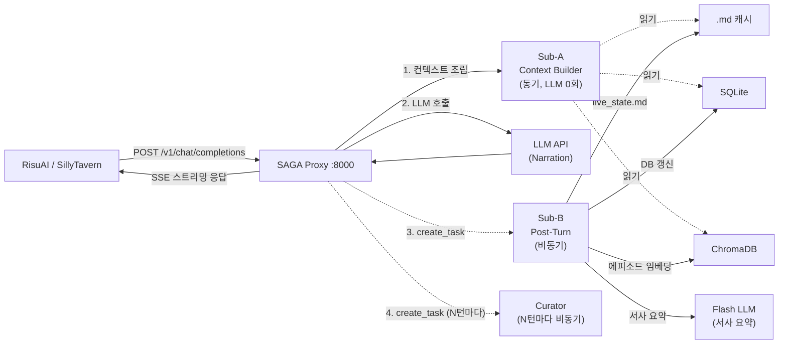

# SAGA — Stateful Context Engine for Narrative RP

장기 RP 세션에서 LLM이 서사를 잃지 않도록 구조화된 메모리와 프롬프트 캐싱을 제공하는 리버스 프록시.
RisuAI/SillyTavern에서 API Base URL만 바꾸면 동작한다. 프론트엔드 수정 없음.

| 지표 | 수치 |
|------|------|
| LOCOMO (ACL 2024) | Judge 2.02 → **3.12**/5 (+54%), multi-hop **4.71**/5 |
| LongMemEval (ICLR 2025) | 21.2% → **63.5%** (+42.3%p) |
| 캐시 적중률 (50턴) | **85.7%**, 비용 43.5% 절감 |

---

## 목차

1. [왜 만들었나](#왜-만들었나)
2. [.md 기반 컨텍스트 구조](#md-기반-컨텍스트-구조)
3. [에이전트는 큐레이션에만](#에이전트는-큐레이션에만)
4. [HypaMemory V3와 비교](#hypamemory-v3와-비교)
5. [LLM 1회 호출 구조](#llm-1회-호출-구조)
6. [프롬프트 캐싱](#프롬프트-캐싱)
7. [Flash 요약 재활용](#flash-요약-재활용)
8. [3-Agent 파이프라인](#3-agent-파이프라인)
9. [벤치마크](#벤치마크)
10. [스토리지 설계](#스토리지-설계)
11. [비용과 성능](#비용과-성능)
12. [빠른 시작](#빠른-시작)
13. [설정 레퍼런스](#설정-레퍼런스)
14. [API 레퍼런스](#api-레퍼런스)
15. [프로젝트 구조](#프로젝트-구조)
16. [참고 자료](#참고-자료)

---

## 왜 만들었나

RP 챗봇을 장기 세션으로 굴리면 50턴 전에 죽은 NPC가 다시 나타나고, 버린 아이템이 인벤토리에 남아 있고, 동쪽으로 이동했는데 서쪽 마을에 있다. 200K 토큰을 보내도 LLM이 50턴 전 세부사항을 기억하리라는 보장은 없고, 비용은 선형으로 늘어난다.

실제 장기 RP 유저의 현실:

```
max context 60K, HypaMemory ON, 메토비 0.15~0.20
→ 누적 30만 토큰 쯤부터 봇이 치매
→ "다음 장기챗할 때 이맘때쯤 슬슬 손요약해라"
→ NPC 리스트를 5만 토큰마다 수동으로 요약해서 로어북에 반영
```

기존 접근들의 한계:

| 접근 | 문제 |
|------|------|
| 정적 로어북 | 세계 상태가 변해도 세션 시작 시점 그대로 |
| 전체 히스토리 전송 | 토큰 낭비, 관련 없는 과거가 절반 |
| HypaMemory V3 | 대화 기억은 되지만 구조화된 상태 추적 불가, Anthropic 캐시를 깨뜨림 |
| Letta 에이전트 루프 | 턴당 3~5회 LLM 호출 → 유저가 전부 대기 |

SAGA의 선택은 메인 응답 경로에서 LLM을 한 번만 쓰는 것이다. 상태 추출은 경량 Flash 모델로 비동기 처리한다. 서사적 판단이 필요한 큐레이션(모순 탐지, 서사 압축)은 Letta 에이전트에게 맡기되, N턴마다 비동기로 실행한다.

---

## .md 기반 컨텍스트 구조

컨텍스트 저장 형식으로 마크다운을 쓴다. 지금 에이전트 시스템들을 보면 아키텍처는 다 다른데, 컨텍스트를 전달하는 최종 형식은 마크다운으로 수렴하고 있다.

| 시스템 | 컨텍스트 관리 |
|--------|--------------|
| Claude Code | CLAUDE.md, ~/.claude/memory/*.md |
| Cursor | .cursor/rules/*.mdc, .cursorrules |
| Codex | AGENTS.md, 마크다운 기반 지시 |
| Letta Code MemFS | memory/*.md + YAML frontmatter |

LLM 학습 데이터에 마크다운이 압도적으로 많아서 가장 잘 읽는 형식이고, 헤딩/리스트/테이블로 반구조화가 가능하고, YAML frontmatter로 메타데이터를 분리할 수 있고, 텍스트 기반이라 diff/캐싱에 유리하다.

Letta Code의 MemFS가 특히 비슷하다. Memory Block(단일 문자열)에서 git 기반 마크다운 파일 시스템으로 진화한 구조인데, SAGA의 stable_prefix.md + live_state.md + YAML frontmatter와 거의 같다. 차이는 편집 주체다 — MemFS는 에이전트가 LLM 호출로 편집하고, SAGA는 코드 로직(Sub-B)이 밀리초 단위로 편집한다.

---

## 에이전트는 큐레이션에만

RP에서 에이전트의 판단력이 진짜 필요한 곳이 어디인지 생각해보면:

- 매 턴 서사 요약 ("어떤 장면이었나, 누가 나왔나") → Flash LLM 4필드 요약으로 충분
- 매 턴 컨텍스트 조립 ("어떤 로어북이 관련 있나") → 점수 기반 필터링으로 충분
- N턴마다 서사 큐레이션 ("이 모순은 의도된 건가, 이 복선은 회수해야 하나") → 이전 판단을 기억하고 일관되게 이어가야 하므로 에이전트가 필요

그래서 Letta를 메인 루프에서 빼고 Curator에만 배치했다. 코딩 에이전트가 Notepad로 작업 맥락을 자기관리하듯, Letta Curator는 Memory Block으로 큐레이션 판단 이력을 자기관리한다.

```
코딩 에이전트 패턴:                    SAGA 적용:
┌──────────────┐                   ┌──────────────────┐
│ Agent        │                   │ Letta Curator     │
│  └ Notepad   │ <- 자기관리        │  └ Memory Block   │ <- 자기편집
│  └ 작업 실행  │                   │  └ 서사 판단       │
└──────────────┘                   └──────────────────┘
  "뭐가 중요하지?"                    "이 모순은 의도적인가?"
  "이전에 뭘 했지?"                   "지난 큐레이션에서 뭘 결정했지?"
```

메인 루프는 LLM 0회(Sub-A) + 1회(내레이션)로 최소 지연이고, Curator의 다회 호출은 N턴마다 비동기라 유저에게 영향 없다.

---

## HypaMemory V3와 비교

RisuAI 기본 메모리 시스템인 HypaMemory V3와 SAGA는 검색 구조가 비슷하다. 둘 다 오래된 턴을 요약하고, 벡터 검색으로 관련 기억을 골라 주입한다. 랭킹도 둘 다 RRF(k=60).

차이는 **캐싱과 서사 관리**.

### 검색: 거의 같다

| | HypaMemory V3 | SAGA |
|--|---------------|------|
| 요약 | 보조 AI에 6개씩 묶어서 요약 | Sub-B Flash 4필드 요약 |
| 유사도 | 코사인, paragraph chunk 단위 | 코사인, 에피소드 단위 |
| 랭킹 | `childToParentRRF`, k=60 | RRF, k=60 |
| 검색 풀 | Important → Recent(40%) → Similar(40%) → Random(20%) | Recent(1.2) → Important(1.0) → Similar(0.8) |

### 캐싱: 완전히 다르다

HypaMemory V3는 메모리를 system 메시지로 주입한다. 매 턴 Similar 검색 결과가 달라지니까 system 내용이 바뀌고, Anthropic prefix 캐시가 매번 깨진다.

소스코드 근거 ([`hypav3.ts`](https://github.com/kwaroran/RisuAI/blob/main/src/ts/process/memory/hypav3.ts)):
```typescript
// 매 턴 Similar 결과가 달라짐 → memory 문자열이 매번 다름
const newChats = [{
    role: "system",
    content: memory,        // ← 매 턴 변동
    memo: "supaMemory",
}, ...chats.slice(startIdx)]
```

Anthropic 핸들러가 이걸 user 메시지로 변환 ([`anthropic.ts`](https://github.com/kwaroran/RisuAI/blob/main/src/ts/process/request/anthropic.ts)):
```typescript
case 'system':
    if (claudeChat.length === 0) {
        systemPrompt += chat.content         // 첫 번째만 system
    } else {
        addClaudeChat({
            role: 'user',
            content: "System: " + chat.content   // 나머지는 user로 변환
        })
    }
```

SAGA는 압축과 검색을 분리했다:
- **MessageCompressor**: 오래된 턴을 불변 chunk로 압축 → 대화 안에 고정 (prefix 불변 → 캐시 유지)
- **Sub-A Context Builder**: 검색 결과를 마지막 user 메시지에 붙임 (prefix 밖 → 캐시 무관)

```
HypaMemory V3가 보내는 메시지:
  [system] 캐릭터 카드                       ← 캐싱 안 됨 (string 형식)
  [user]   "System: <Past Events..."         ← 매 턴 바뀜 → 캐시 깨짐
  [user]   Turn N ...

SAGA가 보내는 메시지:
  [system] 캐릭터 카드 (Stabilizer 고정)     ← BP1, 캐시됨
  [user+asst] chunk: Turn 1-8 요약           ← 불변, 캐시됨
  [user+asst] chunk: Turn 9-16 요약          ← 불변, BP2
  [user] Turn 17 ...
  [user] Turn 20 + [SAGA Dynamic]            ← 동적 컨텍스트는 맨 끝
```

| | HypaMemory V3 | SAGA |
|--|---------------|------|
| system 캐싱 | 안 됨 (string 형식) | BP1로 캐시 |
| 메모리 주입 위치 | system 뒤 (prefix 깨뜨림) | 마지막 user (prefix 밖) |
| chunk 안정성 | 매 턴 변동 | 불변 (immutable) |
| 캐시 히트율 (50턴) | 12.1% | **85.7%** |
| 비용 효과 | -11.4% (손해) | **43.5% 절감** |
| 요약 비용 | 매번 보조 AI 호출 | Sub-B turn_log 재활용 (LLM 0회) |

RisuAI의 `automaticCachePoint` 자동 캐싱도 마지막 user 3개에만 걸려서 턴 12 이후 무효화된다. system 프롬프트를 string으로 보내서 cache_control 자체를 붙일 수 없는 구조.

### 서사 관리: SAGA에만 있다

| 기능 | HypaMemory V3 | SAGA |
|------|:---:|:---:|
| 모순 탐지 (죽은 NPC 재등장 등) | X | O (Curator) |
| 복선 추적 / 서사 구간 분리 | X | O (Curator) |
| 로어 자동생성 | X | O (Curator) |
| NPC 레지스트리 + LLM dedup | X | O (Sub-B) |
| 구조화 요약 (4필드 JSON) | X | O |
| 프롬프트 캐싱 최적화 | X | O (3모듈) |

### 실제 유저 시나리오

```
HypaMemory 유저:
  max context 60K, HypaMemory ON
  → 30만 누적에서 치매
  → 5만마다 NPC 리스트 수동 요약 → 로어북 반영
  → 캐시 안 됨 → 매 턴 60K 전액 비용

SAGA 유저:
  max context 200K, HypaMemory OFF, SAGA ON
  → 치매 없음 (Curator가 서사 관리)
  → NPC 자동 추적 + 로어 자동생성
  → 85.7% 캐시 → 비용 43.5% 절감
  → 손요약 불필요
```

---

## LLM 1회 호출 구조

유저가 체감하는 지연은 LLM 1회 호출분뿐이다. 나머지는 전부 비동기.

```
유저 입력
  │
  ├─ [동기] Sub-A: DB 읽기 + 컨텍스트 조립 (LLM 0회, ~35ms)
  ├─ [동기] LLM 1회 호출 → SSE 스트리밍 응답
  │
  └─ 응답 반환 후 ─────────────────────────────────
      ├─ [비동기] Sub-B: Flash 서사 요약 1회 (유저 안 기다림)
      └─ [비동기] Curator: N턴마다 (유저 안 기다림)
```

비교:

```
[Letta 에이전트 루프]
유저 입력 → 기억 읽기 → 기억 편집 → 응답 생성 → 기억 재편집 → ...
           └─── 3~5회 LLM 호출, 유저가 전부 대기 ───┘

[SAGA]
유저 입력 → DB 검색 + 조립 → LLM 1회 → 응답 반환
                                      └─ (비동기) Flash 요약 + DB 갱신
```

에이전트의 판단력이 진짜 필요한 곳은 N턴마다의 서사 큐레이션(모순 탐지, 복선 추적)뿐이다. 매 턴 서사 요약은 Flash LLM 4필드 추출로 충분하고, 컨텍스트 조립은 점수 기반 필터링으로 충분하다.

---

## 프롬프트 캐싱

Anthropic 프롬프트 캐싱은 prefix가 바뀌면 전체 무효화된다. RP 프록시에서 이걸 유지하기 어려운 이유: Lorebook이 매 턴 바뀔 수 있고, 대화가 쌓이면 앞쪽이 잘리고, 동적 컨텍스트가 매 턴 다르다.

세 모듈이 각각 다른 위협에 대응한다:

```
위협 1: Lorebook 변경 → system 변경 → prefix 무효화
  └─ SystemStabilizer: canonical system 고정, delta를 user prepend로 분리

위협 2: 토큰 초과 → 앞쪽 메시지 트리밍 → prefix 변경
  └─ MessageCompressor: 트리밍 전에 오래된 턴을 immutable chunk로 먼저 압축

위협 3: 그래도 잘렸을 때 → 맥락 손실
  └─ WindowRecovery: hash 비교로 감지 → 잘린 턴 요약을 동적 영역에 주입
```

### SystemStabilizer

RisuAI는 매 턴 Lorebook을 system 메시지에 삽입한다. 엔트리 하나만 바뀌어도 system이 달라지고, BP1 캐시가 무효화된다.

첫 턴의 system을 "canonical"로 저장하고, 이후 턴에서 변경된 부분(delta)만 추출해서 system 밖으로 뺀다. system은 세션 내내 동일 → BP1 캐시 유지.

```
Turn 1: system = [세계관 + 캐릭터 + Lorebook A,B,C]  → canonical로 저장
Turn 5: system = [세계관 + 캐릭터 + Lorebook A,B,C,D] → D를 delta로 분리
         canonical(불변) + delta(D) → user prepend
```

### MessageCompressor

토큰이 임계값(context_max × 0.70)을 초과하면 오래된 턴을 immutable summary chunk로 치환한다:

```
원본: [system] [turn1] [turn2] ... [turn35]         (126K tokens)
압축: [system] [chunk: turns 1-8] [chunk: turns 9-16] [turn17] ... [turn35]
                ↑ immutable, BP2 고정
```

- chunk는 Sub-B의 Flash 요약을 재활용 (추가 LLM 호출 없음)
- chunk는 한번 만들면 절대 수정 안 함 → prefix 불변 → BP2 캐시 항상 히트
- 추가 압축 필요 시 새 chunk를 append할 뿐 기존 chunk는 건드리지 않음

### WindowRecovery

MessageCompressor에도 불구하고 메시지가 잘리면 보완한다:

1. 첫 non-system 메시지의 hash를 비교해서 윈도우 이동을 감지
2. 잘려나간 턴의 요약을 turn_log/ChromaDB에서 가져옴
3. 요약을 마지막 user 메시지에 prepend (캐시 prefix 밖)
4. shift 감지 직후 1회만 주입

### 캐싱 결과

E2E 50턴 검증 (Claude Haiku 4.5):

| 지표 | 수치 |
|------|------|
| 캐시 적중률 (Turn 2+) | 85.7% |
| 비용 절감 | 43.5% |
| 평균 레이턴시 | 6.1초 (50턴 내내 flat) |

```
프롬프트 토큰:  697 (Turn 1) → 32,292 (Turn 50)  ← 46배 증가
레이턴시:     4.0초 (Turn 1) →  5.5초 (Turn 50)  ← 1.4배만 증가
```

---

## Flash 요약 재활용

Sub-B가 매 턴 Flash LLM으로 생성하는 4필드 요약 하나가 시스템 전체에서 4곳에 재활용된다:

```
Sub-B: Flash LLM → { summary, npcs_mentioned, scene_type, key_event }
                          │
          ┌───────────────┼───────────────┬──────────────────┐
          ▼               ▼               ▼                  ▼
    turn_log (SQLite)  ChromaDB       MessageCompressor   WindowRecovery
    턴별 기록 저장     에피소드 임베딩   chunk 요약 원본     잘린 턴 복원
                          │
                          ▼
                    Context Builder
                    RRF 에피소드 검색
```

Flash 1회 요약 비용으로 4가지 기능을 커버한다. HypaMemory는 요약마다 별도 LLM 호출이 필요하다.

---

## 3-Agent 파이프라인

### 전체 요청 흐름


```mermaid
flowchart LR
    Client["RisuAI / SillyTavern"]

    Proxy["SAGA Proxy :8000"]
    SubA["Sub-A<br/>Context Builder<br/>(동기, LLM 0회)"]
    LLM["LLM API<br/>(Narration)"]
    SubB["Sub-B<br/>Post-Turn<br/>(비동기)"]
    Flash["Flash LLM<br/>(서사 요약)"]
    Curator["Curator<br/>(N턴마다 비동기)"]

    SQLite["SQLite"]
    Chroma["ChromaDB"]
    Cache[".md 캐시"]

    Client -- "POST /v1/chat/completions" --> Proxy
    Proxy -- "1. 컨텍스트 조립" --> SubA
    SubA -. "읽기" .-> Cache
    SubA -. "읽기" .-> SQLite
    SubA -. "읽기" .-> Chroma

    Proxy -- "2. LLM 호출" --> LLM
    LLM --> Proxy
    Proxy -- "SSE 스트리밍 응답" --> Client

    Proxy -. "3. create_task" .-> SubB
    Proxy -. "4. create_task (N턴마다)" .-> Curator

    SubB -- "서사 요약" --> Flash
    SubB -- "DB 갱신" --> SQLite
    SubB -- "에피소드 임베딩" --> Chroma
    SubB -- "live_state.md" --> Cache
```

턴마다 일어나는 일:

```
1. 세션 ID 추출 (@@SAGA sentinel → X-SAGA-Session-ID 헤더 → user 필드 → system SHA256)
2. [동기] SystemStabilizer: canonical system 고정 + Lorebook delta 분리
3. [동기] MessageCompressor: 토큰 임계값 초과 시 오래된 턴을 immutable chunk로 치환
4. [동기] WindowRecovery: 슬라이딩 윈도우 감지 + 잘린 턴 요약 준비
5. [동기] Sub-A: .md 캐시 + ChromaDB RRF 검색 + SQLite 로어 → 토큰 예산 내 조립
6. LLM 1회 호출 → SSE 스트리밍 응답
7. [비동기] Sub-B: Flash 서사 요약 → 에피소드 기록 → NPC 레지스트리 → live_state.md
8. [비동기, N턴마다] Curator: 모순 탐지 → 서사 압축 → 로어 자동생성
```

### Sub-A: Context Builder

매 턴 동기 실행, LLM 호출 없음.

에피소드 검색은 3-Stage RRF:

| Stage | 소스 | 가중치 |
|-------|------|--------|
| Recent | `get_recent_episodes(n=10)` | 1.2 |
| Important | `search_important_episodes(≥40, n=10)` | 1.0 |
| Similar | `search_episodes(query, n=15)` | 0.8 |

세 소스를 `asyncio.gather`로 병렬 실행하고, 부분 실패해도 나머지로 동작한다.

### Sub-B: Post-Turn

매 턴 비동기 실행. SSE 완료 후 BackgroundTask로 동작.

```
Flash LLM → 4필드 JSON { summary, npcs_mentioned, scene_type, key_event }
  ↓
Importance 스코어링: base 10 + scene_type(combat +40, event +35) + key_event +30 + NPC +10/명
  ↓
ChromaDB 에피소드 기록
  ↓
NPC 레지스트리 갱신 (alias match → exact match → LLM dedup)
  ↓
live_state.md 갱신
```

**NPC dedup**: 괄호에서 alias 추출 ("루비아(Rubia)" → alias 자동 등록) + LLM 판단으로 한/영/별명 통합. 규칙 기반 정규화 대신 Flash LLM이 "같은 캐릭터인가?" 판단.

### Curator

N턴마다(기본 10턴) 비동기 실행. Letta Memory Block으로 큐레이션 판단 이력을 자기관리한다.

하는 일:
- 모순 탐지: 죽은 NPC 재등장, 타임라인 불일치 등
- 서사 압축: 50턴 이상에서 stable_prefix.md가 비어있으면 강제 압축
- 로어 자동생성: 로어가 없는 엔티티에 대해 자동 생성

Letta primary → Direct LLM fallback 이중 구조. Letta가 죽어도 큐레이션은 계속된다.

실제 로그 (요트 살인 미스터리 시나리오, Turn 10):

```
[Curator] Contradiction: character_identity
  "Turn 5 '이름 모를 남성' 사망 → Turn 6-7 MacNamara로 확인
   → NPC 목록에 둘 다 HP:100 생존"

[Curator] Contradiction: character_duplication
  "Johnson(영문)과 존슨(한글)이 별도 NPC → 동일 인물, 통합 권장"

[Curator] Contradiction: timeline_confusion
  "'Mac을 침대에서 살해' vs 'MacNamara 이미 사망 발견' → 시간순서 모순"
```

---

## 벤치마크

동일 모델(gemini-2.5-flash), 동일 조건 A/B 비교. 모델을 바꾼 게 아니라 컨텍스트에 어떤 정보를 넣느냐만 다르다.

### LOCOMO (ACL 2024)

304 QA, 2개 대화. Baseline: 최근 60턴 truncation. SAGA: 최근 10턴 + ChromaDB 검색.

| Category | N | Baseline | SAGA | Delta |
|----------|---|----------|------|-------|
| **Overall** | 304 | 2.02 | **3.12** | +1.10 |
| multi-hop | 63 | 3.08 | **4.71** | +1.63 |
| single-hop | 43 | 2.21 | **3.49** | +1.28 |
| adversarial | 71 | 1.48 | **2.58** | +1.10 |

multi-hop 4.71/5가 눈에 띈다. 여러 세션에 걸친 정보를 조합하는 문제도 벡터 검색 + RRF로 잡힌다.

### LongMemEval (ICLR 2025)

499 QA, 인스턴스당 ~53세션. Baseline: 마지막 10세션 truncation. SAGA: 질문 관련 상위 10세션 검색.

| Type | N | Baseline | SAGA | Delta |
|------|---|----------|------|-------|
| **Overall** | 499 | 21.2% | **63.5%** | +42.3%p |
| single-session-assistant | 56 | 19.6% | **89.3%** | +69.6%p |
| multi-session | 133 | 12.0% | **57.1%** | +45.1%p |
| temporal-reasoning | 132 | 9.1% | **50.8%** | +41.7%p |

### 프롬프트 캐싱 (50턴 E2E)

| 모드 | 히트율 | 비용 효과 |
|------|:------:|:---------:|
| SAGA 3-BP + 1h TTL | **85.7%** | **43.5% 절감** |
| RisuAI 자동 캐싱 | 12.1% | -11.4% (손해) |
| 캐시 없음 | 0% | 기준선 |

---

## 스토리지 설계

| 스토리지 | 용도 |
|----------|------|
| SQLite (`db/state.db`) | 세션, 턴 로그, NPC, 관계, 로어, 이벤트 큐 |
| ChromaDB (`db/chroma/`) | 에피소드 기억, 로어북 시맨틱 검색 |
| .md 캐시 (`cache/sessions/`) | `stable_prefix.md`(세계관, 캐시용), `live_state.md`(현재 상태) |

컨텍스트 저장 형식으로 마크다운을 쓴다. LLM이 가장 잘 읽는 형식이고, 헤딩/리스트/테이블로 반구조화가 가능하고, diff/캐싱에 유리하다.

### 컨텍스트 조립 구조

```
[--- Lost Turn Summary ---]    ← WindowRecovery (잘린 턴 요약, 동적 영역)
Turn 1: 던전 입구 도착, 루비아와 첫 만남

[--- SAGA Context Cache ---]   ← stable_prefix.md (세계관/캐릭터, 캐시됨)
세계관, 캐릭터 설정 ...

[--- Active Lorebook ---]      ← SystemStabilizer가 분리한 동적 delta

[--- SAGA Dynamic ---]         ← live_state.md + 에피소드
## 현재 상태
- 위치: 어둠의 숲, HP: 85/100

[에피소드 기억]                ← ChromaDB 3-stage RRF 결과
[!] Turn 3: 어둠의 숲 진입, 고블린 족장과 조우
```

---

## 비용과 성능

### 모델별 역할

| 작업 | 모델 | 호출 빈도 |
|------|------|-----------|
| 내레이션 | Claude Haiku 4.5 | 매 턴 1회 |
| 서사 요약 | Gemini Flash Lite | 매 턴 1회 (비동기) |
| 큐레이션 | Claude Sonnet 4.5 via Letta | N턴마다 (비동기) |
| 임베딩 | text-embedding-3-small | 매 턴 (비동기) |

100턴 기준: 내레이션 100회 + Flash 추출 100회 + 큐레이션 10회.

### 50턴 데모 — Curator 큐레이션 진화

실제 RP 세션(마왕24 던전주 시나리오)을 50턴 돌린 결과:

| 스냅샷 | NPC | 복선 | 비고 |
|--------|:---:|:----:|------|
| Turn 10 | 2명 | 3개 | 첫 큐레이션 — 루비아 감정 변화 포착 |
| Turn 20 | 3명 | 태깅 | 한결 등장, 계약 무효 위기 |
| Turn 30 | 6명 | 회수 | "계약 기억상실" Turn 25-27에서 회수 감지 |
| Turn 40 | 3명 | 4개 | 새벽 고백, 면담 진행 중 |
| Turn 50 | 9명 | [회수됨] | 계약 승인, 희원 등장. 서사 8구간 |

Turn 5의 "루비아 뺨이 붉어짐"이 Turn 50에서도 서사 구간에 남아 있다. 슬라이딩 윈도우로 해당 메시지가 컨텍스트에서 잘려도 큐레이션 결과는 DB에 남아서 다시 주입된다.

### 비용 추적

매 LLM 호출마다 토큰 사용량과 비용을 SQLite에 기록한다. `/api/cost` 엔드포인트로 세션별/전체 집계 조회 가능.

### Observability

`@traceable` 데코레이터로 전체 파이프라인을 LangSmith에 트레이싱. `LANGSMITH_TRACING=true`로 활성화.

---

## 빠른 시작

```bash
pip install -r requirements.txt
cp config.example.yaml config.yaml
# config.yaml에서 API 키 설정
python -m saga
```

기본 포트 `8000`.

### RisuAI 설정

1. API Base URL을 `http://localhost:8000`으로 변경
2. max context를 모델 한계까지 올림 (Claude: 200K)
3. HypaMemory OFF
4. 끝

Curator(모순 탐지, 서사 압축)를 쓰려면 Letta 서버 필요:

```bash
docker compose -f docker-compose.letta.yaml up -d
```

Letta 없이도 SAGA는 정상 동작하고, 큐레이션만 비활성화된다.

---

## 설정 레퍼런스

```yaml
server:
  host: "0.0.0.0"
  port: 8000
  api_key: ""                   # Bearer 토큰. 빈 문자열 = 비활성화

models:
  narration: "claude-haiku-4-5-20251001"
  extraction: "gemini-2.5-flash-lite"
  curator: "claude-sonnet-4-5-20250929"
  embedding: "text-embedding-3-small"

token_budget:
  total_context_max: 180000     # RisuAI max context에 맞춤 권장
  dynamic_context_max: 4000

prompt_caching:
  enabled: true
  strategy: "md_prefix"
  stabilize_system: true
  cache_ttl: "1h"
  compress_enabled: true
  compress_threshold_ratio: 0.70
  min_compress_turns: 5
  max_summary_ratio: 0.20

curator:
  interval: 10
  enabled: true
  compress_story_after_turns: 50
  letta_base_url: "http://localhost:8283"
```

---

## API 레퍼런스

### 메인

```
POST /v1/chat/completions    # OpenAI Chat Completions 호환, stream: true
```

### Admin

| 엔드포인트 | 메서드 | 설명 |
|-----------|--------|------|
| `/health` | GET | 헬스 체크 |
| `/api/status` | GET | 서버 상태 |
| `/api/sessions` | GET | 세션 목록 |
| `/api/sessions/{id}/state` | GET | 세션 상태 |
| `/api/sessions/{id}/graph` | GET | 캐릭터/관계 그래프 |
| `/api/sessions/{id}/cache` | GET | .md 캐시 상태 |
| `/api/sessions/{id}/turns` | GET | 턴 로그 |
| `/api/sessions/{id}/reset` | POST | 세션 초기화 |
| `/api/memory/search` | GET | 벡터 메모리 검색 |
| `/api/cost` | GET | 비용 집계 |
| `/api/cost/{session_id}` | GET | 세션별 비용 |

---

## 프로젝트 구조

```
saga/
  server.py                # FastAPI + OpenAI-compatible 엔드포인트 + SSE
  config.py                # Pydantic 설정 + YAML 로더
  system_stabilizer.py     # canonical system 고정 + Lorebook delta 분리
  message_compressor.py    # immutable summary chunk + BP2 안정화
  window_recovery.py       # 슬라이딩 윈도우 감지 + 요약 복구
  cost_tracker.py          # 모델별 비용 추적
  llm/
    client.py              # Anthropic/Google/OpenAI + LangSmith
  agents/
    context_builder.py     # Sub-A: RRF 에피소드 검색 + 토큰 예산 조립
    post_turn.py           # Sub-B: Flash 요약 + NPC LLM dedup + live_state
    extractors.py          # Flash 4필드 JSON 추출기
    curator.py             # Curator: 모순 탐지 + 서사 압축 + 로어 자동생성
  storage/
    sqlite_db.py           # SQLite 9 테이블
    vector_db.py           # ChromaDB (에피소드 + 로어북)
    md_cache.py            # stable_prefix.md + live_state.md (원자적 쓰기)
  adapters/
    curator_adapter.py     # Letta primary / Direct LLM fallback
benchmarks/
  run_locomo.py            # LOCOMO (ACL 2024)
  longmemeval/run.py       # LongMemEval (ICLR 2025)
tests/                     # unit 13 + bench 2 + e2e 4
```

---

## 참고 자료

**[1]** Packer et al. (2023). *MemGPT: Towards LLMs as Operating Systems.* [arXiv:2310.08560](https://arxiv.org/abs/2310.08560)

**[2]** 코히바블랙. (2025). *Letta를 이용한 장기기억 향상 연구.* [아카라이브](https://arca.live/b/characterai/162255622)

**[3]** Edge et al. (2024). *From Local to Global: A Graph RAG Approach.* [arXiv:2404.16130](https://arxiv.org/abs/2404.16130)

**[4]** Lewis et al. (2020). *Retrieval-Augmented Generation.* NeurIPS 2020. [arXiv:2005.11401](https://arxiv.org/abs/2005.11401)

**[5]** Zheng et al. (2023). *Judging LLM-as-a-Judge.* NeurIPS 2023. [arXiv:2306.05685](https://arxiv.org/abs/2306.05685)

**[6]** Wang et al. (2025). *LongMemEval.* ICLR 2025. [HuggingFace](https://huggingface.co/datasets/xiaowu0162/longmemeval-cleaned)

**[7]** Letta. (2025). *MemFS: Memory as a File System.* [docs.letta.com](https://docs.letta.com/letta-code/memory)

**[8]** HypaMemory V3 소스코드. [kwaroran/RisuAI](https://github.com/kwaroran/RisuAI/blob/main/src/ts/process/memory/hypav3.ts)
