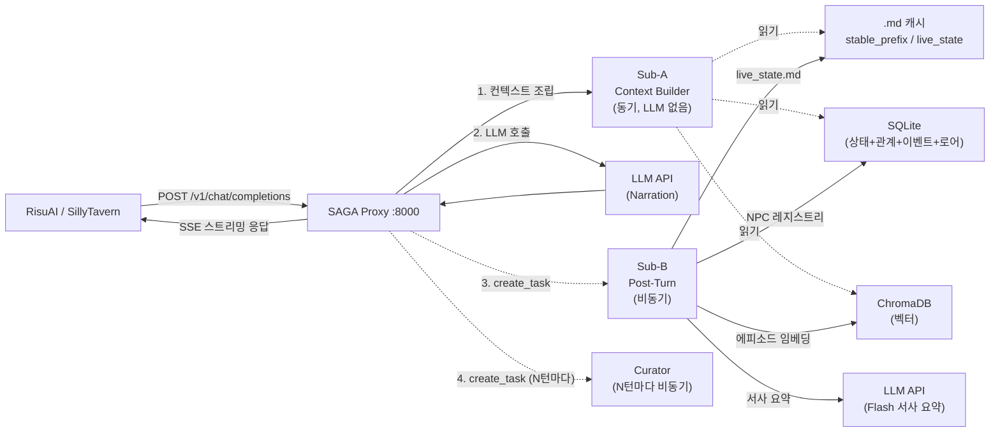

# SAGA -- Stateful Context Engine for RP

OpenAI-compatible 프록시. RisuAI나 SillyTavern에서 API Base URL만 바꾸면 동작한다.

매 턴 LLM은 딱 한 번만 호출된다. 상태 추출과 DB 갱신은 응답을 클라이언트에 보낸 후 비동기로 처리하므로 유저가 기다리는 시간은 없다. 프론트엔드 수정도 없다.

---

## 벤치마크

| 벤치마크 | 규모 | Baseline | SAGA | 비고 |
|----------|------|----------|------|------|
| LOCOMO (ACL 2024) | 304 QA, 2개 대화 | Judge 2.02/5 | 3.12/5 (+54%) | multi-hop 4.71/5 |
| LongMemEval (ICLR 2025) | 499 QA, 인스턴스당 ~53세션 | 21.2% | 63.5% (+42.3%p) | truncation vs retrieval |

동일 모델(gemini-2.5-flash), 동일 조건 A/B 비교. Baseline은 최근 대화를 그대로 잘라 넣고(truncation), SAGA는 벡터 검색으로 질문과 관련된 대화만 골라 넣는다(retrieval). 모델을 바꾼 게 아니라 컨텍스트에 어떤 정보를 넣느냐만 다르다.

SAGA 쪽이 유리한 구조적 이유:
- **관련성 기반 선별**: 최근 N개를 무조건 넣는 대신, 벡터 유사도로 실제 필요한 대화를 골라냄
- **Context Builder의 RRF 랭킹**: Recent + Important + Similar 3-stage 검색 결과를 Reciprocal Rank Fusion으로 통합 정렬하고, 토큰 예산 내에서 우선순위 패킹
- **Sub-B 서사 요약**: 대화 원문이 아니라 Flash LLM이 요약한 에피소드를 저장하므로, 검색 품질이 raw text 대비 높음
- **.md 캐시 구조**: stable_prefix.md(세계관/캐릭터)와 live_state.md(현재 상태)로 컨텍스트를 구조화하여 LLM이 참조하기 쉬운 형태로 제공

---

## 목차

1. [SAGA를 만든 동기](#왜-만들었나)
2. [워크플로우](#어떻게-동작하나)
3. [3-Agent 파이프라인](#3-agent-파이프라인)
4. [스토리지 설계](#스토리지-설계)
5. [비용과 성능](#비용과-성능)
6. [벤치마크: LOCOMO](#벤치마크-locomo-acl-2024)
7. [벤치마크: LongMemEval](#벤치마크-longmemeval-iclr-2025)
8. [빠른 시작](#빠른-시작)
9. [설정 레퍼런스](#설정-레퍼런스)
10. [API 레퍼런스](#api-레퍼런스)
11. [프로젝트 구조](#프로젝트-구조)
12. [참고 자료](#참고-자료)

---

## SAGA를 만든 동기

RP 챗봇을 장기 세션으로 굴리다 보면 구조적인 문제에 부딪힌다. 50턴 전에 죽은 NPC가 다시 나타나고, 버린 아이템이 인벤토리에 남아 있고, 동쪽으로 이동했는데 서쪽 마을에 있다. 이걸 컨텍스트 창 크기로 해결하려 해봤자 한계가 있다. 200K 토큰을 보내도 LLM이 50턴 전 세부사항을 정확히 기억하리라는 보장은 없고, 비용은 선형으로 늘어난다.

기존 접근들의 문제:

- **정적 로어북**: 세계 상태가 변해도(마을 파괴, NPC 사망) 로어북은 세션 시작 시점 그대로다.
- **전체 히스토리 전송**: 토큰 낭비 심하고, 관련 없는 과거 대화가 절반을 차지하는 경우가 많다.
- **Hyper Memory 계열**: 대화 기억은 되지만 HP, 위치, 관계 그래프 같은 구조화된 상태 추적은 안 된다.
- **Letta 에이전트 루프**: 에이전트가 자기편집을 위해 턴당 3~5회 LLM을 호출한다. 강력하지만 유저가 전부 기다려야 한다.

```
[Letta 에이전트 루프]
유저 입력 -> (1) 기억 읽기 -> (2) 기억 편집 -> (3) 응답 생성 -> (4) 기억 재편집 -> ...
           └─── 3~5회 LLM 호출, 유저가 전부 대기 ───┘

[SAGA]
유저 입력 -> DB 검색 + 프롬프트 조립 -> LLM 1회 호출 -> 응답 반환
                                                    └─ (비동기) 상태 추출 + DB 갱신
```

SAGA의 선택은 메인 응답 경로에서 LLM을 한 번만 쓰는 것이다. 상태 추출은 경량 Flash 모델로 비동기 처리한다. 서사적 판단이 필요한 큐레이션(모순 탐지, 서사 압축)은 Letta 에이전트에게 맡기되, N턴마다 비동기로 실행한다.

### .md 기반 컨텍스트 구조

컨텍스트 저장 형식으로 마크다운을 쓴다. 지금 에이전트 시스템들을 보면 아키텍처는 다 다른데, 컨텍스트를 전달하는 최종 형식은 마크다운으로 수렴하고 있다.

| 시스템 | 컨텍스트 관리 |
|--------|-------------|
| Claude Code | `CLAUDE.md`, `~/.claude/memory/*.md` |
| Cursor | `.cursor/rules/*.mdc`, `.cursorrules` |
| Codex | `AGENTS.md`, 마크다운 기반 지시 |
| Letta Code MemFS [[7]](#ref-7) | `memory/*.md` + YAML frontmatter |

LLM 학습 데이터에 마크다운이 압도적으로 많아서 가장 잘 읽는 형식이고, 헤딩/리스트/테이블로 반구조화가 가능하고, YAML frontmatter로 메타데이터를 분리할 수 있고, 텍스트 기반이라 diff/캐싱에 유리하다.

Letta Code의 MemFS [[7]](#ref-7)가 특히 비슷하다. Memory Block(단일 문자열)에서 git 기반 마크다운 파일 시스템으로 진화한 구조인데, SAGA의 `stable_prefix.md` + `live_state.md` + YAML frontmatter와 거의 같다. 차이는 편집 주체다 — MemFS는 에이전트가 LLM 호출로 편집하고, SAGA는 코드 로직(Sub-B)이 밀리초 단위로 편집한다.

### 에이전트는 큐레이션에만

RP에서 에이전트의 판단력이 진짜 필요한 곳이 어디인지 생각해보면:

- 매 턴 서사 요약 ("어떤 장면이었나, 누가 나왔나") → Flash LLM 4필드 요약으로 충분
- 매 턴 컨텍스트 조립 ("어떤 로어북이 관련 있나") → 점수 기반 필터링으로 충분
- N턴마다 서사 큐레이션 ("이 모순은 의도된 건가, 이 복선은 회수해야 하나") → 이전 판단을 기억하고 일관되게 이어가야 하므로 에이전트가 필요

그래서 Letta를 메인 루프에서 빼고 Curator에만 배치했다. 코딩 에이전트가 Notepad로 작업 맥락을 자기관리하듯, Letta Curator는 Memory Block으로 큐레이션 판단 이력을 자기관리한다.

```
코딩 에이전트 패턴:                    SAGA 적용:
┌──────────────┐                   ┌──────────────────┐
│ Agent        │                   │ Letta Curator     │
│  └ Notepad   │ <- 자기관리        │  └ Memory Block   │ <- 자기편집
│  └ 작업 실행  │                   │  └ 서사 판단       │
└──────────────┘                   └──────────────────┘
  "뭐가 중요하지?"                    "이 모순은 의도적인가?"
  "이전에 뭘 했지?"                   "지난 큐레이션에서 뭘 결정했지?"
```

메인 루프는 LLM 0회(Sub-A) + 1회(내레이션)로 최소 지연이고, Curator의 다회 호출은 N턴마다 비동기라 유저에게 영향 없다.

### 관련 선행 연구

SAGA가 참고한 연구들:

- **MemGPT / Letta** [[1]](#ref-1) — LLM에 가상 메모리 계층을 부여하는 OS 패러다임. SAGA Curator의 Memory Block 자기편집 패턴을 여기서 차용했다.
- **코히바블랙** [[2]](#ref-2) — Letta 에이전트 루프를 RP에 적용한 실전 사례. 효과는 검증됐지만 다회 호출 지연이 실용적 한계임을 실증했다. SAGA가 "1회 호출 + 비동기" 구조를 선택하게 된 직접적인 계기다.
- **Graph RAG** [[3]](#ref-3) — 벡터 검색에 그래프 구조를 결합한 Microsoft Research 논문. "구조화된 관계 + 벡터 검색 병합" 설계 방향에 영향을 줬다. SAGA는 정규화된 SQLite 테이블 + ChromaDB로 이를 구현했다.
- **RAG** [[4]](#ref-4), **LLM-as-a-Judge** [[5]](#ref-5), **LongMemEval** [[6]](#ref-6), **Letta MemFS** [[7]](#ref-7)

---

## 워크플로우

### 전체 요청 흐름


```mermaid
flowchart LR
    Client["RisuAI / SillyTavern"]

    Proxy["SAGA Proxy :8000"]
    SubA["Sub-A<br/>Context Builder<br/>(동기, LLM 없음)"]
    LLM["LLM API<br/>(Narration)"]
    SubB["Sub-B<br/>Post-Turn<br/>(비동기)"]
    Flash["LLM API<br/>(Flash 서사 요약)"]
    Curator["Curator<br/>(N턴마다 비동기)"]

    SQLite["SQLite<br/>(상태+관계+이벤트+로어)"]
    Chroma["ChromaDB<br/>(벡터)"]
    Cache[".md 캐시<br/>stable_prefix / live_state"]

    Client -- "POST /v1/chat/completions" --> Proxy
    Proxy -- "1. 컨텍스트 조립" --> SubA
    SubA -. "읽기" .-> Cache
    SubA -. "읽기" .-> SQLite
    SubA -. "읽기" .-> Chroma

    Proxy -- "2. LLM 호출" --> LLM
    LLM --> Proxy
    Proxy -- "SSE 스트리밍 응답" --> Client

    Proxy -. "3. create_task" .-> SubB
    Proxy -. "4. create_task (N턴마다)" .-> Curator

    SubB -- "서사 요약" --> Flash
    SubB -- "NPC 레지스트리" --> SQLite
    SubB -- "에피소드 임베딩" --> Chroma
    SubB -- "live_state.md" --> Cache
```

턴마다 일어나는 일을 순서대로 정리하면:

```
1. 세션 ID 추출 (@@SAGA: plugin sentinel -> X-SAGA-Session-ID 헤더 -> user 필드 -> 시스템 메시지 SHA256 해시 앞 16자)
2. 세션 없으면 신규 생성 (SQLite + .md 캐시 초기화)
3. [동기] SystemStabilizer: canonical system 고정 + Lorebook delta 분리
4. [동기] MessageCompressor: 토큰 임계값 초과 시 오래된 턴을 immutable summary chunk로 치환
5. [동기] WindowRecovery: 슬라이딩 윈도우 감지 + 잘려나간 턴 요약 준비
6. [동기] Sub-A: .md 캐시 읽기 -> ChromaDB 에피소드 검색 + SQLite 로어 조회 -> 토큰 예산 내 조립
7. Anthropic cache_control: ephemeral (1h TTL) 적용
8. LLM 1회 호출
9. SSE 스트리밍으로 클라이언트에 응답 반환
10. 턴 카운터 증가
11. [비동기] Sub-B: Flash 서사 요약 -> ChromaDB 에피소드 기록 -> NPC 레지스트리 갱신 -> live_state.md 갱신
12. [비동기, N턴마다] Curator: 모순 탐지 -> 서사 압축 -> 로어 자동생성
```

Sub-A는 읽기만, Sub-B는 쓰기만 한다. LLM 호출은 Proxy가 직접 한다. Sub-B와 Curator는 서로 독립적으로 `asyncio.create_task()`된다.

### 컨텍스트 조립 구조

Sub-A가 조립한 컨텍스트는 다음 형태로 LLM에 전달된다:

```
[--- Lost Turn Summary ---]    <- WindowRecovery 요약 (슬라이딩 윈도우로 잘려나간 턴)
Turn 1: 던전 입구 도착, 루비아와 첫 만남
Turn 3: 고블린 전투, HP 85로 감소

[--- SAGA Context Cache ---]   <- stable_prefix.md (세계관/캐릭터, 거의 안 변함)
세계관, 캐릭터 설정 ...

[--- Active Lorebook ---]      <- lorebook_delta (SystemStabilizer가 분리한 동적 로어)
### 어둠의 숲
에르시아 변방의 위험한 숲...

[--- SAGA Dynamic ---]         <- dynamic_suffix (live_state + 에피소드)
---
turn: 5
---

## 현재 상태                   <- live_state.md
- 위치: 어둠의 숲
- HP: 85/100

[에피소드 기억]                <- ChromaDB 3-stage RRF 검색 결과
[!] Turn 3: 어둠의 숲 진입, 고블린 족장과 조우
[R] Turn 1: 마을 광장에서 의뢰 수락
```

Claude를 쓸 때는 세 섹션을 모두 마지막 user 메시지에 prepend한다. 시스템 메시지를 건드리지 않으므로 BP1~BP3 프롬프트 캐시가 유지된다. 비-Claude 경로는 시스템 메시지에 합쳐 넣는다.

에피소드 검색은 ChromaDB 3-stage + Reciprocal Rank Fusion이다. Recent(최근 턴, 가중치 1.2), Important(중요도 높은 에피소드, 1.0), Similar(현재 맥락과 유사한 에피소드, 0.8)를 각각 뽑아서 `score += weight / (k + rank + 1)` 공식으로 통합 랭킹한다. 동적 컨텍스트 예산은 기본 4,000 토큰이고, 에피소드 최대 10개(개별 500자 cap), 로어 최대 5개(개별 800자 cap)로 채운다.

---

## 3-Agent 파이프라인

### Sub-A: Context Builder

매 턴 동기 실행, LLM 호출 없음. 밀리초 단위가 목표다.

```
1. stable_prefix.md 읽기 (캐시됨)
   ▼
2. live_state.md 읽기 (매 턴 갱신됨)
   ▼
3. ChromaDB 3-stage 에피소드 검색 (Recent + Important + Similar) + RRF
   ▼
4. SQLite 로어 조회 + ChromaDB 벡터 검색 병합
   ▼
5. 토큰 예산 내 패킹
출력: { md_prefix, dynamic_suffix }
```

### Sub-B: Post-Turn (Flash 서사 요약)

매 턴 비동기 실행. SSE 스트리밍 완료 후 Starlette `BackgroundTask`로 실행된다.

```
1. Flash LLM으로 4필드 JSON 추출
   { summary, npcs_mentioned, scene_type, key_event }
   ▼
2. Importance 스코어링
   base 10점 + scene_type 가중치 (combat +40, event +35, exploration +15, dialogue +0)
   + key_event +30, NPC 등장 +10/명 (최대 2명) -> 0~100점
   ▼
3. ChromaDB 에피소드 기록 (importance >= 40은 Important 검색 대상)
   ▼
4. NPC 레지스트리 갱신 (SQLite characters 테이블, 3-Layer 이름 해소: 정규화 → fuzzy → cross-script romanization)
   ▼
5. SQLite 턴 로그 기록
   ▼
6. live_state.md 갱신 (위치, HP, 기분, 주변 NPC, 최근 이벤트)
```

Flash 서사 요약 출력 예시:

```json
{
  "summary": "나그네가 위지 가문의 저택에 도착하여 소연과 첫 대면. 할아버지의 유언과 일기장을 언급하며 도움을 요청했다.",
  "npcs_mentioned": ["위지소연", "당채련"],
  "scene_type": "dialogue",
  "key_event": "할아버지의 유언 공개"
}
```

초기에는 메인 LLM에게 12필드 상태 블록을 출력하도록 지시하고 regex로 파싱하는 방식을 시도했는데, 추출 정확도가 불안정하고 메인 LLM에서 270~400 tok/턴을 낭비했다. 지금 방식은 메인 LLM에 아무 지시도 추가하지 않는다.

`asyncio.Lock`으로 이전 Sub-B 완료를 대기한 뒤 실행하므로, 빠른 연속 턴에서 DB 경합이 생기지 않는다.

### Curator

N턴마다(기본 10턴) 비동기 실행. 서사 품질 관리 담당이다.

하는 일: 모순 탐지(죽은 NPC 재등장, 파괴된 아이템 재사용 등 — 위치 이동이나 감정 변화는 모순으로 취급하지 않음), 장기 서사 압축(50턴 이상 + stable_prefix.md가 비어있을 때), 이벤트 스케줄링(SQLite event_queue에 저장).

Letta Memory Block(`narrative_summary`, `curation_decisions`, `contradiction_log`)을 가진 에이전트가 매 큐레이션마다 자기편집한다. `message_buffer_autoclear=True`로 대화 히스토리를 매 호출 초기화해서 토큰 누적을 막는다. Letta 실패 시 직접 LLM 호출로 폴백한다.

Letta의 자기편집 패턴을 비동기 후처리에서만 쓰는 게 핵심이다. 메인 응답 경로에서는 Letta를 호출하지 않으므로 Step Loop 지연이 없다.

Curator 실행 로그 예시 (요트 살인 미스터리 시나리오, Turn 10):

```
[Curator] Memory Block updates: 4 succeeded, 0 failed
[Curator] Contradiction fix: {
  type: character_identity, severity: medium,
  description: "Turn 5 '이름 모를 남성'이 요트 침대에서 칼 맞고 사망
    → Turn 6-7에서 같은 시신이 MacNamara로 확인됨
    → 그러나 NPC 목록에 둘 다 HP:100/100으로 살아있음",
  resolution: "NPC 그래프에서 '이름 모를 남성'을 삭제하거나
    MacNamara의 HP를 0으로 변경 권장"
}
[Curator] Contradiction fix: {
  type: character_duplication, severity: low,
  description: "Johnson(영문)과 존슨(한글)이 별도 NPC로 등록됨",
  resolution: "동일 인물이므로 하나로 통합 권장 (Johnson으로 통일)"
}
[Curator] Contradiction fix: {
  type: timeline_confusion, severity: medium,
  description: "Turn 9에서 화자가 'Mac을 Camels 침대에서 살해'했다고 언급
    vs Turn 7에서 Johnson이 '이미 죽은 MacNamara 발견'
    → Mac과 MacNamara가 동일인이라면 시간순서 모순",
  resolution: "Mac ≠ MacNamara로 별도 인물로 처리하거나,
    Turn 9가 과거 회상임을 명시해야 함"
}
```

한 번의 Curator 실행에서 캐릭터 동일성(`이름 모를 남성 = MacNamara`), 영/한 중복 등록(`Johnson = 존슨`), 타임라인 모순(살해 시점 불일치)을 동시에 탐지한다. 이런 판단은 이전 큐레이션 이력을 참조해야 일관되므로 Memory Block을 가진 에이전트가 필요한 부분이다.

---

## 스토리지 설계

SQLite, ChromaDB, .md 캐시 세 가지를 같이 쓴다.

SQLite(`db/state.db`)는 세션 메타, 턴 로그, 세계 상태 KV, 이벤트 큐, 캐릭터/관계/장소/이벤트/로어를 담는다. 트랜잭션과 빠른 조회가 필요한 것들이다.

ChromaDB(`db/chroma/`)는 벡터 유사도 검색용이다. 로어북 시맨틱 검색과 에피소드 기억 저장에 쓴다.

.md 캐시(`cache/sessions/{session_id}/`)는 `stable_prefix.md`와 `live_state.md` 두 파일이다. 프롬프트 캐싱의 안정적 프리픽스로 사용된다.

### SQLite 테이블 (9개)

| 테이블 | 용도 |
|--------|------|
| sessions | 세션 메타 |
| world_state | 세계 상태 KV 저장소 |
| event_queue | 이벤트 큐 |
| turn_log | 턴 로그 |
| characters | PC + NPC 상태 (현재 NPC 이름 등록만 구현, HP/위치/기분 업데이트는 미구현) |
| relationships | NPC 관계 (스키마 정의됨, 쓰기 경로 미구현) |
| locations | 장소 (스키마 정의됨, 쓰기 경로 미구현) |
| events | 세계 이벤트, 퀘스트 (스키마 정의됨, 쓰기 경로 미구현) |
| lore | 로어북 엔트리 |

### .md 캐시 파일 구조

`stable_prefix.md`는 거의 변하지 않는 세계관/캐릭터 설정이 들어간다. Anthropic `cache_control: ephemeral`과 결합하면 동일 세션에서 캐싱되어 입력 토큰 비용을 줄인다.

```yaml
---
version: 1
session_id: abc123de
---

## 세계관
에르시아 대륙, 중세 판타지 세계...

## 등장인물
### 아리아
- 특성: 용감, 호기심 왕성
```

`live_state.md`는 매 턴 Sub-B가 갱신한다.

```yaml
---
turn: 5
---

## 현재 상태
- 위치: 어둠의 숲
- HP: 85/100
- 기분: determined

## 주변 인물
- 에르겐 (관계: met, 친밀도: 30)

## 최근 이벤트
- Turn 4: 고블린 족장과 전투
```

파일 쓰기는 `.tmp`에 작성 후 `os.replace()`로 교체하는 원자적 쓰기다. Sub-B 동시 갱신 시 파일 손상을 막는다.

### 로어북 검색

`_get_active_lore()`가 매 턴 두 소스를 병합한다:

```
1. SQLite lore 테이블에서 세션 전체 로어 조회
   ▼
2. ChromaDB 벡터 검색 (현재 user_input 기반, n_results=5)
   ▼
3. 이름 기준 중복 제거 (SQLite 우선)
   ▼
4. 토큰 예산 내 조립 (per-entry 800자 cap, 최대 5개)
```

향후 추가할 것들: 마지막 언급 이후 경과 턴 기반 우선순위 감쇠, 현재 플레이어 위치/주변 NPC 기반 부스팅, 관계 그래프 기반 관련 로어 발견.

---

## 비용과 성능

### 모델별 역할 분담

| 작업 | 기본 모델 |
|------|----------|
| 내레이션 | Claude Haiku 4.5 |
| 상태 추출 | Gemini Flash Lite (경량 LLM) |
| 큐레이션 | Claude Sonnet 4.5 via Letta (N턴마다 비동기) |
| 로어 자동생성 | Gemini 2.5 Flash Lite (extraction 모델 공유) |
| 임베딩 | text-embedding-3-small |

100턴 기준으로 SAGA는 내레이션 100회 + 경량 추출 100회 + 큐레이션 10회 정도가 된다. 전체 히스토리 전송 방식은 턴마다 토큰이 선형으로 늘어나고, Letta 에이전트 루프는 턴당 3~5회 고성능 모델을 쓰므로 비용이 훨씬 높다.

### 프롬프트 캐싱 효과

Anthropic의 3-BP(3 Breakpoint) 전략을 쓴다. 시스템 프롬프트(BP1), 대화 중간점(BP2), 마지막 assistant(BP3)에 명시적 breakpoint를 두고, 동적 컨텍스트는 모든 BP 뒤인 마지막 user 메시지에 prepend한다. TTL은 1h Extended(`cache_control: {"type":"ephemeral","ttl":"1h"}`).

E2E 50턴 검증 결과 (Claude Haiku 4.5, 위지소연 시나리오):

| 지표 | 수치 |
|------|------|
| 캐시 적중률 (Turn 2+) | 85.7% |
| 비용 절감 | 43.5% |
| 총 캐시 읽기 | 770,202 tokens |
| 평균 레이턴시 | 6.1초 (50턴 내내 flat) |
| 1h TTL 생존 | 6분 대기 후 캐시 생존 확인 |

컨텍스트가 쌓여도 레이턴시가 선형으로 늘어나지 않는 게 핵심이다.

### 슬라이딩 윈도우 대응: MessageCompressor + WindowRecovery

RisuAI가 컨텍스트 초과로 앞쪽 메시지를 잘라내면 Anthropic prefix 캐시가 전체 무효화된다. 두 가지 메커니즘으로 대응한다:

**1. MessageCompressor (선제 압축)**

토큰이 임계값(기본 35%)을 초과하면 RisuAI가 자르기 전에 SAGA가 먼저 오래된 턴을 **immutable summary chunk**로 치환한다:

```
원본: [system] [turn1] [turn2] ... [turn35]         (45K tokens)
압축: [system] [chunk: turns 1-8] [chunk: turns 9-16] [turn17] ... [turn35]
                ↑ immutable, BP2 고정   ↑ 균등한 작은 chunk
```

- 각 chunk는 `[user + assistant]` 메시지 쌍으로, Sub-B의 Flash 요약을 재활용 (추가 LLM 호출 없음)
- chunk는 한번 만들면 **절대 수정하지 않음** → prefix 안정 → BP2 캐시 항상 히트
- 추가 압축 필요 시 새 chunk를 append (기존 chunk 불변)
- BP2를 마지막 chunk의 assistant에 고정하여 캐시 안정성 보장
- chunk 크기 제한: 최소 3턴, **최대 8턴** (`max_compress_turns`) — 균등한 작은 chunk로 요약 품질 유지

**2. WindowRecovery (후속 보완)**

MessageCompressor에도 불구하고 RisuAI가 메시지를 잘라내면 WindowRecovery가 보완한다:

1. **감지**: 첫 non-system 메시지 hash 비교로 윈도우 이동 감지
2. **요약 조회**: 잘려나간 턴의 요약을 turn_log/ChromaDB에서 가져옴
3. **동적 전달**: 요약을 마지막 user 메시지에 prepend (캐시 prefix 밖)
4. **1회 주입**: 요약은 shift 감지 직후 한 번만 inject하고, 이후 턴에서는 재주입하지 않음 (`window_summary_injected_turn` 마커로 추적)

이미 MessageCompressor가 압축한 범위는 건너뛰어 중복을 방지한다.

### 실시간 비용 추적

매 LLM 호출마다 토큰 사용량과 비용을 SQLite에 기록한다. 모델별 단가 테이블(Anthropic/Google/OpenAI)을 기반으로 캐시 할인을 적용한 실비용과 절감액을 산출한다. `/api/cost` 엔드포인트로 세션별/전체 집계를 조회할 수 있다.

### Observability (LangSmith 트레이싱)

`@traceable` 데코레이터로 전체 파이프라인의 각 단계를 LangSmith에 트레이싱한다:

```
saga.handle_chat (루트)
├── pipeline.stabilizer      # System 안정화
├── pipeline.window_detect   # 윈도우 이동 감지
├── pipeline.sub_a           # 컨텍스트 조립
├── llm.call                 # 메인 LLM 호출
├── pipeline.sub_b           # Flash 서사 요약 (비동기)
└── pipeline.curator         # N턴마다 큐레이션 (비동기)
```

`LANGSMITH_TRACING=true` + `LANGSMITH_API_KEY` 환경변수로 활성화. LLM SDK 래핑(`wrap_anthropic`, `wrap_openai`)으로 API 호출 상세도 자동 추적된다:

컨텍스트가 쌓여도 레이턴시가 선형으로 늘어나지 않는 게 핵심이다:

```
프롬프트 토큰:  697 (Turn 1) -> 32,292 (Turn 50)  <- 46배 증가
레이턴시:     4.0초 (Turn 1) ->  5.5초 (Turn 50)  <- 1.4배만 증가
cache_create: 매 턴 ~660-730 tokens 일정           <- 새 턴 데이터만 추가
```

일반 프록시는 대화가 쌓일수록 토큰과 레이턴시가 같이 늘어난다. SAGA는 3-BP 캐싱과 RRF 에피소드 선별 덕분에 이를 피한다.

캐싱 모드 비교 (50턴 기준):

| 모드 | 평균 히트율 | 절감률 |
|------|:----------:|:------:|
| 3-BP + 1h TTL (현재) | 85.7% | 43.5% |
| 수동 3-BP (5min TTL) | 95.5% | 76.0% |
| 자동 top-level | 12.1% | -11.4% |
| 캐시 없음 | 0% | 기준선 |

자동 top-level이 -11.4%인 건 20-block lookback 제한 때문에 턴 12+에서 무효화되기 때문이다.

상세: `tests/e2e_cache_verification.py` (50턴 E2E), `tests/bench_prompt_caching.py` (캐싱 모드 비교)

### 실제 데모 데이터 — 50턴 세션

실제 RP 세션(마왕24 던전주 시나리오)을 50턴 돌린 결과다. Turn 10/20/30/40/50 시점의 큐레이션 스냅샷이 `examples/example_stable_prefix1~5.md`에 있다.

**캐시 성능 (턴 구간별):**

| 구간 | cache_read 히트율 | 원인 |
|------|:-----------------:|------|
| Turn 1~21 | 85~90% | 3-BP 정상 작동, prefix 안정 |
| Turn 22~30 | ~20% | 슬라이딩 윈도우 발동 (max context 32K 한계) |
| Turn 31~ | 즉시 복구 | max context 360K 확장 후 캐시 재안정 |

슬라이딩 윈도우가 발동하면 RisuAI가 히스토리를 트리밍하면서 prefix가 바뀌어 캐시가 깨진다. MessageCompressor가 선제적으로 오래된 턴을 immutable chunk로 압축하여 이를 방지한다. max context를 넉넉히 잡으면 트리밍 자체가 덜 발생하고, 발동하더라도 chunk prefix가 안정적이므로 캐시가 유지된다.

**서사 추적 품질 (Curator 큐레이션 결과):**

| 스냅샷 | 서사 구간 | NPC | 복선 | 로어 | 비고 |
|--------|:---------:|:---:|:----:|:----:|------|
| Turn 10 | 3개 | 2명 | 3개 | 없음 | 첫 큐레이션 |
| Turn 20 | 4개 | 3명 | 태깅 시작 | 3명 | 한결 자동 감지 |
| Turn 30 | 4개 | 6명 | 회수 감지 | 3명 | 루비아 고백 추적 |
| Turn 40 | 6개 | 3명 | 4개 | 3명 | 면담 진행 중 |
| Turn 50 | 8개 | 9명 | [회수됨] 태깅 | 9명 | 계약 해소, 희원 등장 |

Curator는 10턴마다 전체 서사를 조감해서 구간을 분리하고 복선을 태깅한다. Turn 5의 "루비아 뺨이 붉어짐" 씬은 Turn 50에서도 서사 구간 2에 그대로 남아 있다. 슬라이딩 윈도우로 해당 메시지가 컨텍스트에서 잘려도 큐레이션 결과는 DB에 남아서 다시 주입된다.

<details>
<summary><strong>Turn 10 — 첫 큐레이션 (서사 3구간, NPC 2명)</strong></summary>

```markdown
## 서사 요약 (Turn 10 큐레이션 완료)

### 핵심 상황
- 주인공: 반 - 술에 취해 계약서에 서명했으나 전혀 기억하지 못함
- 주요 NPC: 루비아 (계약 관리), 최은지 (정기 점검)

### 서사 진행
1. 계약 혼란 & 시설 안내 (Turn 1-4)
2. 간판 설치 협력 (Turn 5-6): 루비아가 감정적으로 동요(뺨이 붉어짐)
3. 정부 점검 시작 (Turn 7-9)

### 주요 복선
- 루비아의 감정 변화
- 계약서의 복잡한 조항들
- 반의 계약 기억상실
```

</details>

<details>
<summary><strong>Turn 20 — 한결 등장, 복선 태깅 시작 (서사 4구간, NPC 3명)</strong></summary>

```markdown
## 서사 요약 (Turn 20 큐레이션 완료)

### 핵심 상황
- 주인공: 반 - 만취 계약 체결 (루비아가 증인). 기억 못함
- 주요 NPC: 루비아 (한결에게 추궁당하는 중), 최은지 (반을 두둔), 한결 (Turn 14 예고 없이 등장)

### 서사 진행
1. 계약 혼란 & 시설 안내 (Turn 1-6)
2. 정부 점검 시작 (Turn 7-13): 몬스터 미배치 문제 발견
3. 한결 등장 & 갈등 심화 (Turn 14-19): 계약 무효 가능성 제기

### 주요 복선 & 분기점
- [즉시 해결 필요] 계약 무효 여부 판단
- [관계 갈등] 루비아와의 신뢰 문제
- [규정 압박] 몬스터 배치 강제

### 로어 (자동 생성)
루비아, 최은지, 한결 — 각 2~3문장
```

</details>

<details>
<summary><strong>Turn 30 — 복선 회수 감지, NPC 6명 (서사 4구간)</strong></summary>

```markdown
## 서사 요약 (Turn 30 큐레이션 완료)

### 핵심 상황
- 주인공: 반 - Turn 25-27 기억 회복, 자신의 진심이었다고 밝힘
- 주요 NPC: 루비아 (Turn 26 술을 권했다 고백, 죄책감), 최은지 (적극 지원),
  한결 (물러남, "내일 면담" 예고), + 리나, 미라, 페이 등장

### 서사 진행
1. 계약 혼란 & 시설 안내 (Turn 1-6)
2. 정부 점검 시작 (Turn 7-13)
3. 한결 등장 & 갈등 심화 (Turn 14-19)
4. 갈등 완화 & 진실 규명 (Turn 20-30): 기억 회복, 루비아 죄책감 고백

### 복선 진화
- "계약 기억상실" → Turn 25-27에서 회수됨
- 루비아: "감정적 동요" → "죄책감 고백"으로 진화
```

</details>

<details>
<summary><strong>Turn 40 — 새벽 고백, 면담 진행 중 (서사 6구간, NPC 3명)</strong></summary>

```markdown
## 서사 요약 (Turn 40 큐레이션 완료)

### 핵심 상황
- 주인공: 반 - 기억 회복 후 책임 선언. 현재 한결과의 공식 면담 진행 중
- 주요 NPC: 루비아 (Turn 35 마력 교환이 "진심"이었다 고백),
  최은지 (적극 지원), 한결 (Turn 36 면담 1시간 전 조기 등장)

### 서사 진행
1. 계약 혼란 & 시설 안내 (Turn 1-6)
2. 정부 점검 & 몬스터 미배치 (Turn 7-13)
3. 한결 등장 & 갈등 심화 (Turn 14-19)
4. 갈등 완화 & 진실 규명 (Turn 20-30)
5. 새벽 고백 & 면담 준비 (Turn 31-36): 밤새 공부, 루비아 진심 고백
6. 한결과의 공식 면담 (Turn 37-40): 계약 유효성 판단 대기

### 주요 복선
- [즉시 해결 필요] 면담 결과
- [진행 중] 루비아 감정 진전
- [미해결] 기억 조작 가능성
```

</details>

<details>
<summary><strong>Turn 50 — 던전 운영 개시, 9명 NPC (서사 8구간)</strong></summary>

```markdown
## 서사 요약 (Turn 50 큐레이션 완료)

### 핵심 상황
- 주인공: 반 - 계약 승인, 던전 정식 운영 중. 마력 5.0(약 2일치)으로 빠듯
- 주요 NPC 9명: 루비아(진심 고백), 최은지(조력자), 한결(계약 승인),
  리나(편의점 점장), 미라, 정재현/이지은(첫 사냥꾼), 페이, 희원(성녀, 의문 등장)

### 서사 진행
1. 계약 혼란 & 시설 안내 (Turn 1-4)
2. 간판 설치 & 감정 싹트기 (Turn 5-6)
3. 정부 점검 (Turn 7-13)
4. 한결 등장 & 계약 위기 (Turn 14-19)
5. 진실 규명 & 책임 선언 (Turn 20-30)
6. 새벽 공부 & 마력 교환의 진실 (Turn 31-36)
7. 면담 & 계약 승인 (Turn 37-39)
8. 던전 운영 개시 (Turn 40-51)

### 복선 & 분기점
- [새 전개] 희원의 등장 — 목적 불명
- [긴급] 마력 부족 — 5.0으로 2일
- [진행 중] 루비아 감정
- [회수됨] 계약 기억상실 → Turn 25-27 / 계약 무효 → Turn 39 승인
```

</details>

> 전문: [`example_stable_prefix1~5.md`](./examples/example_stable_prefix1.md)

### 한계

Flash 서사 요약 정확도에 의존한다. JSON이 잘릴 경우 복구 로직이 있지만 완벽하지 않다. 서사 요약이 비동기이므로 에피소드가 DB에 반영되기 전에 다음 턴이 시작될 수 있다(`asyncio.Lock`으로 순서를 보장하지만 극단적으로 빠른 입력 시 경합 가능). 세션 간 상태 공유도 미지원이다.

---

## 벤치마크: LOCOMO (ACL 2024)

[LOCOMO](https://github.com/snap-research/locomo)는 장기 대화 메모리 평가 벤치마크다. 10개 대화(총 5,882턴, 1,986 QA pairs)에서 5가지 카테고리로 메모리 회상 능력을 평가한다.

A/B 조건: Baseline은 최근 60턴을 그대로 컨텍스트에 넣고 답변, SAGA는 최근 10턴 + ChromaDB 벡터 검색으로 관련 에피소드를 주입해서 답변.

결과 (2개 대화, 304 QA pairs, QA/Judge: gemini-2.5-flash-lite):

| Category | N | Baseline | SAGA | Delta |
|----------|---|----------|------|-------|
| Overall | 304 | 2.02 | 3.12 | +1.10 |
| multi-hop | 63 | 3.08 | 4.71 | +1.63 |
| single-hop | 43 | 2.21 | 3.49 | +1.28 |
| adversarial | 71 | 1.48 | 2.58 | +1.10 |
| commonsense | 114 | 1.79 | 2.61 | +0.82 |
| temporal | 13 | 1.15 | 1.46 | +0.31 |

multi-hop이 4.71/5인 게 인상적이다. 여러 세션에 걸친 정보를 종합하는 문제를 메모리 검색이 구조적으로 해결한다는 걸 보여준다. 10턴 + 메모리로 60턴 raw context를 이기는 건, 정보를 많이 넣는 것보다 관련 있는 정보를 넣는 게 낫다는 방향을 지지한다. temporal(+0.31)은 상대적으로 효과가 약한데, 시간 순서 추론은 벡터 검색만으로는 한계가 있다.

```bash
# LOCOMO 데이터셋 자동 다운로드 + Sub-B Ingestion + QA 평가 + Judge
python -m benchmarks.run_locomo -n 2 --qa-model gemini-2.5-flash-lite

# Ingestion 완료 후 재평가 (모델/Judge만 변경)
python -m benchmarks.run_locomo -n 2 --qa-model gemini-2.5-flash --skip-ingestion

# Judge 없이 F1만 빠르게 확인
python -m benchmarks.run_locomo -n 2 --qa-model gemini-2.5-flash-lite --no-judge --skip-ingestion
```

결과는 `benchmarks/results/`에 JSON + Markdown으로 저장된다.

---

## 벤치마크: LongMemEval (ICLR 2025)

[LongMemEval](https://huggingface.co/datasets/xiaowu0162/longmemeval-cleaned)은 500개 QA 인스턴스, 인스턴스당 평균 53개 세션(~115K 토큰)으로 구성된다. 다섯 가지 메모리 능력을 평가한다.

| 능력 | 예시 |
|------|------|
| single-session (user/assistant) | "내 강아지 품종이 뭐야?" |
| single-session-preference | "마이애미 호텔 추천해줘" (이전 언급 취향 기반) |
| multi-session | "헤드폰이랑 아이패드 합쳐서 얼마 썼어?" |
| temporal-reasoning | "토마토 심은 게 먼저야, 오이 심은 게 먼저야?" |
| knowledge-update | "지금 직업이 뭐야?" (이직 후) |

A/B 조건: 동일 모델, 동일 토큰 예산(10 sessions). Baseline은 마지막 10개 세션, SAGA는 질문과 관련된 상위 10개를 ChromaDB로 선별.

결과 (499 QA, gemini-2.5-flash):

| Type | N | Baseline | SAGA | Delta |
|------|---|----------|------|-------|
| Overall | 499 | 21.2% | 63.5% | +42.3%p |
| single-session-assistant | 56 | 19.6% | 89.3% | +69.6%p |
| multi-session | 133 | 12.0% | 57.1% | +45.1%p |
| temporal-reasoning | 132 | 9.1% | 50.8% | +41.7%p |
| single-session-user | 70 | 38.6% | 80.0% | +41.4%p |
| knowledge-update | 78 | 46.2% | 75.6% | +29.5%p |
| single-session-preference | 30 | 13.3% | 30.0% | +16.7%p |

single-session-assistant가 +69.6%p로 가장 크다. assistant가 말한 정보는 대화 초반에 몰려 있어서 truncation에 가장 취약하고, 검색으로 거의 완전히 해결된다. single-session-preference가 +16.7%p로 가장 작은데, 선호도 질문은 암묵적이라 벡터 검색으로 잡기 어렵다.


```bash
# 전체 500 인스턴스 (체크포인트 자동 저장, 중단 후 재개 가능)
python -m benchmarks.longmemeval.run -n 500 --qa-model gemini-2.5-flash --concurrency 2

# 체크포인트 초기화 후 재시작
python -m benchmarks.longmemeval.run --clear-checkpoint -n 500

# Judge 없이 답변만 생성
python -m benchmarks.longmemeval.run -n 10 --no-judge
```

OpenAI API 키 필요(text-embedding-3-small). 결과는 `benchmarks/longmemeval/data/results/`에 저장.

---

## 빠른 시작

### 요구사항

- Python 3.11+
- API 키: Anthropic, OpenAI, Google (쓰는 프로바이더)

### 설치 및 실행

```bash
pip install -r requirements.txt
cp config.example.yaml config.yaml
# config.yaml에서 API 키 설정
python -m saga
```

기본 포트 `8000`으로 서버가 뜬다.

### 클라이언트 연결

RisuAI, SillyTavern에서 API Base URL을 `http://localhost:8000`으로 바꾸면 끝이다.

### Letta 서버 (Curator용, 선택사항)

Curator 기능(모순 탐지, 서사 압축)을 쓰려면 Letta 서버가 필요하다.

```bash
docker compose -f docker-compose.letta.yaml up -d
```

`.env`에 `OPENAI_API_KEY`와 `ANTHROPIC_API_KEY`를 설정해야 Letta가 동작한다. Letta 없이도 SAGA는 정상 동작하고, 큐레이션만 비활성화된다.

### E2E 통합 테스트

```bash
# 기본 위지소연 시나리오 (10턴)
python tests/e2e_integration.py

# 던전 보스 시나리오 (23턴)
python tests/e2e_integration.py --scenario dungeon --turns 23

# charx 캐릭터 파일로 실행
python tests/e2e_integration.py --charx /path/to/character.charx
```

### 캐시 검증

```bash
# 위지소연 50턴 + TTL 검증
python tests/e2e_cache_verification.py --scenario soyeon --turns 50 --ttl-test

# 던전 보스 30턴
python tests/e2e_cache_verification.py --scenario dungeon --turns 30
```

결과는 `tests/e2e_cache_results/`에 저장된다.

### 환경변수

| 변수 | 설명 |
|-----|------|
| `SAGA_CONFIG` | 설정 파일 경로 (기본: `config.yaml`) |
| `ANTHROPIC_API_KEY` | Anthropic API 키 |
| `OPENAI_API_KEY` | OpenAI API 키 |
| `GOOGLE_API_KEY` | Google API 키 |

---

## 설정 레퍼런스

```yaml
server:
  host: "0.0.0.0"
  port: 8000
  api_key: ""                   # Bearer 토큰 인증. 빈 문자열 = 비활성화

models:
  narration: "claude-haiku-4-5-20251001"
  extraction: "gemini-2.5-flash-lite"
  curator: "claude-sonnet-4-5-20250929"
  embedding: "text-embedding-3-small"   # "local" -> all-MiniLM-L6-v2

api_keys:
  anthropic: "${ANTHROPIC_API_KEY}"
  openai: "${OPENAI_API_KEY}"
  google: "${GOOGLE_API_KEY}"

token_budget:
  total_context_max: 180000     # Anthropic 200K 기준 안전 마진 (~90%)
  dynamic_context_max: 4000     # SAGA 동적 컨텍스트 (state + episodes + lore)

md_cache:
  enabled: true
  cache_dir: "cache/sessions"
  atomic_write: true

prompt_caching:
  enabled: true
  strategy: "md_prefix"
  stabilize_system: true              # Lorebook 동적삽입 대응
  canonical_similarity_threshold: 0.30
  cache_ttl: "1h"                     # "5m" 또는 "1h"
  compress_enabled: true
  compress_threshold_ratio: 0.35      # total_context_max * ratio 초과 시 압축
  min_compress_turns: 3               # 최소 압축 단위 (턴)
  max_compress_turns: 8               # chunk 당 최대 턴 수

curator:
  interval: 10                  # N턴마다 큐레이터 실행
  enabled: true
  memory_block_schema:
    - narrative_summary
    - curation_decisions
    - contradiction_log
  compress_story_after_turns: 50
  letta_base_url: "http://localhost:8283"
  letta_model: "anthropic/claude-haiku-4-5-20251001"
  letta_embedding: "openai/text-embedding-3-small"

session:
  default_world: "my_world"

cache_warming:
  enabled: true
  interval: 270                 # 초 (4.5분 — 5분 TTL 만료 직전 갱신)
  max_warmings: 4

state_instruction:
  enabled: true                 # false 시 메인 LLM에 state block 생성 지시 안 함

langsmith:
  enabled: false                # true 시 LLM 호출 자동 트레이싱. LANGSMITH_API_KEY 필요
  project: "saga-risu"
```

---

## API 레퍼런스

### 메인 엔드포인트

```
POST /v1/chat/completions
```

표준 OpenAI Chat Completions 형식. `stream: true` 지원.

### Admin API

| 엔드포인트 | 메서드 | 설명 |
|-----------|--------|------|
| `/health` | GET | 헬스 체크 (인증 불필요) |
| `/api/status` | GET | 서버 상태 + 활성 세션 수 |
| `/api/sessions` | GET | 세션 목록 |
| `/api/sessions` | POST | 세션 생성 |
| `/api/sessions/{session_id}/state` | GET | 세션 상태 + world_state KV |
| `/api/sessions/{session_id}/graph` | GET | 캐릭터/관계/이벤트 그래프 요약 |
| `/api/sessions/{session_id}/cache` | GET | .md 캐시 상태 |
| `/api/sessions/{session_id}/turns` | GET | 턴 로그 조회 (from_turn, to_turn 파라미터) |
| `/api/sessions/{session_id}/reset` | POST | 세션 초기화 |
| `/api/sessions/reset-latest` | POST | 가장 최근 세션 초기화 |
| `/api/memory/search` | GET | 벡터 메모리 검색 (`q`, `session`, `collection` 파라미터) |
| `/api/graph/query` | GET | 상태 데이터 조회 (캐릭터/관계/이벤트) |
| `/api/cost` | GET | 전체 비용 집계 (토큰 사용량, 비용, 캐시 절감액, 모델별 breakdown) |
| `/api/cost/{session_id}` | GET | 세션별 비용 집계 |
| `/api/reset-all` | POST | 전체 초기화 (SQLite + ChromaDB + 캐시 + Letta) |

---

## 프로젝트 구조

```
saga/
  __init__.py
  __main__.py              # 엔트리포인트
  server.py                # FastAPI 서버 + OpenAI-compatible 엔드포인트 + BackgroundTask SSE
  config.py                # Pydantic 설정 모델 + YAML 로더
  models.py                # 요청/응답 Pydantic 모델
  session.py               # 세션 관리자
  system_stabilizer.py     # canonical system 저장 -> Lorebook delta 분리
  window_recovery.py       # 슬라이딩 윈도우 캐시 복구 (감지 → 요약 → BP 재구성)
  message_compressor.py    # 자체 윈도우 압축 (immutable summary chunk, BP2 안정화)
  cost_tracker.py          # 비용 추적 (모델별 단가, 캐시 절감 수치화, SQLite 기록)
  llm/
    client.py              # 멀티 프로바이더 LLM 클라이언트 (Anthropic/Google/OpenAI) + LangSmith 트레이싱
  agents/
    context_builder.py     # Sub-A: 동적 컨텍스트 조립 + RRF 에피소드 선택
    post_turn.py           # Sub-B: Flash 서사 요약 + ChromaDB 에피소드 기록 + live_state.md 갱신
    extractors.py          # Flash 서사 요약 추출기 (4필드 JSON)
    curator.py             # Curator: N턴마다 서사 관리 + 모순 탐지 + 로어 자동생성
  storage/
    sqlite_db.py           # SQLite 9개 테이블
    vector_db.py           # ChromaDB (에피소드 기억, 로어북 벡터 검색)
    md_cache.py            # .md 파일 캐시 (stable_prefix + live_state, 원자적 쓰기)
  adapters/
    curator_adapter.py     # Curator 어댑터 (Letta Primary / Direct LLM Fallback)
  utils/
    parsers.py             # JSON 파서 (잘린 JSON 복구, Flash 응답 파싱)
    tokens.py              # tiktoken 기반 토큰 카운팅
    log_analyzer.py        # 서버 로그 분석 유틸리티
benchmarks/
  adapter.py               # LOCOMO JSON -> SAGA 데이터클래스 변환
  download.py              # LOCOMO 데이터셋 다운로드 + 캐싱
  evaluator.py             # Baseline vs SAGA QA 평가 (병렬 실행, retry)
  ingestion.py             # LOCOMO 대화 -> Sub-B 파이프라인 ingestion
  metrics.py               # SQuAD F1 + LLM-as-Judge 파싱
  report.py                # JSON + Markdown 벤치마크 리포트 생성
  run_locomo.py            # CLI 엔트리포인트
  longmemeval/
    download.py            # HuggingFace 데이터셋 다운로드
    evaluator.py           # Baseline vs SAGA QA 평가 (ChromaDB 검색, 체크포인트)
    report.py              # JSON + Markdown 리포트 생성
    run.py                 # CLI 엔트리포인트
tests/
  conftest.py
  test_saga_integration.py
  test_context_builder.py
  test_post_turn_logic.py
  test_server_pure_functions.py
  test_prompt_caching.py
  test_p0_compat.py
  test_p1_stabilizer.py
  test_llm_client.py
  test_models.py
  test_parsers.py
  test_window_recovery.py  # 슬라이딩 윈도우 캐시 복구 테스트
  test_message_compressor.py # 메시지 압축 테스트 (chunk 불변성, BP2 위치, 구조 검증)
  test_cost_tracker.py     # 비용 추적 테스트
  e2e_integration.py       # E2E 통합 테스트 (charx 파싱, 멀티턴 RP, 파이프라인 검증)
  e2e_cache_verification.py # E2E 캐시 검증 (캐시 적중률, 레이턴시, LLM Judge, TTL)
  bench_prompt_caching.py  # 프롬프트 캐싱 벤치마크 (3-BP vs 자동 vs no-cache)
  bench_cache_stability.py
  e2e_llm_client.py
```

---

## 참고 자료

<a id="ref-1"></a>
**[1]** Packer et al. (2023). *MemGPT: Towards LLMs as Operating Systems.* arXiv:2310.08560. https://arxiv.org/abs/2310.08560

<a id="ref-2"></a>
**[2]** 코히바블랙. (2025). *Letta를 이용한 장기기억 향상 및 AI 채팅 경험 향상 연구 초록.* https://arca.live/b/characterai/162255622

<a id="ref-3"></a>
**[3]** Edge et al. (2024). *From Local to Global: A Graph RAG Approach to Query-Focused Summarization.* arXiv:2404.16130. https://arxiv.org/abs/2404.16130

<a id="ref-4"></a>
**[4]** Lewis et al. (2020). *Retrieval-Augmented Generation for Knowledge-Intensive NLP Tasks.* NeurIPS 2020. arXiv:2005.11401. https://arxiv.org/abs/2005.11401

<a id="ref-5"></a>
**[5]** Zheng et al. (2023). *Judging LLM-as-a-Judge with MT-Bench and Chatbot Arena.* NeurIPS 2023. arXiv:2306.05685. https://arxiv.org/abs/2306.05685

<a id="ref-6"></a>
**[6]** Wang et al. (2025). *LongMemEval: Benchmarking Chat Assistants on Long-Term Interactive Memory.* ICLR 2025. https://huggingface.co/datasets/xiaowu0162/longmemeval-cleaned

<a id="ref-7"></a>
**[7]** Letta. (2025). *MemFS: Memory as a File System.* https://docs.letta.com/letta-code/memory

### 사용 기술

| 기술 | 용도 |
|------|------|
| ChromaDB | 임베디드 벡터 DB |
| SQLite | 임베디드 관계형 DB |
| Letta (구 MemGPT) | Curator Memory Block 어댑터 |
| Anthropic Prompt Caching | stable_prefix.md 캐싱 |
| FastAPI | 프록시 서버 프레임워크 |
| tiktoken | 토큰 카운팅 |
| rapidfuzz | NPC 이름 fuzzy matching (Layer 2) |
| unidecode | 한/영 크로스 스크립트 NPC 매칭 (Layer 3) |

### 호환 클라이언트

RisuAI (https://risuai.net), SillyTavern (https://sillytavern.app) — OpenAI-compatible API를 지원하는 클라이언트면 어디든 동작한다.

