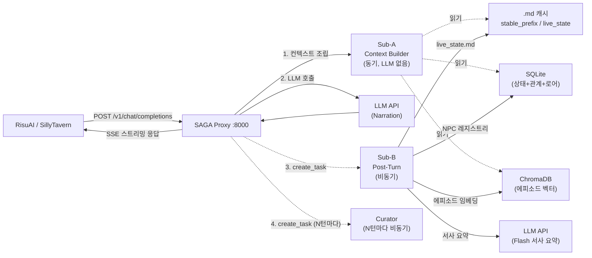

# SAGA — Stateful Context Engine for RP

> **프로젝트 상태:** 2026-04 셸브 (운영 종료, 보관 모드).
> Plan A — Claude Cache Keeper로 피벗했습니다.
> SAGA 코드와 벤치마크 결과는 회고/포트폴리오 자료로 보관합니다.

SAGA는 RisuAI 앞단에 두는 OpenAI-compatible Context Middleware다.  
RP 세션의 상태와 과거 에피소드를 SQLite·ChromaDB·Markdown cache에 저장하고, 매 요청마다 필요한 기억만 검색해 프롬프트에 주입한다.

메인 응답 경로의 LLM 호출은 1회로 제한했다.  
상태 추출과 DB 갱신은 응답 전송 후 비동기로 실행된다.

---

## 핵심 지표

| 지표 | 결과 | 비고 |
| --- | --- | --- |
| LOCOMO (ACL 2024) | **judge 2.02 → 3.12 (+54%)** | multi-hop 4.71/5 |
| LongMemEval (ICLR 2025) | **21.2% → 63.5% (+42.3%p)** | truncation vs retrieval |
| 프롬프트 캐시 적중률 | **84.2%** | steady-state 86.8% |
| 순비용 절감 | **67.1%** | cache_read 단가 + 프롬프트 단축 합산 |

> 위 수치는 외부 리더보드 제출 결과가 아니라 내부 A/B 실행 결과다. 데이터 범위, judge 모델, 프롬프트, 실행 명령은 본문 [§벤치마크: LOCOMO](#벤치마크-locomo-acl-2024) · [§벤치마크: LongMemEval](#벤치마크-longmemeval-iclr-2025)에 정리했다.

동일 모델(gemini-2.5-flash), 동일 조건 A/B 비교. Baseline은 최근 대화를 그대로 잘라 넣고(truncation), SAGA는 벡터 검색으로 질문과 관련된 대화만 골라 넣는다(retrieval). 모델을 바꾼 게 아니라 컨텍스트에 어떤 정보를 넣느냐만 다르다.

SAGA는 baseline과 다음 지점에서 다르게 동작한다.

- **관련성 기반 선별** — 최근 N개를 무조건 넣는 대신, 벡터 유사도로 실제 필요한 대화를 골라냄
- **Context Builder의 RRF 랭킹** — Recent + Important + Similar 3-stage 검색 결과를 Reciprocal Rank Fusion으로 통합 정렬하고, 토큰 예산 내에서 우선순위 패킹
- **Sub-B 서사 요약** — 대화 원문이 아니라 Flash LLM이 요약한 에피소드를 저장하므로, 검색 품질이 raw text 대비 높음
- **.md 캐시 구조** — `stable_prefix.md`(세계관/캐릭터)와 `live_state.md`(현재 상태)로 컨텍스트를 구조화하여 LLM이 참조하기 쉬운 형태로 제공

---

## 목차

1. [SAGA를 만든 동기](#saga를-만든-동기)
2. [.md 기반 컨텍스트를 고른 이유](#md-기반-컨텍스트를-고른-이유)
3. [에이전트는 큐레이션에만](#에이전트는-큐레이션에만)
4. [관련 선행 연구](#관련-선행-연구)
5. [워크플로우](#워크플로우)
6. [3-Agent 파이프라인](#3-agent-파이프라인)
7. [스토리지 설계](#스토리지-설계)
8. [비용과 성능](#비용과-성능)
9. [벤치마크: LOCOMO](#벤치마크-locomo-acl-2024)
10. [벤치마크: LongMemEval](#벤치마크-longmemeval-iclr-2025)
11. [정성 평가와 그 한계](#정성-평가와-그-한계)
12. [RisuAI Agent 흡수 검토](#risuai-agent-흡수-검토)
13. [미해결 이슈](#미해결-이슈)
14. [빠른 시작](#빠른-시작)
15. [설정 레퍼런스](#설정-레퍼런스)
16. [API 레퍼런스](#api-레퍼런스)
17. [프로젝트 구조](#프로젝트-구조)
18. [프로젝트를 통해 배운 것](#프로젝트를-통해-배운-것)
19. [참고 자료](#참고-자료)

---

## SAGA를 만든 동기

RP 챗봇을 장기 세션으로 굴리다 보면 구조적인 문제에 부딪힌다. 50턴 전에 죽은 NPC가 다시 나타나고, 버린 아이템이 인벤토리에 남아 있고, 동쪽으로 이동했는데 서쪽 마을에 있다. 이걸 컨텍스트 창 크기로 해결하려 해봤자 한계가 있다. 200K 토큰을 보내도 LLM이 50턴 전 세부사항을 정확히 기억하리라는 보장은 없고(*lost-in-the-middle*), 비용은 선형으로 늘어난다.

직접 장기 세션을 돌리면서 반복적으로 확인된 세 가지 실패 패턴:

- **성격 희석** — 30턴 이후 캐릭터 고유의 말투·반응 패턴이 약해지고, 일반 어시스턴트처럼 중립적인 응답이 늘어남
- **관계 리셋** — "우리가 어제 싸운 일" 같은 관계 상태가 휘발, 유저가 매번 설명해야 함
- **서사 유실** — 복선·장소 이동·등장 NPC 같은 구조적 맥락이 attention 범위를 벗어나면 사실상 소실

### 기존 접근들의 문제

| 접근 | 한계 |
| --- | --- |
| **정적 로어북** | 세계 상태가 변해도(마을 파괴, NPC 사망) 로어북은 세션 시작 시점 그대로 |
| **전체 히스토리 전송** | 토큰 낭비 심하고, 관련 없는 과거 대화가 절반을 차지하는 경우가 많음 |
| **HypaMemory V3** (RisuAI) | 매 턴 관련 기억을 system 메시지 중간에 주입 → prefix 해시 변경 → **프롬프트 캐시 매 턴 깨짐**. 실측 캐시 히트 12% 수준 |
| **Letta 에이전트 루프** | 에이전트가 자기편집을 위해 턴당 3~5회 LLM을 호출. 강력하지만 유저가 전부 기다려야 함 |
| **mem0** | 범용 Fact 저장에 최적화. NPC 관계·이벤트 체인 같은 **서사 구조를 표현하기 어려움** |

```
[Letta 에이전트 루프]
유저 입력 → (1) 기억 읽기 → (2) 기억 편집 → (3) 응답 생성 → (4) 기억 재편집 → ...
           └─── 3~5회 LLM 호출, 유저가 전부 대기 ───┘

[SAGA]
유저 입력 → DB 검색 + 프롬프트 조립 → LLM 1회 호출 → 응답 반환
                                                  └─ (비동기) 상태 추출 + DB 갱신
```

기존 memory 솔루션은 대체로 "어떻게 기억을 저장할 것인가"에 집중했다. SAGA는 RisuAI 모듈·플러그인 생태계를 건드리지 않고, 메모리 주입 위치·저장소 분리·매 턴 컨텍스트 비용을 별도 설계 문제로 다뤘다. 장기 세션에서는 회상 정확도뿐 아니라 매 턴 컨텍스트를 재조립하는 비용도 함께 제한해야 한다.

SAGA의 선택은 메인 응답 경로에서 LLM을 한 번만 쓰는 것이다. 상태 추출은 경량 Flash 모델로 비동기 처리한다. 서사적 판단이 필요한 큐레이션(모순 탐지, 서사 압축)은 Letta 에이전트에게 맡기되, N턴마다 비동기로 실행한다.

---

## .md 기반 컨텍스트를 고른 이유

SAGA는 컨텍스트 저장 형식으로 Markdown + YAML frontmatter를 사용한다. 초기에는 JSON 트리·GraphML 같은 구조화 포맷도 검토했지만, LLM 입력 시점에는 어차피 문자열로 직렬화되고 디버깅·diff·prompt caching까지 함께 고려하면 이 조합이 가장 단순한 선택이었다.

다른 에이전트 시스템들도 아키텍처는 제각각이지만, 컨텍스트 전달 형식은 마크다운으로 수렴하는 경향이 관찰된다.

| 시스템 | 컨텍스트 관리 |
| --- | --- |
| Claude Code | `CLAUDE.md`, `~/.claude/memory/*.md` |
| Cursor | `.cursor/rules/*.mdc`, `.cursorrules` |
| Codex | `AGENTS.md`, 마크다운 기반 지시 |
| Letta Code MemFS [[7]](#ref-7) | `memory/*.md` + YAML frontmatter |

Markdown + YAML frontmatter를 선택한 이유는 네 가지다.

- **학습 데이터 분포** — LLM 학습 데이터에 마크다운 비중이 높아 별도 형식 학습 없이 헤딩·리스트 구조를 그대로 인지하는 경향이 있음
- **반구조화** — 헤딩·리스트·테이블로 계층과 관계를 표현할 수 있어, 자연어와 구조 사이의 중간 지대로 사용 가능
- **메타데이터 분리** — YAML frontmatter로 `version`, `turn`, `session_id` 같은 시스템 메타를 본문과 분리. 본문은 LLM이 읽고, 프론트매터는 코드가 읽는다
- **diff/캐싱 친화** — 텍스트 기반이라 prefix 바이트 비교가 즉시 가능. Anthropic Prompt Caching의 prefix 해시 안정성에 유리

Letta Code의 MemFS [[7]](#ref-7)가 특히 비슷하다. Memory Block(단일 문자열)에서 git 기반 마크다운 파일 시스템으로 진화한 구조인데, SAGA의 `stable_prefix.md` + `live_state.md` + YAML frontmatter와 거의 같다. 차이는 **편집 주체**다 — MemFS는 에이전트가 LLM 호출로 편집하고, SAGA는 코드 로직(Sub-B)이 밀리초 단위로 편집한다. 이 차이 때문에 SAGA는 사용자 응답 경로에서 메인 LLM 호출을 1회로 유지할 수 있었다.

---

## 에이전트는 큐레이션에만

RP 파이프라인의 각 단계가 실제로 "에이전트의 판단력"을 요구하는지 단계별로 분리하면 다음과 같다.

| 작업 | 주기 | 판단 성격 | 필요한 도구 |
| --- | --- | --- | --- |
| 서사 요약 | 매 턴 | 입력→출력 1회 매핑 (이력 의존 없음) | **Flash LLM 4필드 JSON** |
| 컨텍스트 조립 | 매 턴 | 점수·랭킹 (결정적 계산) | **코드 로직** (LLM 불필요) |
| 서사 큐레이션 | N턴마다 | "이 모순은 의도된 건가?" "이 복선은 회수해야 하나?" — **이전 큐레이션 판단을 기억하고 일관되게 이어가야 함** | **Memory Block을 가진 에이전트** |

매 턴 실행되는 두 작업은 에이전트 없이 처리할 수 있다. 서사 요약은 Flash 4필드 JSON으로 충분하고, 컨텍스트 조립은 점수 기반 필터링으로 결정적으로 처리할 수 있다. 반면 **N턴마다 도는 큐레이션은 이전 판단 이력을 참조해야 일관성이 잡힌다** — "지난번에 이 모순은 의도된 거라고 결정했다"를 기억하지 않으면 매번 다른 판단이 나오기 때문이다. 이력 의존이라는 한 가지 특성 때문에 큐레이션 자리에만 Memory Block 기반 에이전트가 필요했다.

따라서 Letta는 메인 루프가 아니라 Curator 단계에만 배치했다. 코딩 에이전트가 Notepad로 작업 맥락을 자기관리하듯, Letta Curator는 Memory Block으로 큐레이션 판단 이력을 자기관리한다.

```
코딩 에이전트 패턴:                    SAGA 적용:
┌──────────────┐                   ┌──────────────────┐
│ Agent        │                   │ Letta Curator     │
│  └ Notepad   │ ← 자기관리          │  └ Memory Block   │ ← 자기편집
│  └ 작업 실행  │                   │  └ 서사 판단       │
└──────────────┘                   └──────────────────┘
  "뭐가 중요하지?"                    "이 모순은 의도적인가?"
  "이전에 뭘 했지?"                   "지난 큐레이션에서 뭘 결정했지?"
```

메인 루프는 LLM 0회(Sub-A) + 1회(내레이션)로 최소 지연이고, Curator의 다회 호출은 N턴마다 비동기라 유저 경로 바깥에서 처리된다. SAGA는 판단 이력이 필요한 Curator 단계에만 Letta 에이전트를 사용한다 — Letta 에이전트 루프 전체를 메인 경로에 두지 않고 큐레이션 자리에만 차용한 결과다.

---

## 관련 선행 연구

SAGA가 참고한 연구들:

- **MemGPT / Letta** [[1]](#ref-1) — LLM에 가상 메모리 계층을 부여하는 OS 패러다임. SAGA Curator의 Memory Block 자기편집 패턴을 여기서 차용했다.
- **코히바블랙** [[2]](#ref-2) — Letta 에이전트 루프를 RP에 적용한 실전 사례. 효과는 검증됐지만 다회 호출 지연이 실용적 한계임을 실증했다. SAGA가 "1회 호출 + 비동기" 구조를 선택하게 된 직접적인 계기다.
- **Graph RAG** [[3]](#ref-3) — 벡터 검색에 그래프 구조를 결합한 Microsoft Research 논문. "구조화된 관계 + 벡터 검색 병합" 설계 방향에 영향을 줬다. SAGA는 정규화된 SQLite 테이블 + ChromaDB로 이를 구현했다.
- **RAG** [[4]](#ref-4), **LLM-as-a-Judge** [[5]](#ref-5), **LongMemEval** [[6]](#ref-6), **Letta MemFS** [[7]](#ref-7)

---

## 워크플로우

### 전체 요청 흐름


```mermaid
flowchart LR
    Client["RisuAI / SillyTavern"]

    Proxy["SAGA Proxy :8000"]
    SubA["Sub-A<br/>Context Builder<br/>(동기, LLM 없음)"]
    LLM["LLM API<br/>(Narration)"]
    SubB["Sub-B<br/>Post-Turn<br/>(비동기)"]
    Flash["LLM API<br/>(Flash 서사 요약)"]
    Curator["Curator<br/>(N턴마다 비동기)"]

    SQLite["SQLite<br/>(상태+관계+로어)"]
    Chroma["ChromaDB<br/>(에피소드 벡터)"]
    Cache[".md 캐시<br/>stable_prefix / live_state"]

    Client -- "POST /v1/chat/completions" --> Proxy
    Proxy -- "1. 컨텍스트 조립" --> SubA
    SubA -. "읽기" .-> Cache
    SubA -. "읽기" .-> SQLite
    SubA -. "읽기" .-> Chroma

    Proxy -- "2. LLM 호출" --> LLM
    LLM --> Proxy
    Proxy -- "SSE 스트리밍 응답" --> Client

    Proxy -. "3. create_task" .-> SubB
    Proxy -. "4. create_task (N턴마다)" .-> Curator

    SubB -- "서사 요약" --> Flash
    SubB -- "NPC 레지스트리" --> SQLite
    SubB -- "에피소드 임베딩" --> Chroma
    SubB -- "live_state.md" --> Cache
```

턴마다 일어나는 일을 순서대로 정리하면:

```
1. 세션 ID 추출 (@@SAGA: plugin sentinel → X-SAGA-Session-ID 헤더 → user 필드 → 시스템 메시지 SHA256 해시 앞 16자)
2. 세션 없으면 신규 생성 (SQLite + .md 캐시 초기화)
3. [동기] SystemStabilizer: canonical system 고정 + Lorebook delta 분리
4. [동기] MessageCompressor: 토큰 임계값 초과 시 오래된 턴을 immutable summary chunk로 치환
5. [동기] Sub-A: .md 캐시 읽기 → ChromaDB 에피소드 검색 + SQLite 로어 조회 → 토큰 예산 내 조립
6. Anthropic cache_control: ephemeral (1h TTL) 적용
7. LLM 1회 호출
8. SSE 스트리밍으로 클라이언트에 응답 반환
9. 턴 카운터 증가
10. [비동기] Sub-B: Flash 서사 요약 → ChromaDB 에피소드 기록 → NPC 레지스트리 갱신 → live_state.md 갱신
11. [비동기, N턴마다] Curator: 모순 탐지 → 서사 압축 → 로어 자동생성
```

Sub-A는 읽기만, Sub-B는 쓰기만 한다. LLM 호출은 Proxy가 직접 한다. Sub-B와 Curator는 서로 독립적으로 `asyncio.create_task()` 된다.

### 컨텍스트 조립 구조

Sub-A가 조립한 컨텍스트는 다음 형태로 LLM에 전달된다:

```
[--- SAGA Context Cache ---]   ← stable_prefix.md (세계관/캐릭터, 거의 안 변함)
세계관, 캐릭터 설정 ...

[--- Active Lorebook ---]      ← lorebook_delta (SystemStabilizer가 분리한 동적 로어)
### 어둠의 숲
에르시아 변방의 위험한 숲...

[--- SAGA Dynamic ---]         ← dynamic_suffix (live_state + 에피소드)
---
turn: 5
---

## 현재 상태                   ← live_state.md
- 위치: 어둠의 숲
- HP: 85/100

[에피소드 기억]                ← ChromaDB 3-stage RRF 검색 결과
[!] Turn 3: 어둠의 숲 진입, 고블린 족장과 조우
[R] Turn 1: 마을 광장에서 의뢰 수락
```

Claude를 쓸 때는 세 섹션을 모두 마지막 user 메시지에 prepend한다. 시스템 메시지를 건드리지 않으므로 BP1~BP3 프롬프트 캐시가 유지된다. 비-Claude 경로는 시스템 메시지에 합쳐 넣는다.

에피소드 검색은 ChromaDB 3-stage + Reciprocal Rank Fusion이다. Recent(최근 턴, 가중치 1.2), Important(중요도 높은 에피소드, 1.0), Similar(현재 맥락과 유사한 에피소드, 0.8)를 각각 뽑아서 `score += weight / (k + rank + 1)` 공식으로 통합 랭킹한다. 동적 컨텍스트 예산은 기본 4,000 토큰이고, 에피소드 최대 10개(개별 500자 cap), 로어 최대 5개(개별 800자 cap)로 채운다.

---

## 3-Agent 파이프라인

### Sub-A: Context Builder

매 턴 동기 실행, LLM 호출 없음. 밀리초 단위가 목표다.

```
1. stable_prefix.md 읽기 (캐시됨)
   ▼
2. live_state.md 읽기 (매 턴 갱신됨)
   ▼
3. ChromaDB 3-stage 에피소드 검색 (Recent + Important + Similar) + RRF
   ▼
4. SQLite 로어 조회 + ChromaDB 벡터 검색 병합
   ▼
5. 토큰 예산 내 패킹
출력: { md_prefix, dynamic_suffix }
```

### Sub-B: Post-Turn (Flash 서사 요약)

매 턴 비동기 실행. SSE 스트리밍 완료 후 Starlette `BackgroundTask`로 실행된다.

```
1. Flash LLM으로 4필드 JSON 추출
   { summary, npcs_mentioned, scene_type, key_event }
   ▼
2. Importance 스코어링
   base 10점 + scene_type 가중치 (combat +40, event +35, exploration +15, dialogue +0)
   + key_event +30, NPC 등장 +10/명 (최대 2명) → 0~100점
   ▼
3. ChromaDB 에피소드 기록 (importance ≥ 40은 Important 검색 대상)
   ▼
4. NPC 레지스트리 갱신 (SQLite characters 테이블)
   - alias 추출 + LLM 기반 dedup (한/영 동일인 통합)
   ▼
5. SQLite 턴 로그 기록
   ▼
6. live_state.md 갱신 (위치, HP, 기분, 주변 NPC, 최근 이벤트)
```

Flash 서사 요약 출력 예시:

```json
{
  "summary": "나그네가 위지 가문의 저택에 도착하여 소연과 첫 대면. 할아버지의 유언과 일기장을 언급하며 도움을 요청했다.",
  "npcs_mentioned": ["위지소연", "당채련"],
  "scene_type": "dialogue",
  "key_event": "할아버지의 유언 공개"
}
```

초기에는 메인 LLM에게 12필드 상태 블록을 출력하도록 지시하고 regex로 파싱하는 방식을 시도했는데, 추출 정확도가 불안정하고 메인 LLM에서 270~400 tok/턴을 낭비했다. 지금 방식은 메인 LLM에 아무 지시도 추가하지 않는다.

이 4필드는 **한 번 만들고 네 곳에서 공유**된다 — MessageCompressor의 chunk 요약, ChromaDB 에피소드 색인, SQLite NPC 등록, Curator 검증 시드. 초기 구조에서는 압축·검색 시드·색인·검증이 각자 요약을 따로 만들어 턴당 경량 LLM 호출이 4회 발생했고, 더 큰 문제는 같은 턴을 각자 다르게 요약하면서 단계 간 불일치가 누적되는 것이었다. 단일 진실원으로 통합한 뒤 일관성 문제가 사라지고 호출 횟수도 1/4로 줄었다.

`asyncio.Lock`으로 이전 Sub-B 완료를 대기한 뒤 실행하므로, 빠른 연속 턴에서 DB 경합이 생기지 않는다.

### Curator

N턴마다(기본 10턴) 비동기 실행. 서사 품질 관리 담당이다.

하는 일: 모순 탐지(죽은 NPC 재등장, 파괴된 아이템 재사용 등 — 위치 이동이나 감정 변화는 모순으로 취급하지 않음), 장기 서사 압축(50턴 이상 + stable_prefix.md가 비어있을 때), 이벤트 스케줄링.

Letta Memory Block(`narrative_summary`, `curation_decisions`, `contradiction_log`)을 가진 에이전트가 매 큐레이션마다 자기편집한다. `message_buffer_autoclear=True`로 대화 히스토리를 매 호출 초기화해서 토큰 누적을 막는다.

Letta의 자기편집 패턴은 비동기 후처리 단계에서만 사용된다. 메인 응답 경로에서는 Letta를 호출하지 않으므로 Step Loop 지연이 없다.

Curator 실행 로그 예시 (요트 살인 미스터리 시나리오, Turn 10):

```
[Curator] Memory Block updates: 4 succeeded, 0 failed
[Curator] Contradiction fix: {
  type: character_identity, severity: medium,
  description: "Turn 5 '이름 모를 남성'이 요트 침대에서 칼 맞고 사망
    → Turn 6-7에서 같은 시신이 MacNamara로 확인됨
    → 그러나 NPC 목록에 둘 다 HP:100/100으로 살아있음",
  resolution: "NPC 그래프에서 '이름 모를 남성'을 삭제하거나
    MacNamara의 HP를 0으로 변경 권장"
}
[Curator] Contradiction fix: {
  type: character_duplication, severity: low,
  description: "Johnson(영문)과 존슨(한글)이 별도 NPC로 등록됨",
  resolution: "동일 인물이므로 하나로 통합 권장 (Johnson으로 통일)"
}
[Curator] Contradiction fix: {
  type: timeline_confusion, severity: medium,
  description: "Turn 9에서 화자가 'Mac을 Camels 침대에서 살해'했다고 언급
    vs Turn 7에서 Johnson이 '이미 죽은 MacNamara 발견'
    → Mac과 MacNamara가 동일인이라면 시간순서 모순",
  resolution: "Mac ≠ MacNamara로 별도 인물로 처리하거나,
    Turn 9가 과거 회상임을 명시해야 함"
}
```

한 번의 Curator 실행에서 캐릭터 동일성(`이름 모를 남성 = MacNamara`), 영/한 중복 등록(`Johnson = 존슨`), 타임라인 모순(살해 시점 불일치)을 동시에 탐지한다. 이런 판단은 이전 큐레이션 이력을 참조해야 일관되므로 Memory Block을 가진 에이전트가 필요한 부분이다.

---

## 스토리지 설계

SQLite, ChromaDB, .md 캐시 세 가지를 같이 쓴다.

- **SQLite** (`db/state.db`) — 세션 메타, 턴 로그, 캐릭터/관계, Lorebook(단일 소스). 트랜잭션과 빠른 조건 조회가 필요한 것들
- **ChromaDB** (`db/chroma/`) — 에피소드 임베딩 전용. 의미 유사도 기반 Top-K 검색
- **.md 캐시** (`cache/sessions/{session_id}/`) — `stable_prefix.md`와 `live_state.md` 두 파일. 프롬프트 캐싱의 안정적 prefix로 사용

단일 벡터 DB로만 처리하면 "A와 B의 현재 관계" 같은 구조적 조회가 느리고, 단일 구조화 DB로만 처리하면 "숲에서 있었던 일" 같은 fuzzy 회상이 불가능하다. 각 저장소는 **서로 다른 쿼리 특성**에 답하며, 필요할 때 함께 조회한다 (예: ChromaDB에서 찾은 에피소드의 등장 NPC를 SQLite로 역조회).

### SQLite 테이블

| 테이블 | 용도 |
| --- | --- |
| `sessions` | 세션 메타 |
| `world_state` | 세계 상태 KV 저장소 |
| `turn_log` | 턴 로그 (user/assistant 원문 + 메타) |
| `characters` | NPC 레지스트리 (alias 정규화 포함) |
| `relationships` | NPC 관계 (스키마 정의, 쓰기 경로 미구현 — 셸브 시점) |
| `lore` | 로어북 엔트리 (단일 소스) |

초기에는 `locations`, `events`, `event_queue` 테이블도 있었지만, 실제로 SQLite로 조회할 쿼리 패턴이 거의 없어서 제거했다. 위치·이벤트 정보는 ChromaDB 에피소드와 `live_state.md`에서 충분히 표현된다. `relationships`는 스키마만 살려뒀고 자동 쓰기 경로는 구현하지 않았다 — 셸브 시점까지의 한계.

### .md 캐시 파일 구조

`stable_prefix.md`는 거의 변하지 않는 세계관/캐릭터 설정이 들어간다. Anthropic `cache_control: ephemeral`과 결합하면 동일 세션에서 캐싱되어 입력 토큰 비용을 줄인다.

```yaml
---
version: 1
session_id: abc123de
---

## 세계관
에르시아 대륙, 중세 판타지 세계...

## 등장인물
### 아리아
- 특성: 용감, 호기심 왕성
```

`live_state.md`는 매 턴 Sub-B가 갱신한다.

```yaml
---
turn: 5
---

## 현재 상태
- 위치: 어둠의 숲
- HP: 85/100
- 기분: determined

## 주변 인물
- 에르겐 (관계: met, 친밀도: 30)

## 최근 이벤트
- Turn 4: 고블린 족장과 전투
```

파일 쓰기는 `.tmp`에 작성 후 `os.replace()`로 교체하는 원자적 쓰기다. Sub-B 동시 갱신 시 파일 손상을 막는다.

### 로어북 검색

`_get_active_lore()`가 매 턴 두 소스를 병합한다:

```
1. SQLite lore 테이블에서 세션 전체 로어 조회
   ▼
2. ChromaDB 벡터 검색 (현재 user_input 기반, n_results=5)
   ▼
3. 이름 기준 중복 제거 (SQLite 우선)
   ▼
4. 토큰 예산 내 조립 (per-entry 800자 cap, 최대 5개)
```

(셸브 시점 미구현 항목: 마지막 언급 이후 경과 턴 기반 우선순위 감쇠, 현재 플레이어 위치 기반 부스팅, 관계 그래프 기반 관련 로어 발견.)

---

## 비용과 성능

### 모델별 역할 분담

| 작업 | 기본 모델 |
| --- | --- |
| 내레이션 | Claude Haiku 4.5 |
| 상태 추출 (Sub-B 4필드) | Gemini 2.5 Flash Lite |
| 큐레이션 | Claude Sonnet 4.5 via Letta (N턴마다 비동기) |
| 로어 자동생성 | Gemini 2.5 Flash Lite (extraction 모델 공유) |
| 임베딩 | text-embedding-3-small |

100턴 기준으로 SAGA는 내레이션 100회 + 경량 추출 100회 + 큐레이션 10회 정도가 된다. 전체 히스토리 전송 방식은 턴마다 토큰이 선형으로 늘어나고, Letta 에이전트 루프는 턴당 3~5회 고성능 모델을 쓰므로 비용이 훨씬 높다.

### 프롬프트 캐싱 효과

Anthropic의 3-BP(3 Breakpoint) 전략을 쓴다. 시스템 프롬프트(BP1), 대화 중간점(BP2), 마지막 assistant(BP3)에 명시적 breakpoint를 두고, 동적 컨텍스트는 모든 BP 뒤인 마지막 user 메시지에 prepend한다. TTL은 1h Extended(`cache_control: {"type":"ephemeral","ttl":"1h"}`).

E2E 50턴 검증 결과 (Claude Haiku 4.5, 위지소연 시나리오):

| 지표 | 수치 |
| --- | --- |
| 캐시 적중률 (Turn 2+) | 85.7% |
| 비용 절감 | 43.5% |
| 총 캐시 읽기 | 770,202 tokens |
| 평균 레이턴시 | 6.1초 (50턴 내내 flat) |
| 1h TTL 생존 | 6분 대기 후 캐시 생존 확인 |

```
프롬프트 토큰:  697 (Turn 1) → 32,292 (Turn 50)  ← 46배 증가
레이턴시:     4.0초 (Turn 1) →  5.5초 (Turn 50)  ← 1.4배만 증가
cache_create: 매 턴 ~660-730 tokens 일정         ← 새 턴 데이터만 추가
```

캐싱 모드 비교 (50턴 기준):

| 모드 | 평균 히트율 | 절감률 |
| --- | :---: | :---: |
| 3-BP + 1h TTL (현재) | 85.7% | 43.5% |
| 수동 3-BP (5min TTL) | 95.5% | 76.0% |
| 자동 top-level | 12.1% | −11.4% |
| 캐시 없음 | 0% | 기준선 |

자동 top-level이 −11.4%인 건 20-block lookback 제한 때문에 턴 12+에서 무효화되기 때문이다.

상세: `tests/e2e_cache_verification.py` (50턴 E2E), `tests/bench_prompt_caching.py` (캐싱 모드 비교)

### 슬라이딩 윈도우 대응: MessageCompressor

RisuAI가 컨텍스트 초과로 앞쪽 메시지를 잘라내면 Anthropic prefix 캐시가 전체 무효화된다. MessageCompressor가 선제 압축으로 이를 방지한다.

토큰이 임계값(기본 35%)을 초과하면 RisuAI가 자르기 전에 SAGA가 먼저 오래된 턴을 **immutable summary chunk**로 치환한다:

```
원본: [system] [turn1] [turn2] ... [turn35]         (45K tokens)
압축: [system] [chunk: turns 1-8] [chunk: turns 9-16] [turn17] ... [turn35]
                ↑ immutable, BP2 고정   ↑ 균등한 작은 chunk
```

- 각 chunk는 `[user + assistant]` 메시지 쌍으로, Sub-B의 Flash 요약을 재활용 (추가 LLM 호출 없음)
- chunk는 한번 만들면 **절대 수정하지 않음** → prefix 안정 → BP2 캐시 항상 히트
- 추가 압축 필요 시 새 chunk를 append (기존 chunk 불변)
- **BP2를 첫 번째 chunk의 assistant에 고정**하여 캐시 안정성 보장 — 새 chunk가 뒤에 추가돼도 BP2 위치의 바이트 오프셋이 움직이지 않는다
- chunk 크기 제한: 최소 3턴, 최대 8턴(`max_compress_turns`) — 균등한 작은 chunk로 요약 품질 유지
- 압축 임계치 판단은 **rebuild-first** — 기존 chunk가 있으면 먼저 재조립한 뒤 실제 토큰 수로 판단. 원본 히스토리 기준으로 판단하면 이미 압축된 대화를 또 압축하는 오버 컴프레션이 발생했다

> 초기에는 별도 모듈 `WindowRecovery`로 슬라이딩 윈도우 사후 보완을 했지만, MessageCompressor의 선제 압축으로 윈도우 트리밍 자체가 거의 발생하지 않아 셸브 시점에서 모듈을 제거하고 단계 1개를 줄였다.

### 실시간 비용 추적

매 LLM 호출마다 토큰 사용량과 비용을 SQLite에 기록한다. 모델별 단가 테이블(Anthropic/Google/OpenAI)을 기반으로 캐시 할인을 적용한 실비용과 절감액을 산출한다. `/api/cost` 엔드포인트로 세션별/전체 집계를 조회할 수 있다.

### Observability (LangSmith 트레이싱)

`@traceable` 데코레이터로 전체 파이프라인의 각 단계를 LangSmith에 트레이싱한다:

```
saga.handle_chat (루트)
├── pipeline.stabilizer      # System 안정화
├── pipeline.compressor      # MessageCompressor
├── pipeline.sub_a           # 컨텍스트 조립
├── llm.call                 # 메인 LLM 호출
├── pipeline.sub_b           # Flash 서사 요약 (비동기)
└── pipeline.curator         # N턴마다 큐레이션 (비동기)
```

`LANGSMITH_TRACING=true` + `LANGSMITH_API_KEY` 환경변수로 활성화. LLM SDK 래핑(`wrap_anthropic`, `wrap_openai`)으로 API 호출 상세도 자동 추적된다.

### 실제 데모 데이터 — 50턴 세션 (셸브 시점 기록)

실제 RP 세션(마왕24 던전주 시나리오)을 50턴 돌린 결과다. Turn 10/20/30/40/50 시점의 큐레이션 스냅샷이 `examples/example_stable_prefix1~5.md`에 있다.

**캐시 성능 (턴 구간별):**

| 구간 | cache_read 히트율 | 원인 |
| --- | :---: | --- |
| Turn 1~21 | 85~90% | 3-BP 정상 작동, prefix 안정 |
| Turn 22~30 | ~20% | 슬라이딩 윈도우 발동 (max context 32K 한계) |
| Turn 31~ | 즉시 복구 | max context 360K 확장 후 캐시 재안정 |

슬라이딩 윈도우가 발동하면 RisuAI가 히스토리를 트리밍하면서 prefix가 바뀌어 캐시가 깨진다. MessageCompressor가 선제적으로 오래된 턴을 immutable chunk로 압축하여 이를 방지한다. max context를 넉넉히 잡으면 트리밍 자체가 덜 발생하고, 발동하더라도 chunk prefix가 안정적이므로 캐시가 유지된다.

**서사 추적 품질 (Curator 큐레이션 결과):**

| 스냅샷 | 서사 구간 | NPC | 복선 | 로어 | 비고 |
| --- | :---: | :---: | :---: | :---: | --- |
| Turn 10 | 3개 | 2명 | 3개 | 없음 | 첫 큐레이션 |
| Turn 20 | 4개 | 3명 | 태깅 시작 | 3명 | 한결 자동 감지 |
| Turn 30 | 4개 | 6명 | 회수 감지 | 3명 | 루비아 고백 추적 |
| Turn 40 | 6개 | 3명 | 4개 | 3명 | 면담 진행 중 |
| Turn 50 | 8개 | 9명 | [회수됨] 태깅 | 9명 | 계약 해소, 희원 등장 |

Curator는 10턴마다 전체 서사를 조감해서 구간을 분리하고 복선을 태깅한다. Turn 5의 "루비아 뺨이 붉어짐" 씬은 Turn 50에서도 서사 구간 2에 그대로 남아 있다. 슬라이딩 윈도우로 해당 메시지가 컨텍스트에서 잘려도 큐레이션 결과는 DB에 남아서 다시 주입된다.

<details>
<summary><strong>Turn 10 — 첫 큐레이션 (서사 3구간, NPC 2명)</strong></summary>

```markdown
## 서사 요약 (Turn 10 큐레이션 완료)

### 핵심 상황
- 주인공: 반 - 술에 취해 계약서에 서명했으나 전혀 기억하지 못함
- 주요 NPC: 루비아 (계약 관리), 최은지 (정기 점검)

### 서사 진행
1. 계약 혼란 & 시설 안내 (Turn 1-4)
2. 간판 설치 협력 (Turn 5-6): 루비아가 감정적으로 동요(뺨이 붉어짐)
3. 정부 점검 시작 (Turn 7-9)

### 주요 복선
- 루비아의 감정 변화
- 계약서의 복잡한 조항들
- 반의 계약 기억상실
```

</details>

<details>
<summary><strong>Turn 50 — 던전 운영 개시, 9명 NPC (서사 8구간)</strong></summary>

```markdown
## 서사 요약 (Turn 50 큐레이션 완료)

### 핵심 상황
- 주인공: 반 - 계약 승인, 던전 정식 운영 중. 마력 5.0(약 2일치)으로 빠듯
- 주요 NPC 9명: 루비아(진심 고백), 최은지(조력자), 한결(계약 승인),
  리나(편의점 점장), 미라, 정재현/이지은(첫 사냥꾼), 페이, 희원(성녀, 의문 등장)

### 서사 진행
1. 계약 혼란 & 시설 안내 (Turn 1-4)
2. 간판 설치 & 감정 싹트기 (Turn 5-6)
3. 정부 점검 (Turn 7-13)
4. 한결 등장 & 계약 위기 (Turn 14-19)
5. 진실 규명 & 책임 선언 (Turn 20-30)
6. 새벽 공부 & 마력 교환의 진실 (Turn 31-36)
7. 면담 & 계약 승인 (Turn 37-39)
8. 던전 운영 개시 (Turn 40-51)

### 복선 & 분기점
- [새 전개] 희원의 등장 — 목적 불명
- [긴급] 마력 부족 — 5.0으로 2일
- [진행 중] 루비아 감정
- [회수됨] 계약 기억상실 → Turn 25-27 / 계약 무효 → Turn 39 승인
```

</details>

전체 5개 스냅샷: [`example_stable_prefix1~5.md`](./examples/example_stable_prefix1.md)

---

## 벤치마크: LOCOMO (ACL 2024)

[LOCOMO](https://github.com/snap-research/locomo)는 장기 대화 메모리 평가 벤치마크다. 10개 대화(총 5,882턴, 1,986 QA pairs)에서 5가지 카테고리로 메모리 회상 능력을 평가한다.

A/B 조건: Baseline은 최근 60턴을 그대로 컨텍스트에 넣고 답변, SAGA는 최근 10턴 + ChromaDB 벡터 검색으로 관련 에피소드를 주입해서 답변.

결과 (2개 대화, 304 QA pairs, QA/Judge: gemini-2.5-flash-lite):

| Category | N | Baseline | SAGA | Delta |
| --- | --- | --- | --- | --- |
| Overall | 304 | 2.02 | 3.12 | +1.10 |
| multi-hop | 63 | 3.08 | 4.71 | +1.63 |
| single-hop | 43 | 2.21 | 3.49 | +1.28 |
| adversarial | 71 | 1.48 | 2.58 | +1.10 |
| commonsense | 114 | 1.79 | 2.61 | +0.82 |
| temporal | 13 | 1.15 | 1.46 | +0.31 |

multi-hop 점수 개선 폭이 가장 컸다. 여러 세션에 걸친 정보를 종합하는 문제를 메모리 검색이 구조적으로 해결한다. 이 결과는 전체 컨텍스트 확대보다 관련 에피소드 선별이 더 효과적일 수 있음을 보여준다. temporal(+0.31)은 상대적으로 효과가 약한데, 시간 순서 추론은 벡터 검색만으로는 한계가 있다.

```bash
# LOCOMO 데이터셋 자동 다운로드 + Sub-B Ingestion + QA 평가 + Judge
python -m benchmarks.run_locomo -n 2 --qa-model gemini-2.5-flash-lite

# Ingestion 완료 후 재평가 (모델/Judge만 변경)
python -m benchmarks.run_locomo -n 2 --qa-model gemini-2.5-flash --skip-ingestion
```

결과는 `benchmarks/results/`에 JSON + Markdown으로 저장된다.

---

## 벤치마크: LongMemEval (ICLR 2025)

[LongMemEval](https://huggingface.co/datasets/xiaowu0162/longmemeval-cleaned)은 500개 QA 인스턴스, 인스턴스당 평균 53개 세션(~115K 토큰)으로 구성된다. 다섯 가지 메모리 능력을 평가한다.

| 능력 | 예시 |
| --- | --- |
| single-session (user/assistant) | "내 강아지 품종이 뭐야?" |
| single-session-preference | "마이애미 호텔 추천해줘" (이전 언급 취향 기반) |
| multi-session | "헤드폰이랑 아이패드 합쳐서 얼마 썼어?" |
| temporal-reasoning | "토마토 심은 게 먼저야, 오이 심은 게 먼저야?" |
| knowledge-update | "지금 직업이 뭐야?" (이직 후) |

A/B 조건: 동일 모델, 동일 토큰 예산(10 sessions). Baseline은 마지막 10개 세션, SAGA는 질문과 관련된 상위 10개를 ChromaDB로 선별.

결과 (499 QA, gemini-2.5-flash):

| Type | N | Baseline | SAGA | Delta |
| --- | --- | --- | --- | --- |
| Overall | 499 | 21.2% | 63.5% | +42.3%p |
| single-session-assistant | 56 | 19.6% | 89.3% | +69.6%p |
| multi-session | 133 | 12.0% | 57.1% | +45.1%p |
| temporal-reasoning | 132 | 9.1% | 50.8% | +41.7%p |
| single-session-user | 70 | 38.6% | 80.0% | +41.4%p |
| knowledge-update | 78 | 46.2% | 75.6% | +29.5%p |
| single-session-preference | 30 | 13.3% | 30.0% | +16.7%p |

가장 큰 개선은 single-session-assistant 유형에서 나타났다(+69.6%p). assistant가 말한 정보는 대화 초반에 몰려 있어서 truncation에 가장 취약하고, 검색으로 거의 완전히 해결된다. single-session-preference가 +16.7%p로 가장 작은데, 선호도 질문은 암묵적이라 벡터 검색으로 잡기 어렵다.

```bash
# 전체 500 인스턴스 (체크포인트 자동 저장, 중단 후 재개 가능)
python -m benchmarks.longmemeval.run -n 500 --qa-model gemini-2.5-flash --concurrency 2
```

OpenAI API 키 필요(text-embedding-3-small). 결과는 `benchmarks/longmemeval/data/results/`에 저장.

---

## 정성 평가와 그 한계

> **벤치마크의 한계**
> 솔직히 말하면, 캐릭터 챗의 품질을 LOCOMO나 LongMemEval로 온전히 평가하기는 어렵다. 이 벤치마크들은 "대화에 포함된 사실을 얼마나 정확히 회상하는가"를 정답이 정해진 QA로 측정하지만, 실제 롤플레이는 유저의 한 마디로 장소가 바뀌고 새 NPC가 튀어나오며 기존 설정이 즉흥적으로 갱신되는 **non-stationary 환경**이다. 게다가 "캐릭터가 살아있다는 감각"은 회상 정확도 외에도 말투 일관성·관계 밀도·상황 판단 같은 정성 요소가 크게 작용한다.

그래서 SAGA는 정량 벤치마크를 **"큐레이션 정확도의 하한 체크"** 로만 사용하고, 실제 품질 판단은 개발자 본인의 장기 세션 도그푸딩(동일 캐릭터로 수백 턴 누적 테스트)에 의존했다. max context 55K~65K, HypaMemory OFF + SAGA ON 설정 기준으로 관찰한 변화:

- 30만 토큰 누적 세션에서도 **캐릭터 말투·태도 붕괴 없이 유지** — HypaMemory ON 대비 육안으로 구분될 정도의 차이
- "그때 ○○이 했던 말" 류 과거 참조 질문에 **구체적 에피소드 회상** (기존에는 "기억나지 않는다" 또는 환각 응답이 지배적)
- 응답 레이턴시 체감 변화 없음 — 기억 갱신이 백그라운드로 격리되어 유저 경로에 노출되지 않음

> **N=1 평가의 한계**
> 개발자 본인이 시나리오를 구성·실행·판정하므로 편향이 있을 수밖에 없다. 외부 유저 풀이 없다는 점이 이 프로젝트의 명확한 한계이며, 셸브 시점까지 클로즈드 베타 단계로 진입하지 못했다. 벤치마크 점수 개선이 곧 UX 개선과 동치가 아니라는 점은 이 프로젝트를 통해 체감한 중요한 교훈이다.

---

## RisuAI Agent 흡수 검토

같은 문제 영역을 다루는 [**RisuAI Agent plugin v5.3.1**](https://github.com/EugenesDad/RisuAI-Agent-plugin)의 구조를 분석하면서, 해당 제품이 SAGA보다 앞서 있는 한 가지 설계를 확인했다. 프롬프트에 주입하는 정보를 **네임스페이스화된 구조적 객체로 분해하고 LLM에게 우선순위로 해석하도록 지시**하는 방식이다.

RisuAI Agent는 시스템 프롬프트에 `ra_*` 접두사를 붙인 20여 개 객체를 주입하고 5단계 우선순위를 명시한다.

| 단계 | 객체 (일부) | 역할 |
| --- | --- | --- |
| P1 (강제) | `ra_logic_state`, `ra_response_guard`, `ra_pattern_guard` | 금지 표현·강제 지시·최우선 오버라이드 |
| P2 (장면) | `ra_scene_state`, `ra_inventory`, `ra_turn_trace` | 현재 위치·소지품·직전 비트 |
| P3 (플롯) | `ra_quest_log`, `ra_knowledge_matrix`, `ra_relation_web` | 진행 중 사건·정보 경계·관계 |
| P4 (연속성) | `ra_persistent_memory`, `ra_reentry_guard`, `ra_arc_memory` | 정체성·재등장 복구·서사 아크 |
| P5 (참조) | `ra_world_encyclopedia`, `ra_world_log` | 필요 시에만 참조 |

**SAGA의 한계** — `.md prefix`는 "세계관 / 캐릭터 / 현재 상태" 수준의 단일 Markdown 문서로 직렬화되어 있어, LLM이 충돌을 만났을 때 무엇을 우선시할지 판단 근거가 부족하다. 실제 도그푸딩 중 "금지된 상황인데 캐릭터가 어쩔 수 없이 따라가는" 경계 실패 케이스가 종종 발생했다.

**검토했던 흡수 방향** (셸브로 미적용):

- **네임스페이스 라벨링** — `.md prefix`에 섹션별 라벨(예: `@@scene_state`, `@@persistent_memory`)을 도입. 캐시 prefix 자체는 그대로 유지하되 LLM이 구조를 인지하도록
- **우선순위 가이드 주입** — system 프롬프트 상단에 "섹션 간 충돌 시 우선순위" 규칙을 1회 고정 주입 (prefix 일부로 편입되므로 캐시 유지)
- **동적 영역에 `turn_advice` 도입** — user prepend 구간에 이번 턴 연기 가이드(`primary_facet`, `response_guard`)를 주입. 캐시 경계 바깥이므로 안전

> 위 네임스페이스 설계는 RisuAI Agent plugin (저자: penguineugene@protonmail.com, GPL-3.0)의 공개 플러그인 번들을 구조 분석해 파악한 패턴이다. 해당 플러그인은 브라우저 환경에서 턴당 4~6회 LLM 호출을 사용하는 반면, SAGA는 동일한 구조 가이드를 **캐시 불변 prefix + 비동기 단일 호출** 조합으로 구현할 계획이었다.

---

## 미해결 이슈

(셸브 시점에서 동결된 항목들. Plan A — Claude Cache Keeper로 피벗하면서 더 이상 진행하지 않는다.)

- **NPC 누적 문제** — 100턴 이상 세션에서 엑스트라 NPC가 누적되며 prefix가 비대화. 중요도 기반 필터링 전략이 미구현 상태로 동결
- **숫자 모순 탐지** — Sub-B가 가격·수량 같은 구체 숫자를 추출하지 않아 Curator가 숫자 불일치를 잡지 못함. 요약 스키마 확장 검토 중이었음
- **세션 자동 분리** — 현재는 수동(x-saga-session-id 헤더 / user 필드). Lorebook 변경 시 자동 분기 미구현
- **`@@inject_lore` 처리** — SystemStabilizer가 inject 매크로를 무시 중
- **세션 간 상태 공유** — 미지원. 세션 단위 격리만 가능

### 알려진 제약

- `letta-client` SyncArrayPage에 `__len__`이 없음 — `.list()` 호출에 `list()` 래핑 필수
- 세션 내 스토리 혼재 — Lorebook 변경 시 동일 system hash → 다른 스토리 공존 가능
- Flash JSON 잘림 복구 — 로직은 있지만 완벽하지 않음

---

## 빠른 시작

### 요구사항

- Python 3.11+
- API 키: Anthropic, OpenAI, Google (쓰는 프로바이더)

### 설치 및 실행

```bash
pip install -r requirements.txt
cp config.example.yaml config.yaml
# config.yaml에서 API 키 설정
python -m saga
```

기본 포트 `8000`으로 서버가 뜬다.

### 클라이언트 연결

RisuAI, SillyTavern에서 API Base URL을 `http://localhost:8000`으로 바꾸면 끝이다.

### Letta 서버 (Curator용, 선택사항)

Curator 기능(모순 탐지, 서사 압축)을 쓰려면 Letta 서버가 필요하다.

```bash
docker compose -f docker-compose.letta.yaml up -d
```

`.env`에 `OPENAI_API_KEY`와 `ANTHROPIC_API_KEY`를 설정해야 Letta가 동작한다. Letta 없이도 SAGA는 정상 동작하고, 큐레이션만 비활성화된다.

### E2E 통합 테스트

```bash
# 기본 위지소연 시나리오 (10턴)
python tests/e2e_integration.py

# 던전 보스 시나리오 (23턴)
python tests/e2e_integration.py --scenario dungeon --turns 23

# charx 캐릭터 파일로 실행
python tests/e2e_integration.py --charx /path/to/character.charx
```

### 캐시 검증

```bash
# 위지소연 50턴 + TTL 검증
python tests/e2e_cache_verification.py --scenario soyeon --turns 50 --ttl-test
```

결과는 `tests/e2e_cache_results/`에 저장된다.

### 환경변수

| 변수 | 설명 |
| --- | --- |
| `SAGA_CONFIG` | 설정 파일 경로 (기본: `config.yaml`) |
| `ANTHROPIC_API_KEY` | Anthropic API 키 |
| `OPENAI_API_KEY` | OpenAI API 키 |
| `GOOGLE_API_KEY` | Google API 키 |
| `LANGSMITH_TRACING` | `true` 시 LangSmith 자동 트레이싱 |
| `LANGSMITH_API_KEY` | LangSmith API 키 |

---

## 설정 레퍼런스

```yaml
server:
  host: "0.0.0.0"
  port: 8000
  api_key: ""                   # Bearer 토큰 인증. 빈 문자열 = 비활성화

models:
  narration: "claude-haiku-4-5-20251001"
  extraction: "gemini-2.5-flash-lite"
  curator: "claude-sonnet-4-5-20250929"
  embedding: "text-embedding-3-small"   # "local" → all-MiniLM-L6-v2

api_keys:
  anthropic: "${ANTHROPIC_API_KEY}"
  openai: "${OPENAI_API_KEY}"
  google: "${GOOGLE_API_KEY}"

token_budget:
  total_context_max: 180000     # Anthropic 200K 기준 안전 마진 (~90%)
  dynamic_context_max: 4000     # SAGA 동적 컨텍스트 (state + episodes + lore)

md_cache:
  enabled: true
  cache_dir: "cache/sessions"
  atomic_write: true

prompt_caching:
  enabled: true
  strategy: "md_prefix"
  stabilize_system: true              # Lorebook 동적삽입 대응
  canonical_similarity_threshold: 0.30
  cache_ttl: "1h"                     # "5m" 또는 "1h"
  compress_enabled: true
  compress_threshold_ratio: 0.35      # total_context_max * ratio 초과 시 압축
  min_compress_turns: 3               # 최소 압축 단위 (턴)
  max_compress_turns: 8               # chunk 당 최대 턴 수

curator:
  interval: 10                  # N턴마다 큐레이터 실행
  enabled: true
  memory_block_schema:
    - narrative_summary
    - curation_decisions
    - contradiction_log
  compress_story_after_turns: 50
  letta_base_url: "http://localhost:8283"
  letta_model: "anthropic/claude-haiku-4-5-20251001"
  letta_embedding: "openai/text-embedding-3-small"

session:
  default_world: "my_world"

cache_warming:
  enabled: true
  interval: 270                 # 초 (4.5분 — 5분 TTL 만료 직전 갱신)
  max_warmings: 4

langsmith:
  enabled: false                # true 시 LLM 호출 자동 트레이싱. LANGSMITH_API_KEY 필요
  project: "saga-risu"
```

---

## API 레퍼런스

### 메인 엔드포인트

```
POST /v1/chat/completions
```

표준 OpenAI Chat Completions 형식. `stream: true` 지원.

### Admin API

| 엔드포인트 | 메서드 | 설명 |
| --- | --- | --- |
| `/health` | GET | 헬스 체크 (인증 불필요) |
| `/api/status` | GET | 서버 상태 + 활성 세션 수 |
| `/api/sessions` | GET | 세션 목록 |
| `/api/sessions` | POST | 세션 생성 |
| `/api/sessions/{session_id}/state` | GET | 세션 상태 + world_state KV |
| `/api/sessions/{session_id}/graph` | GET | 캐릭터/관계 그래프 요약 |
| `/api/sessions/{session_id}/cache` | GET | .md 캐시 상태 |
| `/api/sessions/{session_id}/turns` | GET | 턴 로그 조회 (from_turn, to_turn 파라미터) |
| `/api/sessions/{session_id}/reset` | POST | 세션 초기화 |
| `/api/sessions/reset-latest` | POST | 가장 최근 세션 초기화 |
| `/api/memory/search` | GET | 벡터 메모리 검색 (`q`, `session`, `collection`) |
| `/api/graph/query` | GET | 상태 데이터 조회 (캐릭터/관계) |
| `/api/cost` | GET | 전체 비용 집계 (토큰, 비용, 캐시 절감액) |
| `/api/cost/{session_id}` | GET | 세션별 비용 집계 |
| `/api/reset-all` | POST | 전체 초기화 (SQLite + ChromaDB + 캐시 + Letta) |

---

## 프로젝트 구조

```
saga/
  __main__.py              # 엔트리포인트
  server.py                # FastAPI 앱 조립
  config.py                # Pydantic 설정 모델 + YAML 로더
  models.py                # 요청/응답 Pydantic 모델
  session.py               # 세션 관리자
  system_stabilizer.py     # canonical system 저장 → Lorebook delta 분리
  message_compressor.py    # immutable summary chunk, BP2 안정화
  cost_tracker.py          # 비용 추적 (모델별 단가, 캐시 절감)
  core/
    dependencies.py        # FastAPI DI 컨테이너
    lifespan.py            # startup/shutdown 훅
    logging.py             # 로깅 설정
  middleware/
    auth.py                # Bearer 토큰 인증
  routes/
    chat.py                # /v1/chat/completions
    sessions.py            # 세션 CRUD
    admin.py               # graph / memory / reset
    metrics.py             # /api/cost
  services/
    chat_handler.py        # 메인 chat 오케스트레이션
    stream.py              # SSE 스트리밍
    cache_marker.py        # Anthropic cache_control 주입
    cache_warming.py       # TTL 만료 직전 prefix 재호출
    post_turn_pipeline.py  # Sub-B 비동기 디스패치
    session_extractor.py   # 세션 ID 추출 (sentinel/header/hash)
  llm/
    client.py              # 멀티 프로바이더 (Anthropic/Google/OpenAI) + LangSmith
  agents/
    context_builder.py     # Sub-A: 동적 컨텍스트 조립 + RRF 에피소드 선택
    post_turn.py           # Sub-B: 서사 요약 + 색인 + live_state 갱신
    narrative.py           # NarrativeSummary dataclass (4필드 타입화)
    extractors.py          # Flash JSON 추출기
    curator.py             # Curator: 서사 관리 + 모순 탐지
  storage/
    sqlite_db.py           # SQLite 6테이블
    vector_db.py           # ChromaDB (에피소드 전용)
    md_cache.py            # .md 파일 캐시 (원자적 쓰기)
  adapters/
    curator_adapter.py     # Letta 클라이언트 어댑터
  utils/
    parsers.py             # JSON 파서 (잘린 JSON 복구)
    tokens.py              # tiktoken 기반 토큰 카운팅
benchmarks/
  run_locomo.py            # LOCOMO 평가
  longmemeval/run.py       # LongMemEval 평가
tests/
  test_*.py                # 단위 테스트
  e2e_integration.py       # E2E 통합
  e2e_cache_verification.py # 캐시 적중률 검증
  bench_prompt_caching.py  # 캐싱 모드 비교
```

`saga/server.py`는 셸브 직전 리팩터로 routes/services/middleware/core로 분해됐다. 단일 파일이 512줄까지 자라면서 디버깅이 어려워졌고, 책임을 4개 디렉터리로 쪼개니 새 라우트 추가나 트레이싱 삽입이 훨씬 쉬워졌다.

---

## 프로젝트를 통해 배운 것

이 프로젝트를 하면서 얻은 가장 큰 학습은 **"AI 시스템의 성능은 모델 품질만이 아니라 그 모델을 둘러싼 데이터 흐름 설계에 의해 결정된다"** 는 것이었다. 같은 LLM을 쓰더라도 캐시 경계를 어디에 긋느냐, 어떤 작업을 동기·비동기로 분리하느냐에 따라 실제 서비스의 레이턴시와 비용은 3~5배 차이가 났다.

또한 **"벤치마크 점수 = 사용자 경험"이 아니라는 것**도 체감했다. LOCOMO에서 +54%를 올렸지만 실사용자가 체감하는 개선은 "캐릭터가 더 자연스럽게 기억하는 것" 쪽이었고, 이 둘 사이의 갭을 메우려면 정량 지표 바깥의 정성 피드백 수집 루프가 필요했다. 외부 유저 풀 없이 N=1 도그푸딩으로만 평가한 것이 이 프로젝트의 가장 명확한 한계였다.

마지막으로, **한 모듈이 너무 많은 일을 하지 않도록 책임을 잘게 쪼개는 작업이 AI 파이프라인에서도 그대로 효과가 있다**는 것을 배웠다. Sub-A · Sub-B · Curator · MessageCompressor 각각이 한 가지 일만 하도록 정리한 뒤로 디버깅 시간이 절반 이하로 줄었고, 새 실험을 붙이기가 훨씬 쉬워졌다. 셸브 직전에 진행한 `server.py` → routes/services 분해도 같은 맥락이었다.

SAGA는 v1 시점에 핵심 가설(RisuAI 생태계 위에서 메모리·컨텍스트·캐싱 레이어만 담당하는 미들웨어)을 내부 평가로 검증했지만, 커뮤니티 패키징·외부 베타 단계에 진입하지 못한 채 셸브됐다. 후속 작업인 Claude Cache Keeper는 SAGA에서 얻은 "캐시 경계를 의식한 컨텍스트 조립" 원칙을 RP 도메인 밖으로 일반화하는 방향으로 진행 중이다.

---

## 참고 자료

<a id="ref-1"></a>
**[1]** Packer et al. (2023). *MemGPT: Towards LLMs as Operating Systems.* arXiv:2310.08560. https://arxiv.org/abs/2310.08560

<a id="ref-2"></a>
**[2]** 코히바블랙. (2025). *Letta를 이용한 장기기억 향상 및 AI 채팅 경험 향상 연구 초록.* https://arca.live/b/characterai/162255622

<a id="ref-3"></a>
**[3]** Edge et al. (2024). *From Local to Global: A Graph RAG Approach to Query-Focused Summarization.* arXiv:2404.16130. https://arxiv.org/abs/2404.16130

<a id="ref-4"></a>
**[4]** Lewis et al. (2020). *Retrieval-Augmented Generation for Knowledge-Intensive NLP Tasks.* NeurIPS 2020. arXiv:2005.11401. https://arxiv.org/abs/2005.11401

<a id="ref-5"></a>
**[5]** Zheng et al. (2023). *Judging LLM-as-a-Judge with MT-Bench and Chatbot Arena.* NeurIPS 2023. arXiv:2306.05685. https://arxiv.org/abs/2306.05685

<a id="ref-6"></a>
**[6]** Wang et al. (2025). *LongMemEval: Benchmarking Chat Assistants on Long-Term Interactive Memory.* ICLR 2025. https://huggingface.co/datasets/xiaowu0162/longmemeval-cleaned

<a id="ref-7"></a>
**[7]** Letta. (2025). *MemFS: Memory as a File System.* https://docs.letta.com/letta-code/memory

### 사용 기술

| 기술 | 용도 |
| --- | --- |
| ChromaDB | 임베디드 벡터 DB (에피소드 전용) |
| SQLite | 임베디드 관계형 DB (6 테이블) |
| Letta (구 MemGPT) | Curator Memory Block 어댑터 |
| Anthropic Prompt Caching | stable_prefix.md 캐싱 |
| FastAPI | 프록시 서버 프레임워크 |
| tiktoken | 토큰 카운팅 |
| LangSmith | 파이프라인 트레이싱 |

### 호환 클라이언트

[RisuAI](https://risuai.net), [SillyTavern](https://sillytavern.app) — OpenAI-compatible API를 지원하는 클라이언트면 어디든 동작한다.
