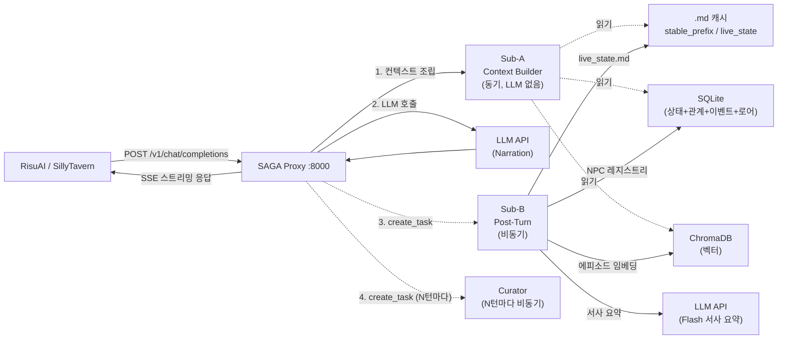

# SAGA RP Agent Proxy v3.0

## Stateful Agent Architecture — Stateful RAG 기반 Context Engineering 프록시

---

> **한 줄 요약:** 매 턴 1회 LLM 호출만으로 장기 RP 세션의 상태 일관성을 유지하는 OpenAI-compatible 프록시.
> SQLite + 벡터 DB + .md 캐시를 조합하여, 프론트엔드 수정 없이 동적 컨텍스트를 자동 주입한다.

---

## 목차

1. [용어 설명](#1-용어-설명)
2. [연구 개요](#2-연구-개요)
3. [기존 방식의 한계](#3-기존-방식의-한계)
4. [SAGA의 접근: Stateful RAG](#4-saga의-접근-stateful-rag)
5. [시스템 아키텍처](#5-시스템-아키텍처)
6. [3-Agent 파이프라인](#6-3-agent-파이프라인)
7. [스토리지 설계](#7-스토리지-설계)
8. [다이나믹 로어북](#8-다이나믹-로어북)
9. [비용 및 품질 고찰](#9-비용-및-품질-고찰)
10. [평가 (LLM-as-a-Judge)](#10-평가-llm-as-a-judge)
11. [빠른 시작](#11-빠른-시작)
12. [설정 레퍼런스](#12-설정-레퍼런스)
13. [API 레퍼런스](#13-api-레퍼런스)
14. [월드 데이터 작성법](#14-월드-데이터-작성법)
15. [프로젝트 구조](#15-프로젝트-구조)
16. [로드맵](#16-로드맵)
17. [선행 연구 및 참고 자료](#17-선행-연구-및-참고-자료)

---

## 1. 용어 설명

이 문서에서 반복적으로 등장하는 개념을 먼저 정리한다.

| 용어 | 설명 |
|------|------|
| **RAG** (Retrieval-Augmented Generation) | 외부 저장소에서 관련 정보를 검색하여 LLM 프롬프트에 주입하는 패턴. |
| **Graph RAG** | 벡터 검색에 그래프 구조를 결합하여 관계 기반 검색 품질을 높이는 RAG 확장. SAGA는 이 아이디어에서 영감을 받아 **정규화된 관계형 테이블(SQLite) + 벡터 검색(ChromaDB)**으로 구조화된 상태 추적을 구현했다. |
| **Stateful RAG** | 매 턴 LLM 응답에서 상태를 추출하여 저장소를 갱신하고, 다음 턴 검색에 반영하는 Read-Write 순환 RAG. 일반 RAG가 읽기 전용이라면, Stateful RAG는 매 턴 쓰기도 수행한다. |
| **Context Engineering** | 제한된 토큰 예산 안에서 어떤 정보를 얼마나 넣을지 우선순위를 매겨 프롬프트를 조립하는 기법. |
| **Prompt Caching** | Anthropic `cache_control: ephemeral` 등을 이용하여 프롬프트의 불변 부분을 캐싱, 비용과 지연을 줄이는 기법. |
| **서사 요약 (Narrative Extract)** | Sub-B가 경량 LLM(Flash)으로 매 턴 응답에서 추출하는 4필드 미니 요약: summary, npcs_mentioned, scene_type, key_event. |
| **Lorebook** | 세계관 설정 항목의 모음. 전통적으로 정적이지만, SAGA에서는 동적으로 필터링/감쇠된다. |
| **Curator** | N턴마다 서사 품질을 자동 관리하는 에이전트. 모순 탐지, 서사 압축, 이벤트 스케줄링을 수행한다. |
| **RisuAI / SillyTavern** | RP 프론트엔드 클라이언트. OpenAI-compatible API를 지원하므로 SAGA 프록시를 투명하게 사용할 수 있다. |

---

## 2. 연구 개요

### 배경: RP 장기 세션의 근본 문제

RP(롤플레이) 챗봇은 수십~수백 턴에 걸친 장기 세션에서 구조적인 한계에 부딪힌다.

- **상태 유실**: 50턴 전에 죽은 NPC가 재등장하고, 버린 아이템이 인벤토리에 남아 있다.
- **모순 누적**: HP가 0인데 전투를 계속하고, 동쪽으로 이동했는데 서쪽 마을에 있다.
- **로어북 정적 한계**: 세계 상태가 변해도(마을 파괴, 세력 붕괴) 로어북은 초기 설정 그대로다.
- **컨텍스트 낭비**: 전체 대화 히스토리를 보내면 128K 토큰 중 상당수가 관련 없는 과거 대화로 소모된다.

이 문제들은 단순히 컨텍스트 창을 늘려서 해결되지 않는다. 200K 토큰을 보내도 LLM이 50턴 전 세부사항을 정확히 기억하리라는 보장은 없으며, 비용은 선형으로 증가한다.

### 목표

- **프론트엔드 변경 없이** 장기 기억 + 상태 일관성을 확보한다.
- 기존 클라이언트(RisuAI, SillyTavern 등)에서 **API Base URL만 변경**하면 동작한다.
- 유저 체감 지연을 최소화한다 — **1회 LLM 호출 + 비동기 후처리**.

### 선행 연구

SAGA는 다음 연구와 프로젝트들의 아이디어를 결합하고 확장한다:

- **MemGPT / Letta** [[1]](#ref-1) — LLM에 가상 메모리 계층을 부여하여 무한 컨텍스트를 시뮬레이션하는 OS 패러다임을 제안. Letta의 "Step Loop" — 에이전트가 자기 Memory Block을 읽고 편집하는 다회 호출 패턴 — 은 RP 도메인에서 코히바블랙 [[2]](#ref-2) 에 의해 실증적으로 검증되었다. SAGA의 Curator는 이 패턴을 비동기 후처리에서 차용하되, 유저 대기 경로에서는 사용하지 않는 트레이드오프를 택했다.
- **Graph RAG** [[3]](#ref-3) — Microsoft Research가 제안한 그래프 기반 RAG. 벡터 검색만으로 포착하기 어려운 관계 기반 질의를 그래프 확장으로 보완한다. SAGA는 이 아이디어에서 "구조화된 관계 + 벡터 검색 병합"이라는 설계 방향을 차용하여, 정규화된 SQLite 테이블(characters, relationships, locations, events, lore) + ChromaDB 벡터 검색으로 구현했다.
- **RAG** [[4]](#ref-4) — 검색 증강 생성의 원형. 외부 저장소에서 관련 문서를 검색하여 LLM 프롬프트에 주입하는 기본 패턴.
- **LLM-as-a-Judge** [[5]](#ref-5) — LLM을 평가자로 사용하는 방법론. SAGA는 크로스 프로바이더 저지 + 네거티브 캘리브레이션으로 편향을 완화했다.
- **코히바블랙의 연구** [[2]](#ref-2) — Letta 기반 RP 에이전트의 실전 적용기. 같은 문제(RP 장기 세션의 상태 유실)를 "에이전트 자기편집 다회 호출"로 풀었다. SAGA는 이를 벤치마크 삼아 "프록시 기반 1회 호출 + 비동기 추출"이라는 다른 아키텍처를 선택했다.
- **에이전트 컨텍스트 관리의 .md 수렴** — Claude Code, Cursor, oh-my-claudecode(OMC), Codex, Letta Code MemFS[[6]](#ref-6) 등 아키텍처가 다른 에이전트 시스템들이 공통적으로 마크다운을 컨텍스트 관리 형식으로 채택하고 있다. "에이전트가 무엇이 중요한지 스스로 판단하여 .md 메모를 갱신한다"는 패러다임에서 영감을 받아, SAGA의 .md 캐시 설계와 Letta Curator의 Memory Block 자기편집 구조로 이어졌다.

### 접근 방식

OpenAI-compatible 프록시로 클라이언트와 LLM 사이에 위치하여:

1. **매 턴 요청 시** — 2종 DB에서 현재 상태와 관련 컨텍스트를 검색, 프롬프트에 주입 (동기, ~35ms)
2. **매 턴 응답 후** — LLM 응답에서 상태 변화를 추출, 2종 DB를 갱신 (비동기, 유저 대기 없음)
3. **N턴마다** — 서사 모순 탐지, 장기 서사 압축, 이벤트 스케줄링 (비동기)

---

## 3. 기존 방식의 한계

### 비교 테이블

| 접근 방식 | 상태 추적 | 구조화된 상태 | 유저 지연 | 비용 | 한계 |
|-----------|----------|-------------|----------|------|------|
| **정적 로어북** | X | X | 없음 | 낮음 | 세계가 변해도 로어북은 고정 |
| **전체 히스토리 전송** | 암묵적 | X | 없음 | 높음 | 토큰 낭비, 관련 없는 정보 포함, 장기 세션에서 누적 모순 |
| **Hyper Memory 계열** | 대화 기억 | X | 낮음 | 중간 | 비구조적 기억 — "위치", "HP", "관계 그래프" 같은 구조화된 상태 추적 불가 |
| **Letta Step Loop** | O | O | **높음 (다회 호출)** | **높음** | 에이전트가 자기편집을 위해 3~5회 LLM 호출 → 턴당 지연 수 초~수십 초 |
| **SAGA (본 프로젝트)** | O | O | **낮음 (1회 호출)** | 중간 | Flash 서사 요약 정확도에 의존 |

### 정적 로어북의 문제

전통적인 로어북은 세션 시작 시 고정된다. "에르겐은 마을 광장의 약초상이다"라고 작성해 두면, 에르겐이 숲으로 이동하거나 사망하더라도 로어북은 변하지 않는다. 결과적으로 LLM은 오래된 설정을 참조하여 모순된 서사를 생성한다.

### Letta Step Loop 방식과의 차이

Letta [[1]](#ref-1)는 에이전트가 자신의 Memory Block을 직접 편집하는 "Step Loop" 패턴을 사용한다. 코히바블랙 [[2]](#ref-2)은 이를 RP 도메인에 적용하여 장기 세션에서의 효과를 실증했다. 강력하지만, 한 번의 유저 턴에 대해 에이전트가 **3~5회 LLM을 호출**하여 기억을 읽고, 수정하고, 응답을 생성한다.

```
[Letta Step Loop]
유저 입력 → (1) 기억 읽기 → (2) 기억 편집 → (3) 응답 생성 → (4) 기억 재편집 → ...
           └─── 3~5회 LLM 호출, 유저가 전부 대기 ───┘

[SAGA]
유저 입력 → (1) DB 검색 + 프롬프트 조립 → LLM 1회 호출 → 응답 반환
                                                          └─ (비동기) 상태 추출 + DB 갱신
```

SAGA는 이 트레이드오프를 다르게 풀었다:
- **동기 경로**: DB 검색 + 프롬프트 조립만 수행 (LLM 호출 없음, ~35ms)
- **비동기 경로**: 응답 반환 후 경량 LLM으로 상태 추출 (유저 대기 없음)
- **Curator**: N턴마다 Letta Memory Block 기반 자기편집 수행 (비동기, 유저 대기 없음)

결과적으로 유저가 체감하는 지연은 LLM 1회 호출뿐이다.

---

## 4. SAGA의 접근: Stateful RAG

### 핵심 아이디어: Read-Write 순환

```
                    ┌──────────────────────────────┐
                    │         2종 DB 저장소          │
                    │  SQLite(상태) + ChromaDB(벡터)  │
                    └──────┬───────────────┬────────┘
                   READ    │               │  WRITE
                (동기 ~35ms)│               │(비동기)
                           ▼               │
    ┌────────┐    ┌────────────────┐    ┌──┴──────────────┐
    │ Client │───▶│  Sub-A:        │───▶│  LLM (1회 호출)   │
    │        │◀───│  Context Build │◀───│                  │
    └────────┘    └────────────────┘    └──┬──────────────┘
                                           │ 응답 반환 후
                                           ▼
                                    ┌──────────────┐
                                    │  Sub-B:      │
                                    │  추출 + 갱신  │──▶ DB WRITE
                                    └──────────────┘
```

매 턴은 두 단계로 구성된다:

1. **READ** (동기): Sub-A가 2종 DB에서 현재 상태, 관련 로어북을 검색하여 프롬프트에 주입
2. **WRITE** (비동기): Sub-B가 Flash 서사 요약으로 에피소드를 기록하고 NPC 레지스트리를 갱신

이 순환이 매 턴 반복되므로, DB는 항상 최신 세계 상태를 반영하고, 다음 턴의 검색은 갱신된 상태를 기반으로 동작한다.

### 설계 철학: "에이전트는 큐레이션만, 메인 루프는 코드로"

RP는 본질적으로 **동적 메모리 시스템**을 요구한다. 세계 상태가 매 턴 변하고, 그 변화가 다음 턴의 맥락에 즉시 반영되어야 한다. Letta(MemGPT) [[1]](#ref-1)는 이를 에이전트의 자기편집 Step Loop로 해결하지만, 메인 응답 경로에 에이전트를 두면 다회 호출 지연이 불가피하다.

SAGA의 착안점은 **에이전트 생태계 전반에서 관찰되는 컨텍스트 관리 패턴의 수렴**이었다.

| 시스템 | 아키텍처 | 컨텍스트 관리 |
|--------|---------|-------------|
| **Claude Code** | CLI 에이전트 | `CLAUDE.md`, `~/.claude/memory/*.md` |
| **oh-my-claudecode (OMC)** | 오케스트레이터 | `notepad.md`, `AGENTS.md`, `.omc/plans/*.md` |
| **Cursor** | IDE 에이전트 | `.cursor/rules/*.mdc`, `.cursorrules` |
| **Codex** | CLI 에이전트 | `AGENTS.md`, 마크다운 기반 지시 |
| **Letta Code** | 에이전트 프레임워크 | `memory/*.md` + YAML frontmatter (MemFS) [[6]](#ref-6) |

Swarm, Orchestrator, Skill 시스템 등 상위 아키텍처는 다양하지만, **에이전트에게 컨텍스트를 전달하는 최종 형식은 마크다운으로 수렴**하고 있다:

- LLM의 학습 데이터에 마크다운이 압도적으로 많아 **가장 잘 읽는 형식**
- 헤딩/리스트/테이블로 **반구조화** 가능 (JSON은 기계적, 자연어는 비구조적)
- YAML frontmatter로 **메타데이터 분리** (본문은 LLM이, 프론트매터는 코드가 읽음)
- 텍스트 기반이라 **diff/캐싱 친화적** (git diff, Prompt Caching 모두 효율적)

특히 Letta Code의 MemFS[[6]](#ref-6)는 주목할 만하다. Memory Block(단일 문자열)에서 진화하여, git 기반 마크다운 파일 시스템으로 에이전트 메모리를 관리한다 — SAGA의 .md 캐시(`stable_prefix.md`, `live_state.md` + YAML frontmatter)와 매우 유사한 구조다. 차이는 **편집 주체**: MemFS는 에이전트가 LLM 호출로 편집하고, SAGA는 코드 로직(Sub-B)이 밀리초 단위로 편집한다.

SAGA의 .md 캐시는 임의적 선택이 아니라, **에이전트 생태계 전체가 수렴하고 있는 패턴의 RP 도메인 적용**이다.

이 배경 위에서, RP에 적용할 때 핵심 질문은: **에이전트의 판단력이 정말 필요한 곳은 어디인가?**

- **매 턴 서사 요약**: "어떤 장면이었는가? 누가 등장했는가?" → 경량 LLM(Flash) 4필드 요약으로 충분. 에이전트 판단 불필요.
- **매 턴 컨텍스트 조립**: "어떤 로어북이 관련 있는가?" → 점수 기반 필터링으로 충분. 에이전트 판단 불필요.
- **N턴마다 서사 큐레이션**: "이 모순은 의도된 것인가? 이 복선은 회수해야 하는가?" → **에이전트의 판단력이 필수.** 이전 큐레이션 결정을 기억하고 일관되게 이어가야 한다.

따라서 SAGA는 Letta를 **메인 루프에서 빼고, Curator에만 배치**했다. 코딩 에이전트가 Notepad를 통해 작업 맥락을 자기관리하듯, Letta Curator는 Memory Block을 통해 큐레이션 판단 이력을 자기관리한다. 매 턴의 기계적 작업(추출, 검색, 필터링)은 코드 로직이 처리하고, 서사적 판단이 필요한 큐레이션에서만 에이전트가 개입한다.

```
코딩 에이전트 패턴:                    SAGA 적용:
┌──────────────┐                   ┌──────────────────┐
│ Agent        │                   │ Letta Curator     │
│  └ Notepad   │ ← 자기관리        │  └ Memory Block   │ ← 자기편집
│  └ 작업 실행  │                   │  └ 서사 판단       │
└──────────────┘                   └──────────────────┘
  "뭐가 중요하지?"                    "이 모순은 의도적인가?"
  "이전에 뭘 했지?"                   "지난 큐레이션에서 뭘 결정했지?"
```

이 분리 덕분에:
- **메인 루프**: LLM 0회 호출 (Sub-A) + LLM 1회 호출 (내레이션) = 최소 지연
- **큐레이션**: Letta Step Loop의 다회 호출을 허용하되, N턴마다 비동기로 실행하므로 유저에게 영향 없음

### 일반 RAG vs Stateful RAG

| | 일반 RAG | Stateful RAG (SAGA) |
|---|---------|-------------------|
| 검색 대상 | 정적 문서 | 매 턴 갱신되는 2종 DB |
| 쓰기 | 없음 (읽기 전용) | 매 턴 비동기 DB 갱신 |
| 검색 방식 | 벡터 유사도 | 벡터 유사도 + SQLite 상태 조회 |
| 상태 구조 | 비구조적 텍스트 | SQLite 테이블 (characters, relationships, locations, events, lore) |
| 로어북 | 정적 | SQLite + 벡터 검색 병합, 토큰 예산 내 선별 |

### 에피소드 검색: 3-stage ChromaDB + SQLite 로어 조회

에피소드 기억은 ChromaDB 3-stage 검색 + **Reciprocal Rank Fusion(RRF)**으로 가져온다: Recent(최근 턴, 가중치 1.2), Important(중요도 높은 에피소드, 1.0), Similar(현재 맥락과 유사한 에피소드, 0.8)를 각각 검색한 뒤 RRF 공식(`score += weight / (k + rank + 1)`)으로 통합 랭킹한다. 로어북은 SQLite lore 테이블 조회와 ChromaDB 벡터 검색을 함께 사용한다.

```
ChromaDB 3-stage 에피소드 검색:
    Stage 1 (Recent):    최근 N턴 에피소드
    Stage 2 (Important): importance_score 상위 에피소드
    Stage 3 (Similar):   현재 user_input과 유사도 높은 에피소드
                    │
로어 조회:          ▼
    SQLite lore 테이블 (priority 기반 필터)
    + ChromaDB 벡터 검색 → 병합 + 중복 제거
```

### Context Engineering: 토큰 예산 내 우선순위 패킹

128K 컨텍스트 중 동적 컨텍스트에 할당하는 예산은 기본 4,000 토큰이다. stable_prefix.md 토큰을 뺀 나머지를 다음 우선순위로 패킹한다:

| 항목 | 설명 |
|------|------|
| live_state.md | 매 턴 갱신되는 현재 상태 (위치, HP, 주변 인물, 최근 이벤트) |
| 에피소드 기억 | RRF 랭킹된 관련 에피소드 (최대 10개, 개별 500자 cap) |
| 활성 로어 | SQLite + 벡터 검색 병합 (최대 5개, 개별 800자 cap) |

---

## 5. 시스템 아키텍처

### 전체 요청 흐름


```mermaid
flowchart LR
    Client["RisuAI / SillyTavern"]

    Proxy["SAGA Proxy :8000"]
    SubA["Sub-A<br/>Context Builder<br/>(동기, LLM 없음)"]
    LLM["LLM API<br/>(Narration)"]
    SubB["Sub-B<br/>Post-Turn<br/>(비동기)"]
    Flash["LLM API<br/>(Flash 서사 요약)"]
    Curator["Curator<br/>(N턴마다 비동기)"]

    SQLite["SQLite<br/>(상태+관계+이벤트+로어)"]
    Chroma["ChromaDB<br/>(벡터)"]
    Cache[".md 캐시<br/>stable_prefix / live_state"]

    %% 요청 흐름
    Client -- "POST /v1/chat/completions" --> Proxy
    Proxy -- "1. 컨텍스트 조립" --> SubA
    SubA -. "읽기" .-> Cache
    SubA -. "읽기" .-> SQLite
    SubA -. "읽기" .-> Chroma

    Proxy -- "2. LLM 호출" --> LLM
    LLM --> Proxy
    Proxy -- "SSE 스트리밍 응답" --> Client

    %% 비동기 후처리 (Proxy가 둘 다 fire)
    Proxy -. "3. create_task" .-> SubB
    Proxy -. "4. create_task (N턴마다)" .-> Curator

    SubB -- "서사 요약" --> Flash
    SubB -- "NPC 레지스트리" --> SQLite
    SubB -- "에피소드 임베딩" --> Chroma
    SubB -- "live_state.md" --> Cache
```

> **핵심**: Sub-A = **읽기 전용** (DB→컨텍스트), Sub-B = **쓰기 전용** (Flash 서사 요약→에피소드 기록→NPC 레지스트리→live_state.md 갱신), LLM 호출은 **Proxy가 직접** 수행한다. Sub-B와 Curator는 Proxy가 독립적으로 `asyncio.create_task()`하며, Sub-B → Curator 종속 관계는 없다.

### 요청 처리 단계

```
1. 세션 ID 추출 (4단계 우선순위: @@SAGA: plugin sentinel → X-SAGA-Session-ID 헤더 → user 필드 → 시스템 메시지 첫 paragraph SHA256 해시 앞 16자)
2. 세션 존재 확인 → 없으면 새 세션 생성 (SQLite + .md 캐시 초기화)
3. [동기] Sub-A: Context Builder (~35ms)
   → .md 캐시 읽기 → ChromaDB 에피소드 검색 + SQLite 로어 조회 → 예산 내 조립
4. 프롬프트 캐싱 적용 (Anthropic cache_control: ephemeral, 1h TTL)
5. LLM 1회 호출 (내레이션 모델)
6. 클라이언트에 응답 반환 (SSE 스트리밍)
7. 턴 카운터 증가
8. [비동기] Sub-B: Post-Turn
   → Flash 서사 요약 (4필드) → ChromaDB 에피소드 기록 → NPC 레지스트리 갱신 → turn_log 기록 → live_state.md 갱신
9. [비동기, N턴마다] Curator
   → 모순 탐지 → 서사 압축 → 로어 자동생성
```

---

## 6. 3-Agent 파이프라인

### Sub-A: Context Builder

> **역할**: 매 턴 동기 실행, ~35ms 목표, LLM 호출 없음

Sub-A는 유저 요청이 올 때마다 실행되어 동적 컨텍스트를 조립한다. 핵심은 **2-tier 조회**: .md 캐시를 먼저 읽고, DB에서 동적으로 보충하는 구조이다.

**파이프라인:**

```
1. stable_prefix.md 읽기 (캐시됨, 거의 안 변함)
  ▼
2. live_state.md 읽기 (매 턴 갱신)
  ▼
3. ChromaDB 3-stage 에피소드 검색 (Recent + Important + Similar)
  ▼
4. SQLite 로어 조회 + ChromaDB 벡터 검색
  ▼
5. 토큰 예산 내 조립
출력: { md_prefix (stable), dynamic_suffix (live + episodes + lore) }
```

**출력 형식:**

Sub-A의 결과는 `{"md_prefix": str, "dynamic_suffix": str}`로 반환된다. 이 둘은 프롬프트에 삽입되는 위치가 경로에 따라 다르다:

- **Claude 경로**: `md_prefix`, `lorebook_delta`, `dynamic_suffix` 3개 섹션이 모두 **마지막 user 메시지에 prepend**된다. 시스템 메시지는 변경하지 않으므로 BP1~BP3 캐시가 유지된다.
- **비-Claude 경로**: `[--- SAGA Dynamic Context ---]` 헤더로 시스템 메시지에 합쳐진다.

```
[--- SAGA Context Cache ---]   ← md_prefix (stable_prefix.md)
세계관, 캐릭터 설정 ...

[--- Active Lorebook ---]      ← lorebook_delta (SystemStabilizer가 분리한 동적 로어)
### 어둠의 숲
에르시아 변방의 위험한 숲...

[--- SAGA Dynamic ---]         ← dynamic_suffix (live + episodes)
---
turn: 5
---

## 현재 상태                    ← live_state.md
- 위치: 어둠의 숲
- HP: 85/100

[에피소드 기억]                 ← ChromaDB 3-stage RRF 검색 결과
[!] Turn 3: 어둠의 숲 진입, 고블린 족장과 조우
[R] Turn 1: 마을 광장에서 의뢰 수락
```

### Sub-B: Post-Turn (Flash 서사 요약)

> **역할**: 매 턴 비동기 실행, 유저 대기 없음

SSE 스트리밍 응답이 완료된 후, Starlette `BackgroundTask`로 cancel scope 외부에서 안전하게 실행된다.

**파이프라인:**

```
1. Flash 서사 요약 (경량 LLM)
   │  Gemini Flash로 4필드 JSON 추출:
   │  { summary, npcs_mentioned, scene_type, key_event }
   │  response_mime_type="application/json" → 구조화된 출력 보장
   ▼
2. Importance 스코어링
   │  scene_type 기반 가중치 (base 10점):
   │    combat +40 | event +35 | exploration +15 | dialogue +0
   │    key_event +30 | NPC 등장 +10/명 (최대 2명)
   │  → 최종 0~100점
   ▼
3. ChromaDB 에피소드 기록
   │  요약 텍스트 + importance 점수로 에피소드 임베딩
   │  importance ≥ 50: 중요 에피소드로 분류
   ▼
4. NPC 레지스트리 갱신
   │  npcs_mentioned → SQLite characters 테이블에 등록
   ▼
5. SQLite 턴 로그 기록
   │  turn_log (state_changes[=narrative dict], user_input, assistant_output)
   ▼
6. live_state.md 갱신
   │  SQLite query_player_context() → write_live()
   │  위치, HP, 기분, 주변 NPC, 최근 이벤트
```

**서사 요약 형식 (Flash 출력):**

```json
{
  "summary": "나그네가 위지 가문의 저택에 도착하여 소연과 첫 대면. 할아버지의 유언과 일기장을 언급하며 도움을 요청했다.",
  "npcs_mentioned": ["위지소연", "당채련"],
  "scene_type": "dialogue",
  "key_event": "할아버지의 유언 공개"
}
```

> **설계 결정**: 초기에는 LLM에게 12필드 상태 블록(위치, HP, 아이템, 관계 등)을 출력하도록 지시하고 regex로 파싱하는 방식을 시도했으나, 추출 정확도 불안정 + 메인 LLM 토큰 낭비(270~400 tok/턴)로 폐기. 현재의 Flash 서사 요약은 메인 LLM에 어떤 지시도 추가하지 않으며, 비동기 경량 LLM만으로 4필드를 추출한다.

**동시성 제어:** `asyncio.Lock`으로 이전 Sub-B 완료를 대기한 뒤 실행. 빠른 연속 턴에서 DB 경합을 방지한다.

### Curator

> **역할**: N턴마다(기본 10턴) 비동기 실행, 서사 품질 자동 관리

**수행 작업:**

| 작업 | 설명 |
|------|------|
| 서사 모순 탐지 | 죽은 NPC 재등장, 파괴된 아이템 재사용, 동시 두 장소 존재 등 (정상적 위치 이동/감정 변화는 모순으로 취급하지 않음) |
| 장기 서사 압축 | stable_prefix.md가 50턴 이상이면 요약 압축 |
| 이벤트 스케줄링 | LLM이 제안한 이벤트를 SQLite event_queue에 저장 (트리거/실행 로직은 미구현) |

**어댑터 구조:**

- **Primary — Letta Memory Block**: Memory Block(`narrative_summary`, `curation_decisions`, `contradiction_log`)을 가진 에이전트가 매 큐레이션마다 자기편집. `message_buffer_autoclear=True`로 대화 히스토리를 매 호출 초기화하여 토큰 누적을 방지한다.
- **Fallback — Direct LLM**: Letta 실패 시 직접 LLM 호출로 JSON 응답 수신

Curator는 Letta의 자기편집 패턴을 **비동기 후처리에서만** 사용한다. 유저 대기 경로(동기)에서는 Letta를 호출하지 않으므로, Step Loop의 지연 문제를 회피한다.

---

## 7. 스토리지 설계

### 3종 스토리지 역할

| 스토리지 | 역할 | 특성 | 경로 |
|---------|------|------|------|
| **SQLite** | 세션 메타, 턴 로그, world_state KV, 이벤트 큐, **캐릭터, 관계, 장소, 이벤트, 로어** | 트랜잭션, 빠른 조회 | `db/state.db` |
| **ChromaDB** (벡터 DB) | 로어북 시맨틱 검색, 에피소드 기억 | 벡터 유사도 검색 | `db/chroma/` |
| **.md 캐시** | stable_prefix.md + live_state.md 2파일 | 프롬프트 캐싱 프리픽스, 원자적 쓰기 | `cache/sessions/{session_id}/` |

### SQLite 테이블 스키마 (9개 테이블)

| 테이블 | 주요 컬럼 | 용도 |
|--------|----------|------|
| **sessions** | id, name, world_config, turn_count, created_at, updated_at | 세션 메타 |
| **world_state** | session_id, key, value, updated_at | 세계 상태 KV 저장소 |
| **event_queue** | session_id, event_type, trigger_condition, priority, payload, status | 이벤트 큐 |
| **turn_log** | session_id, turn_number, user_input, assistant_output, state_changes, token_count | 턴 로그 |
| **characters** | session_id, name, is_player, hp, max_hp, location, mood, traits, custom | PC + NPC 상태 |
| **relationships** | session_id, from_name, to_name, rel_type, strength | NPC 관계 |
| **locations** | session_id, name, description, first_visit_turn | 장소 |
| **events** | session_id, name, event_type, description, turn, importance, entities | 세계 이벤트, 퀘스트 |
| **lore** | session_id, name, lore_type, keywords, content, priority, auto_generated, source_turns | 로어북 엔트리 |

### .md 캐시와 프롬프트 캐싱

.md 캐시 2파일은 프롬프트의 프리픽스로 사용된다. `stable_prefix.md`는 거의 변하지 않는 세계관/캐릭터 설정을 담아 프롬프트 캐싱의 주요 대상이 되고, `live_state.md`는 매 턴 갱신되는 현재 상태를 담는다. Anthropic의 `cache_control: ephemeral`과 결합하면, `stable_prefix.md` 부분은 동일 세션에서 캐싱되어 재전송 비용을 줄인다.

**YAML Frontmatter 구조 (stable_prefix.md):**

```yaml
---
version: 1
session_id: abc123de
---

## 세계관
에르시아 대륙, 중세 판타지 세계...

## 등장인물
### 아리아
- 특성: 용감, 호기심 왕성

## 로어
### 어둠의 숲
에르시아 변방의 위험한 숲...
```

**YAML Frontmatter 구조 (live_state.md):**

```yaml
---
turn: 5
---

## 현재 상태
- 위치: 어둠의 숲
- HP: 85/100
- 기분: determined

## 주변 인물
- 에르겐 (관계: met, 친밀도: 30)

## 최근 이벤트
- Turn 4: 고블린 족장과 전투
```

**원자적 쓰기:** `.tmp` 파일에 작성 후 `os.replace()`로 교체. Sub-B의 동시 갱신에서 파일 손상을 방지한다.

---

## 8. 로어북 검색

### 현재 구현: SQLite + 벡터 검색 병합

Sub-A의 `_get_active_lore()` 메서드가 매 턴 로어북을 검색한다. 현재 구현은 두 소스를 병합하는 간단한 구조:

```
1. SQLite lore 테이블에서 세션 전체 로어 조회
   │
   ▼
2. ChromaDB 벡터 검색 (현재 user_input 기반, n_results=5)
   │
   ▼
3. 이름 기준 중복 제거 (SQLite 우선)
   │
   ▼
4. 토큰 예산 내 조립 (per-entry 400자 cap, 최대 5개)
```

SQLite lore 테이블의 `priority` 컬럼과 `keywords` 컬럼이 존재하지만, 현재 필터링 로직에서는 사용하지 않는다 — 전체 조회 후 벡터 검색 결과와 병합한다.

### 계획: 우선순위 기반 필터링 (미구현)

향후 개선으로 다음 기능이 계획되어 있다:

- **우선순위 감쇠**: 마지막 언급 이후 경과 턴 기반 필터링
- **위치/NPC 게이트**: 현재 플레이어 위치와 주변 NPC 기반 부스팅
- **관계 전파**: 관계 그래프 기반 관련 로어 발견

이 기능들은 Phase 5 로드맵에서 구현할 예정이다.

---

## 9. 비용 및 품질 고찰

### 멀티모델 전략

SAGA는 작업별로 다른 모델을 사용하여 비용을 최적화한다:

| 작업 | 기본 모델 | 이유 |
|------|----------|------|
| 내레이션 | Claude Haiku 4.5 | 비용 효율적이면서 충분한 서사 품질 (E2E Judge 4.73/5.0 검증) |
| 상태 추출 | 경량 LLM (Gemini Flash 등) | 구조화된 추출은 저비용 모델로 충분 |
| 큐레이션 | Claude Sonnet 4.5 (via Letta) | 서사 판단 필요, N턴마다 비동기. message_buffer_autoclear로 토큰 누적 방지 |
| 로어 자동생성 | Gemini 2.0 Flash | 저비용 구조화 출력, 큐레이션당 최대 3건 |
| 임베딩 | text-embedding-3-small | 범용 임베딩, 저비용 |

### 비용 비교 (100턴 기준, 개념적 추정)

| 접근 방식 | LLM 호출 횟수 | 예상 비용 비율 | 비고 |
|-----------|-------------|-------------|------|
| 전체 히스토리 전송 | 100 | 높음 | 턴마다 전체 히스토리 포함, 토큰 선형 증가 |
| Letta Step Loop | 300~500 | 매우 높음 | 턴당 3~5회 호출, 모두 고성능 모델 |
| SAGA | 100 + 100 경량 + 10 Curator | 중간 | 내레이션 100회 + 경량 LLM 추출 100회 + 큐레이션 10회 |

SAGA는 내레이션에 Haiku(비용 효율), 서사 요약과 로어 자동생성에 Flash(경량), Curator에만 Sonnet(고비용, N턴마다 비동기)을 사용한다. .md 캐시 + 3-BP Prompt Caching으로 입력 토큰 비용을 추가 절감한다.

### 프롬프트 캐싱 효과 (실측 벤치마크)

Anthropic의 [Prompt Caching](https://docs.anthropic.com/en/docs/build-with-claude/prompt-caching)을 3-BP(3 Breakpoint) 전략으로 적용. 1시간 Extended TTL(`cache_control: {"type":"ephemeral","ttl":"1h"}`)로 장기 세션에서도 캐시를 유지한다.

**E2E 50턴 캐시 검증 결과** (Claude Haiku 4.5, 위지소연 시나리오):

| 지표 | 수치 |
|------|------|
| **캐시 적중률** (Turn 2+) | **85.7%** |
| **비용 절감** | **43.5%** |
| **총 캐시 읽기** | 770,202 tokens (90% 할인 적용) |
| **레이턴시** | avg **6.1초**, 50턴 내내 flat |
| **1h TTL** | 6분 대기 후에도 캐시 생존 (PASS) |

**레이턴시 안정성** — 컨텍스트가 쌓여도 느려지지 않는다:

```
프롬프트 토큰:  697 (Turn 1) → 32,292 (Turn 50)  ← 46배 증가
레이턴시:     4.0초 (Turn 1) → 5.5초 (Turn 50)   ← 1.4배만 증가
cache_create: 매 턴 ~660-730 tokens 일정           ← 새 턴 데이터만 추가
```

이는 3-BP 캐싱(stable prefix 히트) + Context Engineering(RRF 에피소드 선별, 토큰 예산 패킹)의 결합 효과다. 일반 프록시에서는 대화 누적 → 토큰 선형 증가 → 레이턴시 선형 증가가 불가피하다.

**캐싱 모드 비교** (50턴 기준):

| 모드 | 평균 히트율 | 절감률 | 비고 |
|------|:----------:|:------:|------|
| **3-BP + 1h TTL** | **85.7%** | **43.5%** | 현재 SAGA 기본 설정 |
| 수동 3-BP (5min TTL) | 95.5% | 76.0% | 이전 벤치마크 (`bench_prompt_caching.py`) |
| 자동 top-level | 12.1% | -11.4% | 20-block lookback 제한으로 턴 12+에서 무효화 |
| 캐시 없음 | 0% | 기준선 | — |

3-BP 전략은 시스템 프롬프트(BP1), 대화 중간점(BP2), 마지막 assistant(BP3)에 명시적 breakpoint를 배치하여 대화 길이에 무관하게 캐시를 유지한다. 동적 컨텍스트는 모든 BP 뒤에 위치하도록 마지막 user 메시지에 prepend한다.

> 상세: `tests/e2e_cache_verification.py` (50턴 E2E) | `tests/bench_prompt_caching.py` (캐싱 모드 비교)

### 한계와 트레이드오프

**SAGA가 잘 하는 것:**
- 50턴 내내 레이턴시 flat (캐싱 + Context Engineering)
- 프론트엔드 수정 없이 적용 가능 (OpenAI-compatible 프록시)
- 유저 체감 지연 최소화 (1회 호출 + 비동기 후처리)
- 서사 품질 유지: LLM Judge 4.73/5.0 (50턴), 캐릭터 일관성·맥락 연속성 5.0/5

**SAGA의 한계:**
- **서사 요약 정확도**: Flash 서사 요약의 추출 품질에 의존. JSON 잘림 시 복구 로직으로 완화하지만 완벽하지 않음
- **1턴 지연**: 서사 요약이 비동기이므로, 에피소드가 DB에 반영되기 전에 다음 턴이 시작될 수 있음 (asyncio.Lock으로 순서 보장하지만, 극단적으로 빠른 입력 시 경합 가능)
- **단일 세션 한정**: 세션 간 상태 공유 미지원. 같은 월드의 다른 세션은 독립적

---

## 10. 평가 (LLM-as-a-Judge)

### 방법론

- **크로스 프로바이더 저지** [[5]](#ref-5): 내레이션 모델과 다른 프로바이더의 LLM을 저지로 사용하여 자기평가 편향(same-provider bias)을 회피
- **기본 저지**: `gpt-4.1` (OpenAI) — 프로바이더/모델 변경 가능
- **네거티브 캘리브레이션**: 의도적 저품질 응답을 저지에게 평가시켜, 저지의 변별력을 검증

### 6개 평가 기준 (각 5점 만점)

| 기준 | 설명 | 핵심 체크 |
|------|------|----------|
| **서사 품질** | 문장력, 묘사의 생생함, 문체 일관성 | 몰입감 있는 서술인가? |
| **캐릭터 일관성** | NPC 성격/말투 유지, 설정 준수 | NPC가 이전 턴과 같은 인물인가? |
| **세계관 정합성** | 판타지 세계관 논리적 일관성 | 현대 요소 혼입, 설정 모순 없는가? |
| **유저 자율성** | 강제 전개 없이 유저 행동 반영 | 유저 입력을 무시하거나 강제하지 않는가? |
| **응답 관련성** | 유저 입력에 대한 직접적 반응 | 질문에 답하고, 행동에 반응하는가? |
| **플레이어 주권** | 유저 캐릭터 이름/외모/무기/스킬 임의 결정 금지 | 내레이터가 PC 설정을 침범하지 않는가? |

### 8개 시나리오

| ID | 시나리오 | 카테고리 | 검증 포인트 |
|----|---------|---------|-----------|
| S1 | 첫 만남 — 마을 광장 | introduction | 마을 묘사, NPC 존재, 분위기 설정 |
| S2 | 전투 시작 — 고블린 습격 | combat | 전투 묘사, 피해/결과, 적 반응 |
| S3 | 감정적 대화 — NPC 신뢰 얻기 | dialogue | NPC 감정 변화, 대사, 관계 발전 |
| S4 | 탐색 — 던전 입구 발견 | exploration | 환경 묘사, 미스터리, 선택 제시 |
| S5 | 멀티턴 연속성 (3턴) | continuity | 이전 턴 참조, NPC 일관성, 아이템명 기억 |
| S6 | 서사 요약 파이프라인 검증 | pipeline | Flash 서사 요약 추출, 에피소드 기록, NPC 레지스트리 갱신 |
| S7 | 적대적 입력 — 세계관 위반 시도 | adversarial | 현대 요소 거부/변환, 판타지 유지 |
| S8 | 부정 교정 (네거티브 캘리브레이션) | negative_calibration | 저지가 3.0 미만 점수를 부여하는지 검증 |

### E2E 50턴 Judge 결과 (위지소연 시나리오, Claude Haiku 4.5)

| 턴 | 평균 | 캐릭터 일관성 | 서사 품질 | 맥락 연속성 | 몰입감 | 창의성 |
|:---:|:----:|:-----------:|:--------:|:----------:|:-----:|:-----:|
| 1 | 4.8 | 5 | 5 | 5 | 5 | 4 |
| 10 | 4.8 | 5 | 5 | 5 | 5 | 4 |
| 20 | 4.8 | 5 | 5 | 5 | 5 | 4 |
| 30 | 4.8 | 5 | 5 | 5 | 5 | 4 |
| 40 | 4.6 | 5 | 4 | 5 | 5 | 4 |
| 50 | 4.6 | 5 | 4 | 5 | 5 | 4 |
| **평균** | **4.73** | **5.0** | **4.67** | **5.0** | **5.0** | **4.0** |

Quality drift: **-0.13** (50턴 동안 품질 안정)

> Judge 코멘트 (Turn 30): "감정 억제된 쿠데레 캐릭터의 미묘한 감정 변화를 완벽하게 표현했으며, 침묵과 행동으로 깊이 있는 감정 전달을 이루었다."

### 실행 방법

```bash
# 서버 실행 상태에서
python tests/eval_llm_judge.py

# 옵션
python tests/eval_llm_judge.py \
  --server http://localhost:8000 \
  --judge-model gpt-4.1 \
  --judge-provider openai
```

환경변수로도 설정 가능: `SAGA_URL`, `JUDGE_MODEL`, `JUDGE_PROVIDER`

---

## 11. 빠른 시작

### 요구사항

- Python 3.11+
- API 키: Anthropic, OpenAI, Google (사용하는 프로바이더)

### 설치

```bash
pip install -r requirements.txt
```

### 설정

```bash
cp config.example.yaml config.yaml
```

`config.yaml`에서 API 키를 환경변수 참조(`${ANTHROPIC_API_KEY}`)로 설정하거나 직접 입력한다.

### 실행

```bash
python -m saga
```

기본 포트 `8000`에서 서버가 시작된다.

### Letta 서버 (Curator용, 선택사항)

Curator 기능을 사용하려면 Letta 서버가 필요하다. Docker Compose로 실행:

```bash
docker compose -f docker-compose.letta.yaml up -d
```

`.env` 파일에 `OPENAI_API_KEY`와 `ANTHROPIC_API_KEY`를 설정해야 Letta 서버가 임베딩/LLM을 사용할 수 있다. Letta 없이도 SAGA는 동작하지만, 서사 큐레이션(모순 탐지, 장기 서사 압축)이 비활성화된다.

### 클라이언트 연결

RisuAI, SillyTavern 등에서 API Base URL을 `http://localhost:8000`으로 변경하면 된다. 별도의 클라이언트 설정은 필요 없다.

### E2E 통합 테스트

전체 파이프라인(Sub-A → LLM → Sub-B → Curator)을 자동 검증:

```bash
# 기본 위지소연 시나리오 (10턴)
python tests/e2e_integration.py

# 던전 보스 시나리오 (23턴)
python tests/e2e_integration.py --scenario dungeon --turns 23

# charx 캐릭터 파일로 실행
python tests/e2e_integration.py --charx /path/to/character.charx
```

### E2E 캐시 검증

캐시 적중률, 레이턴시 트렌드, LLM Judge 품질을 종합 검증:

```bash
# 위지소연 50턴 + TTL 검증
python tests/e2e_cache_verification.py --scenario soyeon --turns 50 --ttl-test

# 던전 보스 30턴
python tests/e2e_cache_verification.py --scenario dungeon --turns 30

# 기본 유이 (Yui) 100턴
python tests/e2e_cache_verification.py --turns 100
```

결과는 `tests/e2e_cache_results/`에 JSON + 마크다운 리포트로 저장된다.

SAGA 서버(`localhost:8000`)가 실행 중이어야 한다. Letta 서버는 Curator 기능 사용 시에만 필요.

### 환경변수

| 변수 | 설명 | 기본값 |
|-----|------|-------|
| `SAGA_CONFIG` | 설정 파일 경로 | `config.yaml` |
| `ANTHROPIC_API_KEY` | Anthropic API 키 | — |
| `OPENAI_API_KEY` | OpenAI API 키 | — |
| `GOOGLE_API_KEY` | Google API 키 | — |

---

## 12. 설정 레퍼런스

```yaml
server:
  host: "0.0.0.0"
  port: 8000
  api_key: ""                   # Bearer 토큰 인증. 빈 문자열 = 인증 비활성화

models:
  narration: "claude-haiku-4-5-20251001"   # 메인 내레이션
  extraction: "gemini-2.5-flash-lite"            # Flash 서사 요약 (경량 LLM)
  curator: "claude-sonnet-4-5-20250929"     # 큐레이터
  embedding: "text-embedding-3-small"       # 벡터 임베딩 ("local" → all-MiniLM-L6-v2)

api_keys:
  anthropic: "${ANTHROPIC_API_KEY}"
  openai: "${OPENAI_API_KEY}"
  google: "${GOOGLE_API_KEY}"

token_budget:
  total_context_max: 180000     # Anthropic 200K 기준 안전 마진 (~90%)
  dynamic_context_max: 4000     # SAGA 동적 컨텍스트 (state + episodes + lore)

md_cache:
  enabled: true
  cache_dir: "cache/sessions"
  atomic_write: true

prompt_caching:
  enabled: true
  strategy: "md_prefix"
  stabilize_system: true              # System message 안정화 (Lorebook 동적삽입 대응)
  canonical_similarity_threshold: 0.30
  cache_ttl: "1h"                     # extended-cache-ttl: "5m" (기본) or "1h"

curator:
  interval: 10                  # N턴마다 큐레이터 실행
  enabled: true
  memory_block_schema:          # Letta Memory Block 스키마
    - narrative_summary
    - curation_decisions
    - contradiction_log
  compress_story_after_turns: 50
  letta_base_url: "http://localhost:8283"
  letta_model: "anthropic/claude-sonnet-4-5-20250929"
  letta_embedding: "openai/text-embedding-3-small"

session:
  default_world: "my_world"

cache_warming:
  enabled: true
  interval: 270                 # 초 (4.5분 — 5분 TTL 만료 직전 갱신)
  max_warmings: 4

state_instruction:
  enabled: true                 # false 시 LLM에 state block 생성 지시 안 함 (Flash 추출로 대체)

langsmith:
  enabled: false                # true 시 LLM 호출 자동 트레이싱. LANGSMITH_API_KEY 필요
  project: "saga-risu"
```

---

## 13. API 레퍼런스

### OpenAI-compatible 엔드포인트

```
POST /v1/chat/completions
```

표준 OpenAI Chat Completions 형식을 그대로 사용한다. 스트리밍(`stream: true`) 지원.

### Admin API

| 엔드포인트 | 메서드 | 설명 |
|-----------|--------|------|
| `/health` | GET | 헬스 체크 (인증 불필요) |
| `/api/status` | GET | 서버 상태 + 활성 세션 수 |
| `/api/sessions` | GET | 세션 목록 |
| `/api/sessions` | POST | 세션 생성 |
| `/api/sessions/{id}/state` | GET | 세션 상태 + world_state KV |
| `/api/sessions/{id}/graph` | GET | 캐릭터/관계/이벤트 그래프 요약 |
| `/api/sessions/{id}/cache` | GET | .md 캐시 상태 |
| `/api/sessions/{id}/turns` | GET | 턴 로그 조회 (from_turn, to_turn 파라미터) |
| `/api/sessions/{id}/reset` | POST | 세션 초기화 |
| `/api/sessions/reset-latest` | POST | 가장 최근 세션 초기화 |
| `/api/memory/search` | GET | 벡터 메모리 검색 (`q`, `session`, `collection` 파라미터) |
| `/api/graph/query` | GET | 상태 데이터 조회 (캐릭터/관계/이벤트) |
| `/api/reset-all` | POST | 전체 초기화 (SQLite + ChromaDB + 캐시 + Letta) |

---

## 14. 월드 데이터 작성법

현재 월드 데이터는 RisuAI/SillyTavern 클라이언트가 프롬프트에 포함하여 전송한다. SAGA는 클라이언트가 보낸 시스템 메시지에서 세계관 정보를 자동으로 인식하며, 별도의 월드 데이터 파일 작성이 필요하지 않다.

향후 서버사이드 월드 데이터 로더(`data/worlds/{world_name}/`)를 구현할 계획이다. 이 기능이 추가되면 CHARACTERS.md, LOREBOOK.md, WORLD.md 파일을 작성하여 세션 생성 시 자동 로드할 수 있게 된다.

---

## 15. 프로젝트 구조

```
saga/
  __main__.py              # 엔트리포인트
  server.py                # FastAPI 서버 + OpenAI-compatible 엔드포인트 + BackgroundTask SSE
  config.py                # Pydantic 설정 모델 + YAML 로더
  models.py                # 요청/응답 Pydantic 모델
  session.py               # 세션 관리자 (get_or_create, reset)
  system_stabilizer.py     # SystemStabilizer: canonical system 저장 → Lorebook delta 분리
  llm/
    client.py              # 멀티 프로바이더 LLM 클라이언트 (Anthropic/Google/OpenAI)
  agents/
    context_builder.py     # Sub-A: 동적 컨텍스트 조립 + RRF 에피소드 선택 (LLM 호출 없음)
    post_turn.py           # Sub-B: Flash 서사 요약 + ChromaDB 에피소드 기록 + live_state.md 갱신
    extractors.py          # Flash 서사 요약 추출기 (4필드 JSON: summary, npcs, scene_type, key_event)
    curator.py             # 큐레이터: N턴마다 서사 관리 + 모순 탐지 + 로어 자동생성
  storage/
    sqlite_db.py           # SQLite 9개 테이블 (세션, 턴 로그, 캐릭터, 관계, 장소, 이벤트, 로어, world_state, event_queue)
    vector_db.py           # ChromaDB (에피소드 기억, 로어북 벡터 검색)
    md_cache.py            # .md 파일 캐시 (stable_prefix + live_state, 원자적 쓰기)
  adapters/
    curator_adapter.py     # 큐레이터 어댑터 (Letta Primary / Direct LLM Fallback)
  utils/
    parsers.py             # JSON 파서 (잘린 JSON 복구, Flash 응답 파싱)
    tokens.py              # tiktoken 기반 토큰 카운팅
    log_analyzer.py        # 서버 로그 분석 유틸리티
tests/
  conftest.py              # pytest 공통 fixture
  test_saga_integration.py # 통합 테스트 (Sub-A/B + Curator 파이프라인)
  test_context_builder.py  # Sub-A 단위 테스트
  test_post_turn_logic.py  # Sub-B 단위 테스트
  test_server_pure_functions.py # 서버 순수 함수 테스트
  test_prompt_caching.py   # 프롬프트 캐싱 테스트
  test_p0_compat.py        # OpenAI 호환성 테스트
  test_p1_stabilizer.py    # SystemStabilizer 테스트
  test_llm_client.py       # LLM 클라이언트 테스트
  test_models.py           # Pydantic 모델 테스트
  test_parsers.py          # JSON 파서 테스트
  e2e_integration.py       # E2E 통합 테스트 (charx 파싱, 멀티턴 RP, 파이프라인 검증)
  e2e_cache_verification.py # E2E 캐시 검증 (캐시 적중률, 레이턴시, LLM Judge, TTL)
  eval_llm_judge.py        # LLM-as-a-Judge 평가 스크립트 (8 시나리오)
  bench_prompt_caching.py  # 프롬프트 캐싱 벤치마크 (3-BP vs 자동 vs no-cache)
```

---

## 16. 로드맵

| Phase | 상태 | 내용 |
|-------|------|------|
| **Phase 1** | 완료 | 코어 프록시 + 3-Agent 파이프라인 + 2종 DB |
| **Phase 2** | 완료 | 다이나믹 로어북 + .md 캐시 + 프롬프트 캐싱 |
| **Phase 3** | 완료 | LLM-as-a-Judge 평가 + 크로스 프로바이더 저지 + 네거티브 캘리브레이션 |
| **Phase 3.5** | 완료 | Letta Curator 통합 + E2E 통합 검증 (23턴 ALL PASS) + BackgroundTask SSE 수정 |
| **Phase 4** | 완료 | 멀티모달 content 배열 지원, Pydantic extra="ignore", 1h 캐시 TTL, Flash 서사 요약 전환 |
| **Phase 4.5** | 완료 | E2E 캐시 검증 (50턴, 15/16 PASS, Judge 4.73/5.0), 시나리오 3종 (위지소연/던전/유이) |
| **Phase 5** | 예정 | 모듈 시스템 (RPG 스탯, 맵 그래프) |
| **Phase 6** | 예정 | 멀티 세션 상태 공유 + 세션 간 월드 연속성 |
| **Phase 7** | 예정 | 웹 UI 대시보드 (그래프 시각화, 세션 관리) |

---

## 17. 선행 연구 및 참고 자료

### 핵심 선행 연구

<a id="ref-1"></a>
**[1]** Packer, C., Wooders, S., Lin, K., Fang, V., Patil, S. G., Stoica, I., & Gonzalez, J. E. (2023). *MemGPT: Towards LLMs as Operating Systems.* arXiv:2310.08560. — LLM에 가상 메모리 계층(Main Context / Archival Storage / Recall Storage)을 부여하여 무한 컨텍스트를 시뮬레이션. SAGA의 Curator가 채택한 Memory Block 자기편집 패턴의 원형. https://arxiv.org/abs/2310.08560

<a id="ref-2"></a>
**[2]** 코히바블랙. (2025). *Letta를 이용한 장기기억 향상 및 AI 채팅 경험 향상 연구 초록.* [arca.live AI 채팅 채널](https://arca.live/b/characterai/162255622). — Letta Step Loop를 RP 도메인에 적용한 실전 적용기. 에이전트가 다회 호출로 Memory Block을 자기편집하는 접근 방식의 효과와 한계를 실증. SAGA가 "프록시 기반 1회 호출" 아키텍처를 선택하게 된 직접적 벤치마크.

<a id="ref-3"></a>
**[3]** Edge, D., Trinh, H., Cheng, N., Bradley, J., Chao, A., Mody, A., Truitt, S., & Larson, J. (2024). *From Local to Global: A Graph RAG Approach to Query-Focused Summarization.* arXiv:2404.16130. — 벡터 검색에 그래프 커뮤니티 구조를 결합하여 글로벌 질의에 대한 RAG 품질을 향상. "구조화된 관계 + 벡터 검색 병합"이라는 설계 방향에서 SAGA의 SQLite + ChromaDB 조합에 영향을 줌. https://arxiv.org/abs/2404.16130

<a id="ref-4"></a>
**[4]** Lewis, P., Perez, E., Piktus, A., Petroni, F., Karpukhin, V., Goyal, N., ... & Kiela, D. (2020). *Retrieval-Augmented Generation for Knowledge-Intensive NLP Tasks.* NeurIPS 2020. arXiv:2005.11401. — 외부 지식을 검색하여 생성에 활용하는 RAG 패러다임의 원형. https://arxiv.org/abs/2005.11401

<a id="ref-5"></a>
**[5]** Zheng, L., Chiang, W. L., Sheng, Y., Zhuang, S., Wu, Z., Zhuang, Y., ... & Stoica, I. (2023). *Judging LLM-as-a-Judge with MT-Bench and Chatbot Arena.* NeurIPS 2023. arXiv:2306.05685. — LLM을 평가자로 활용하는 방법론과 그 편향 분석. SAGA의 크로스 프로바이더 저지 설계에 참고. https://arxiv.org/abs/2306.05685

<a id="ref-6"></a>
**[6]** Letta. (2025). *MemFS: Memory as a File System.* Letta Documentation. — 에이전트 메모리를 git 기반 마크다운 파일 시스템으로 관리하는 접근. Memory Block에서 진화하여 YAML frontmatter + 마크다운 파일 구조를 채택. SAGA의 .md 캐시 2파일 (stable_prefix + live_state) 설계의 직접적 참고점. https://docs.letta.com/letta-code/memory

### 사용 기술

| 기술 | 용도 | 참고 |
|------|------|------|
| **ChromaDB** | 임베디드 벡터 DB (시맨틱 검색) | https://www.trychroma.com |
| **SQLite** | 임베디드 관계형 DB (상태, 로어, 이벤트) | https://www.sqlite.org |
| **Letta** (구 MemGPT) | Curator Memory Block 어댑터 | https://www.letta.com |
| **Anthropic Prompt Caching** | stable_prefix.md 캐싱 | https://docs.anthropic.com/en/docs/build-with-claude/prompt-caching |
| **FastAPI** | 프록시 서버 프레임워크 | https://fastapi.tiangolo.com |
| **tiktoken** | 토큰 카운팅 | https://github.com/openai/tiktoken |

### RP 프론트엔드 호환

| 클라이언트 | 설명 | 참고 |
|-----------|------|------|
| **RisuAI** | 웹 기반 RP 프론트엔드 | https://risuai.net |
| **SillyTavern** | 데스크톱 RP 프론트엔드 | https://sillytavern.app |

---

## 라이선스

Private repository.
